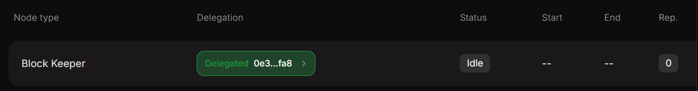
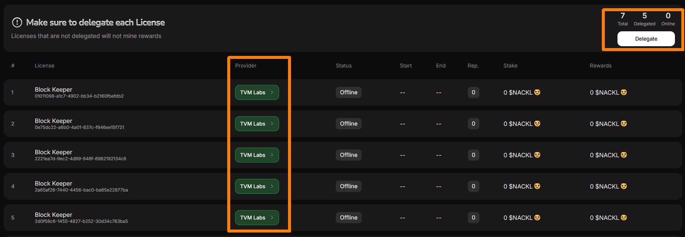
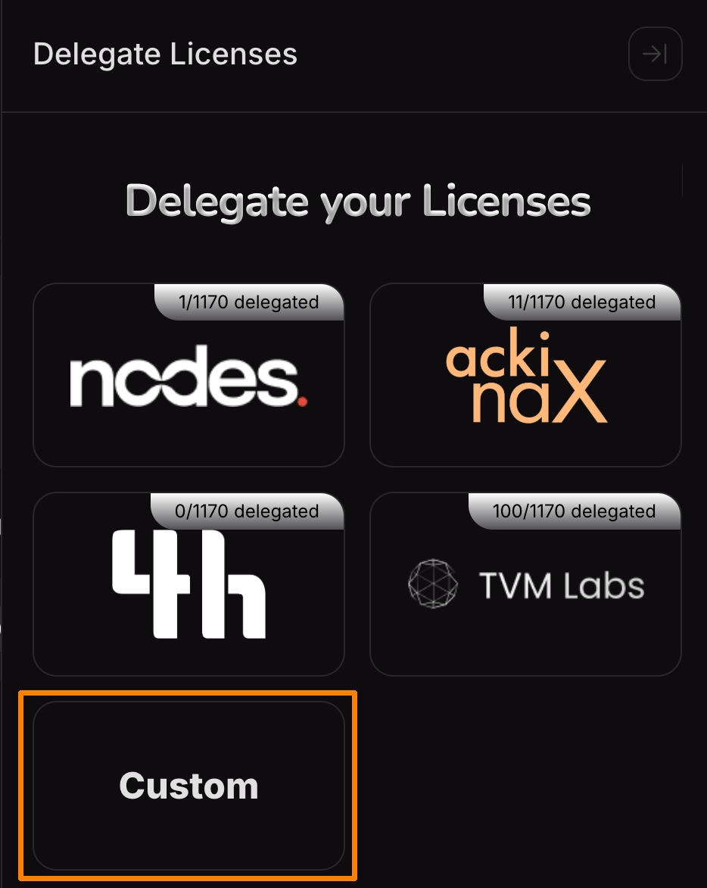
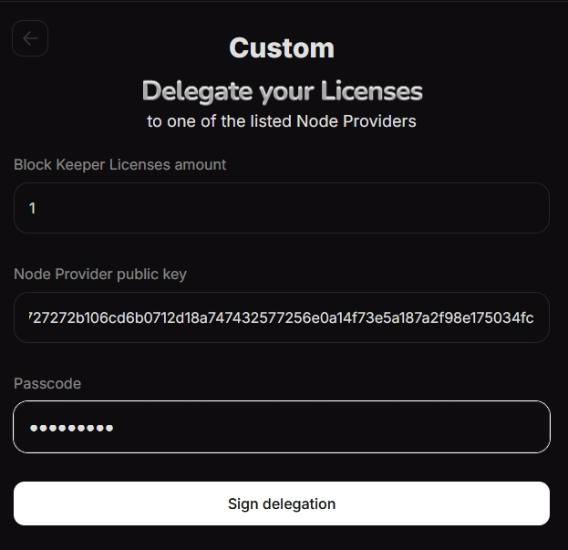
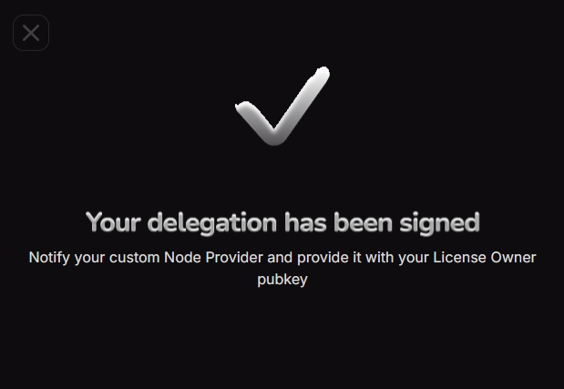
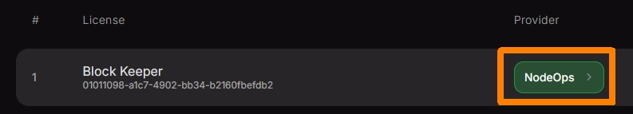
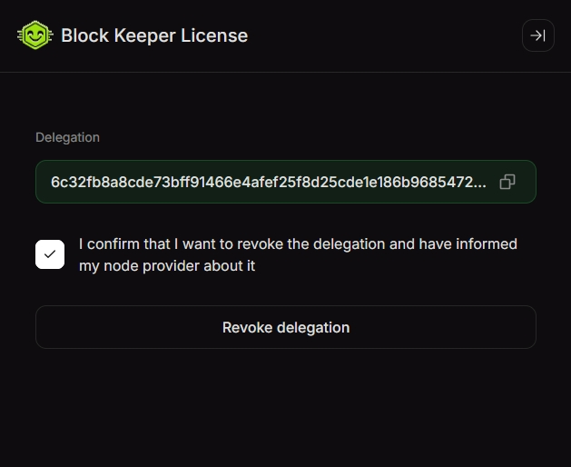

# License Delegation Guide

After purchasing a **BK license**, it does not become active automatically. To activate its participation in the protocol and start receiving rewards, the license must be delegated to a node that will perform validator functions.

In order for the licenses to be added to the zerostate and start getting rewards from the 1st block, this delegation has to happen before the network launch.


A maximum of **20 (twenty)** licenses can be delegated to a single node.


## Delegation via Acki Nacki Dashboard

To use the dashboard, you need to register and obtain [License Owner Keys](https://docs.ackinacki.com/glossary#license-owner-keys) .&#x20;

To do this, follow [the onboarding guide for the dashboard](dashboard-onboarding.md).


If, after completing the registration, you don't see your licenses on the **Licenses** tab, contact a Gosh representative through any publicly available channel or community group, and provide them with your `License Owner's public key`.


You can delegate your licenses directly through the [Acki Nacki Dashboard](https://dashboard.ackinacki.com/licenses) in two ways:

* [By submitting a request to one of the official Node Provider partners](./#request-delegation-via-node-provider)
* [By manually entering a Custom Node Provider’s public key](./#delegate-using-a-node-providers-public-key), if you already know which Provider you want to delegate to.

### **Request Delegation via Node Provider**

After registering in [the dashboard](https://dashboard.ackinacki.com/licenses), go to the **`Licenses`** tab and click the **`Delegate`** button.

<figure><figcaption></figcaption></figure>

Choose a Node Provider to whom you want to delegate your Licenses:

<figure><figcaption></figcaption></figure>

and submit a delegation request by filling in the following fields:

* **Block Keeper Licenses amount** – specify the number of available licenses you want to delegate to this provider’s nodes.
* Also provide your contact details so the Node Provider can get in touch with you:
  * **`Name`**
  * **`Email`**
  * **`Telegram`**

Confirm the entered information by entering your passcode in the **`Passcode`** field.

Contact the selected Node Provider to agree on the delegation fee and complete the payment process, then confirm by checking the box.


Be sure to contact the selected Node Provider to coordinate and complete the delegation payment.


Confirm this by checking the box.

Then click the **`Sign and send request`** button:


By doing so, you confirm that you are intentionally delegating your licenses to this Node Provider. This action generates a `delegation_sig`, which is required to validate the delegation.


<figure><figcaption></figcaption></figure>

You will see a confirmation that your request has been signed.

<figure><figcaption></figcaption></figure>

Once the request is signed, the **`Provider`** column will display the name of the Node Provider to whom you delegated your licenses, and the counter at the top will update to reflect the increased number of delegated licenses:

<figure><figcaption></figcaption></figure>


**Inform your Node Provider about the delegation and share your `License Owner public key` with them. This is important for data verification.**


Now proceed to [the next step after delegation](./#next-steps-after-delegation).

### **Delegate Using a Node Provider’s Public Key**

If the Node Provider has shared their public key with you, then after registering in the dashboard, go to the **Licenses** tab and click the **Delegate** button:

<figure><figcaption></figcaption></figure>

In the list of Node Providers that appears, click the **Custom** button:

<figure><figcaption></figcaption></figure>

Please fill out the delegation form, enter your passcode to confirm the delegation, and click `Sign Delegation`


By doing so, you confirm that you are intentionally delegating your licenses to this Node Provider. This action generates a `delegation_sig`, which is required to validate the delegation.


<figure><figcaption></figcaption></figure>

You will see a confirmation that your request has been signed.

<figure><figcaption></figcaption></figure>


**Inform your Node Provider about the delegation and share your `License Owner public key` with them. This is important for data verification.**


## Self-Delegation (Node Owners)

If you are both a License Owner and a Node Owner (Node Provider), you can delegate your licenses directly to your own node.

You can do this **Using the Dashboard** by specifying the `Node Provider public key` you generated, [as described in the section above](./#delegate-using-a-node-providers-public-key).

## Next Steps After Delegation

At this stage, preparations for the network launch are underway. For licenses delegated during this phase to be included in the [Zerostate](../../../../../glossary.md#zerostate), the node to which you delegated your license must join the [Decentralized Network Starter Protocol (DNSP)](https://docs.ackinacki.com/protocol-participation/block-keeper/join-dnsp-gossip).&#x20;

Once the DNSP client is launched by your Node Provider, the license will show an `Online` status in the Dashboard (this feature is still in development).

## **Revoke License**

**Before revoking the delegation of your license, please notify your Node Provider.**&#x20;


A delegation signature on a running node  is only invalidated by a newer delegation signature on another running node.



If a Node Provider had already started a node with your license - ask  to remove your license from the node


**If you signed the delegation via Dashboard** - also revoke the delegation to delete the signature - click on the name of the Node Provider to whom the license has been delegated.

<figure><figcaption></figcaption></figure>

Confirm your decision by checking the box and clicking the **`Revoke Delegation`** button:

<figure><figcaption></figcaption></figure>

You will see the changes reflected in the Dashboard, The "Provider" column will be empty

You can now delegate your license again. Remember, if the license is not delegated, it will not generate any rewards.
