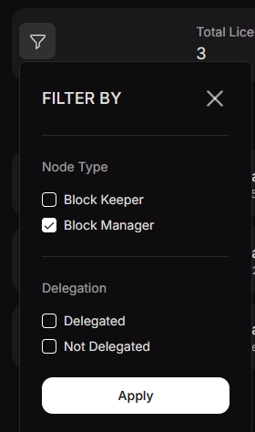
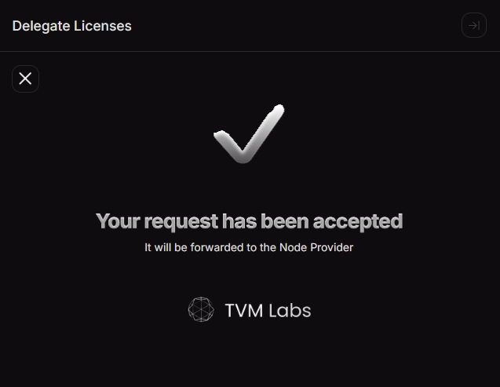
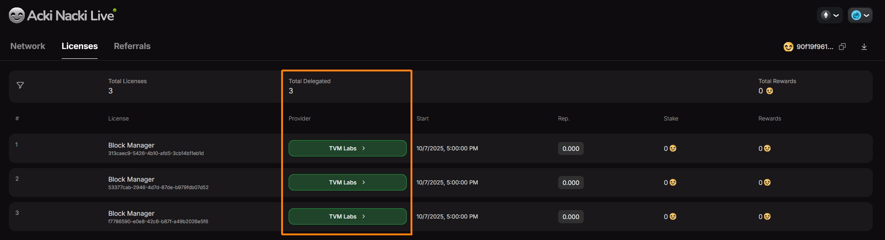

# Guide to BM License Delegation

After purchasing a Block Manager (BM) License, it does **not** become active automatically.\
To enable participation in the protocol and start receiving rewards, the license must be **delegated to a Provider**.

Delegation can be done through the **Acki Nacki Dashboard**.

#### **Step 1. Log in to your** [**Acki Nacki Dashboard**](https://dashboard.ackinacki.com/) **account**

If you don’t have an account yet, please follow the [onboarding guide](https://docs.ackinacki.com/for-node-owners/protocol-participation/block-keeper/license/license-delegation-guide/dashboard-onboarding) to create one.

After logging in, go to the **Licenses** tab — there you can view all your licenses.


If, after completing the registration, you don't see your licenses on the **Licenses** tab, contact a Gosh representative through any publicly available channel or community group, and provide them with your `License Owner's public key`.


#### **Step 2. Filter BM Licenses**

You can use the filter to display only your **BM Licenses**.

<figure><figcaption></figcaption></figure>

#### **Step 3. Delegate your License**

Click the **`Delegate`** button.

<figure><figcaption></figcaption></figure>

In the pop-up window, click on **`Block Manager`** and select **TVM Labs** as the Node Provider.

<figure><figcaption></figcaption></figure>

Submit a delegation request by filling in the following fields:

* **`Block Manager Licenses amount`** – specify how many of your available licenses you want to delegate
* **Contact details** – provide information so the Node Provider can reach you:
  * Name
  * Email
  * Telegram

Enter your **passcode** in the **`Passcode`** field to confirm the information you entered above.

Check the box to confirm your intention to contact the provider to agree on the **delegation fee** and proceed with the **payment process**.

<figure><figcaption></figcaption></figure>

#### **Step 4. Confirmation**

You will see a message confirming that your request has been signed.

<figure><figcaption></figcaption></figure>

Once the request is signed, the **Provider** column will display the name of the Node Provider to whom you delegated your licenses, and the **Total Delegated** counter will be updated.

<figure><figcaption></figcaption></figure>

#### **Step 5. License Activation**

After your license becomes active and the **BM service** is launched, you will be able to view your **reputation coefficient**, **stake**, and **rewards** on the same tab.
