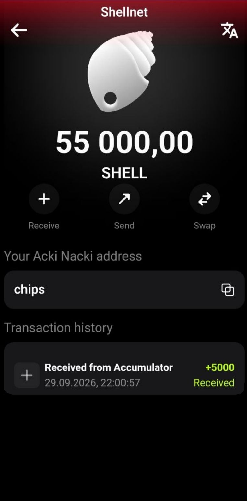

# Converting eccUSDC for SHELL via Acki Nacki Wallet (Android only)

If you already have eccUSDC in your balance, you can instantly exchange it for SHELL directly in the Acki Nacki Wallet mobile app.

## Prerequisites

* [Acki Nacki Wallet app](https://ackinacki.com/wallet) installed
* eccUSDC in your balance (minimum 1 eccUSDC)

## Step-by-Step Guide



#### Open the **Convert** Section

On the main wallet screen, where your balances are displayed, tap the **Swap** button button and select **Convert SHELL**

<figure><figcaption></figcaption></figure> <figure><figcaption></figcaption></figure>




#### Select Receive SHELL

On the conversion screen, make sure the **`+`** mode is selected.

<figure><figcaption></figcaption></figure>



#### Enter the eccUSDC Amount

In the **Select amount** field, enter the amount of eccUSDC you want to spend on SHELL. The system will instantly show how much SHELL you'll receive.

**Input rules:**

* Whole numbers only (1, 5, 100, etc.)
* Minimum amount — 1 eccUSDC
* Cannot exceed your eccUSDC balance

Your current eccUSDC balance is displayed at the bottom of the screen.

**Example:** you enter 50 eccUSDC — the system shows you'll receive 5,000 SHELL.

<figure><figcaption></figcaption></figure>



#### Tap "Get SHELL"

After entering the amount, tap the **Get SHELL** button at the bottom of the screen



#### Confirm the Purchase

A confirmation screen appears with the details:

<figure><figcaption></figcaption></figure>

Tap **Confirm** to proceed or **Cancel** to go back



#### Wait for Execution

The transaction is being processed on the blockchain.



#### Purchase Complete

On success, you'll see the confirmation:

<figure><figcaption></figcaption></figure> <figure><figcaption></figcaption></figure>

Tap **Close** to return to the main screen. Your SHELL balance will update automatically.



## What Happens Under the Hood

When you buy/convert SHELL, the system follows this algorithm:

1. Your eccUSDC is sent to the Accumulator smart contract
2. The contract checks if there is SHELL available in seller queues
3. If sellers exist — their SHELL is transferred to you, and eccUSDC is reserved for seller payouts
4. If there aren't enough sellers — the missing SHELL is created (minted) by the system
5. All SHELL is sent to you in a single transaction

As a buyer, it doesn't matter where the SHELL came from — you always receive exactly **amount × 100 SHELL**.

## Possible Errors

| Message                       | Cause                         | Solution                                 |
| ----------------------------- | ----------------------------- | ---------------------------------------- |
| `Get SHELL` button inactive   | Amount field is empty or zero | Enter an amount greater than 0           |
| Enter a whole number          | A decimal number was entered  | Enter a whole number                     |
| Insufficient eccUSDC  balance | Not enough eccUSDC            | Reduce the amount or top up your balance |
| Transaction failed. Try again | Transaction error             | Try again after a few seconds            |

