# Purchase with Crypto or Card (Credit/Debit)

Shell Buyer is a web application for purchasing SHELL tokens using a credit/debit card or cryptocurrency. Available at [shellbuy.ackinax.com](https://shellbuy.ackinax.com/).

## How It Works

The purchase consists of three steps:

1. **Connect Wallet** — scan a QR code with your Acki Nacki Wallet to link it
2. **Choose Package** — select a token package and pay with a card or crypto
3. **Confirm & Receive** — SHELL tokens are delivered directly to your wallet

## Prerequisites

* A browser (Chrome, Firefox, Safari, or any modern browser)
* [Acki Nacki Wallet app](https://ackinacki.com/wallet) installed on your phone
* A credit/debit card (Visa, MasterCard) **or** cryptocurrency (USDC, USDT)

## Step-by-Step Guide



#### Open Shell Buyer

Navigate to [https://shellbuy.ackinax.com](https://shellbuy.ackinax.com/) in your browser. \
A **Connect Your Wallet** card appears with the **Generate QR Code** button. Click it.

<figure><figcaption></figcaption></figure>



#### Choose Your Packages

The **Choose Your Packages** screen displays five token packages:

<figure>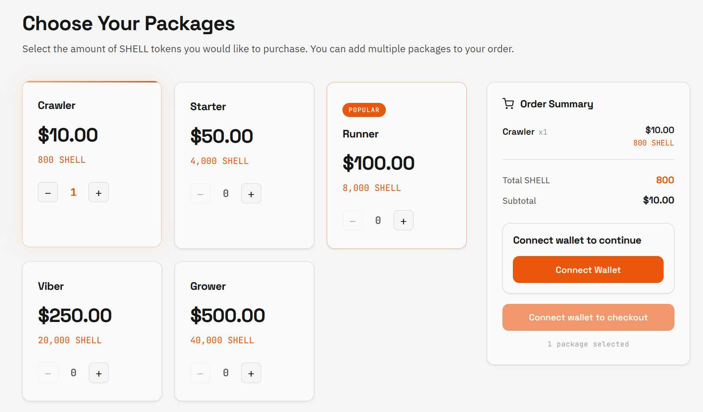<figcaption></figcaption></figure>

Each package has a quantity selector (−/+). You can add multiple packages to your order. The **Order Summary** panel on the right updates in real time, showing the selected packages, total SHELL, and subtotal.

When ready, tap **Connect Wallet**.



#### Scan the QR Code

A QR code is displayed on screen with the message **Approve in your wallet**. You can scan the code either with your phone's camera or with the scanners in the Acki Nacki Wallet app. The page shows "Waiting for wallet confirmation…"

<figure>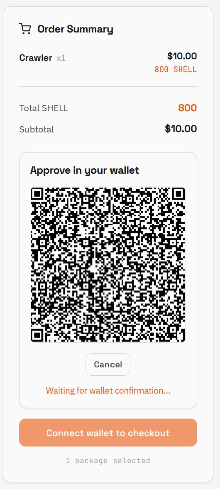<figcaption></figcaption></figure>



#### Confirm Connection in the Wallet

Open your Acki Nacki Wallet app. A prompt appears: **Do you want to connect your wallet to Shell Buyer?** Tap **Connect** to confirm.

<figure>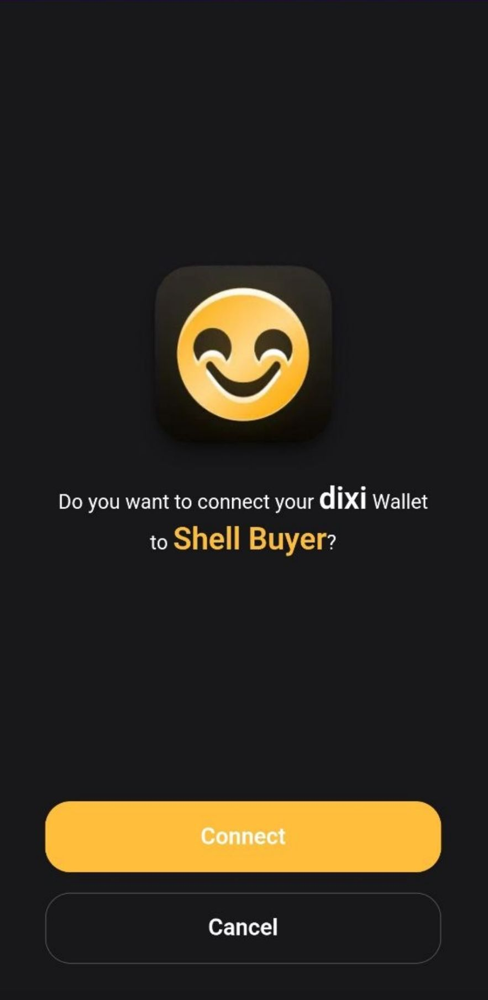<figcaption></figcaption></figure>

After confirming, the wallet shows a success screen: **Wallet has been connected**.

<figure>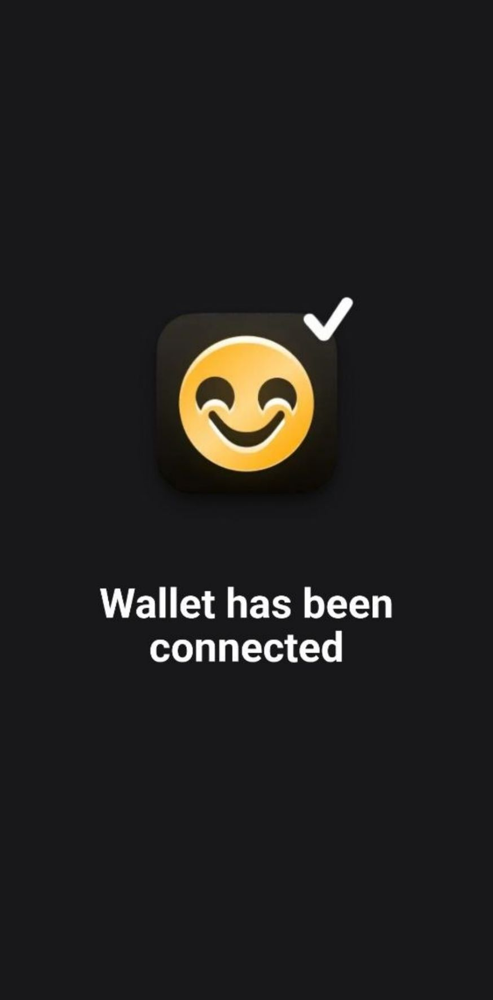<figcaption></figcaption></figure>



#### Wallet Connected

Returning to your browser, you'll see the "Order Summary" page with your wallet name, address, and package details.

If everything is correct, click "Proceed to Checkout."

<figure>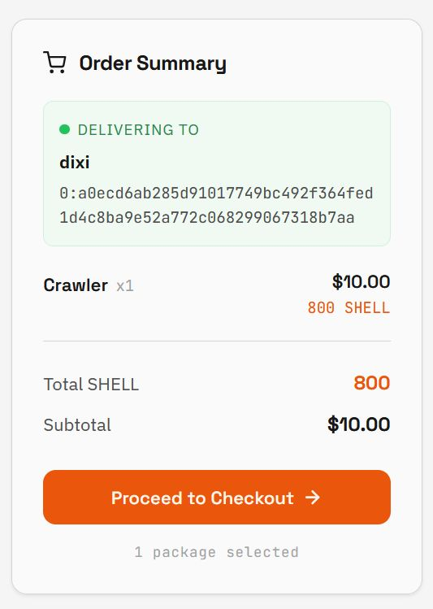<figcaption></figcaption></figure>



#### Fill in Contact Information

On the Checkout page, fill in:

* **Full Name**
* **Email Address**
* **Country**


The **Order Summary** on the right shows your selected packages, SHELL amount, subtotal, any applicable fees and taxes, and the total.




#### Select Payment Method



In the **Payment Method** section, select **Credit Card** (selected by default). The button at the bottom reads **Pay $X.XX with Card**.

Tap **Pay with Card**.

<figure>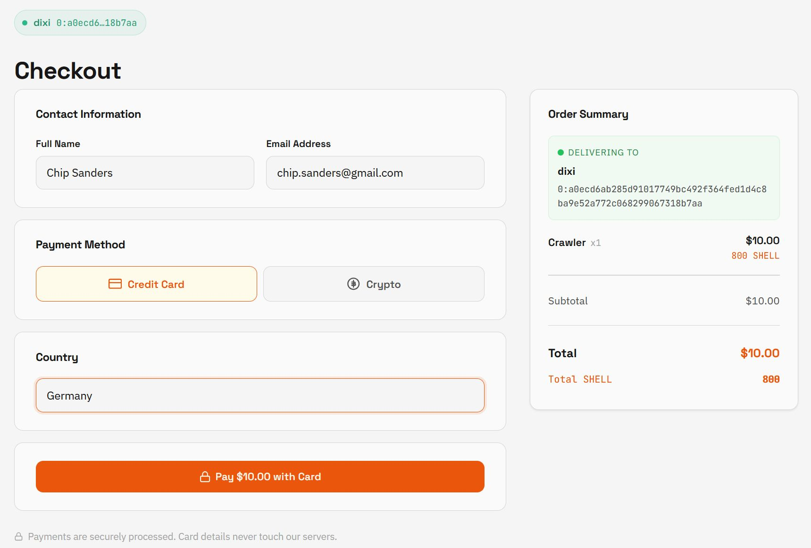<figcaption></figcaption></figure>



In the **Payment Method** section, select **Crypto**. Additional fields appear:

* **Currency** — choose USDC or USDT

<figure>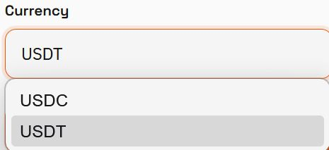<figcaption></figcaption></figure>

* **Network** — choose from Arbitrum, Ethereum, BSC, Polygon, Optimism, or Tron

<figure>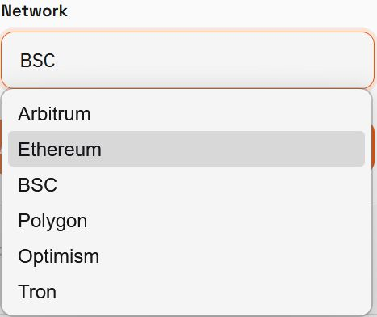<figcaption></figcaption></figure>

After selecting the currency and network, the button reads **Pay $X.XX with \[currency]**.

Tap the **Pay** button:

<figure>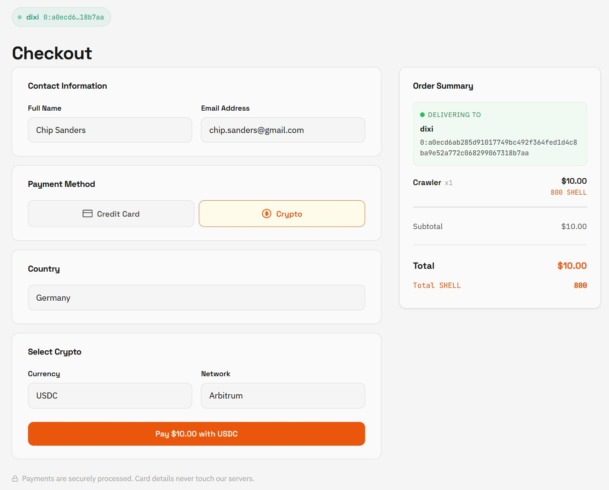<figcaption></figcaption></figure>





#### Complete Payment



You are redirected to the payment provider's page (Stripe). Here you can:

* Choose the payment currency (e.g. EUR or USD)
* Enter card details (card number, expiry, CVC, cardholder name)
* Select your country or region
* Optionally use Amazon Pay or other available methods (Bancontact, EPS, etc.)

Complete the payment by tapping **Pay**.

<figure>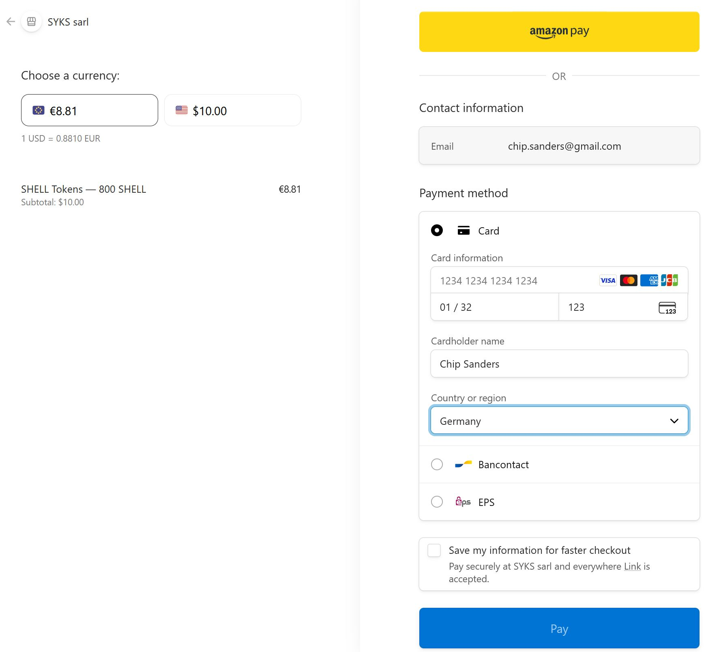<figcaption></figcaption></figure>


Payments are securely processed. Card details never touch Shell Buyer servers.




You are redirected to the NOWPayments page. \
The page displays:

* A **QR code** for the payment address
* The exact **amount** to send (e.g. 10.22142717 USDC)
* The **address** to send to
* A countdown **timer** for the exchange rate lock
* Payment status: Waiting for payment → Processing payment → Success

Send the specified amount of the selected cryptocurrency to the provided address on the correct network.

<figure>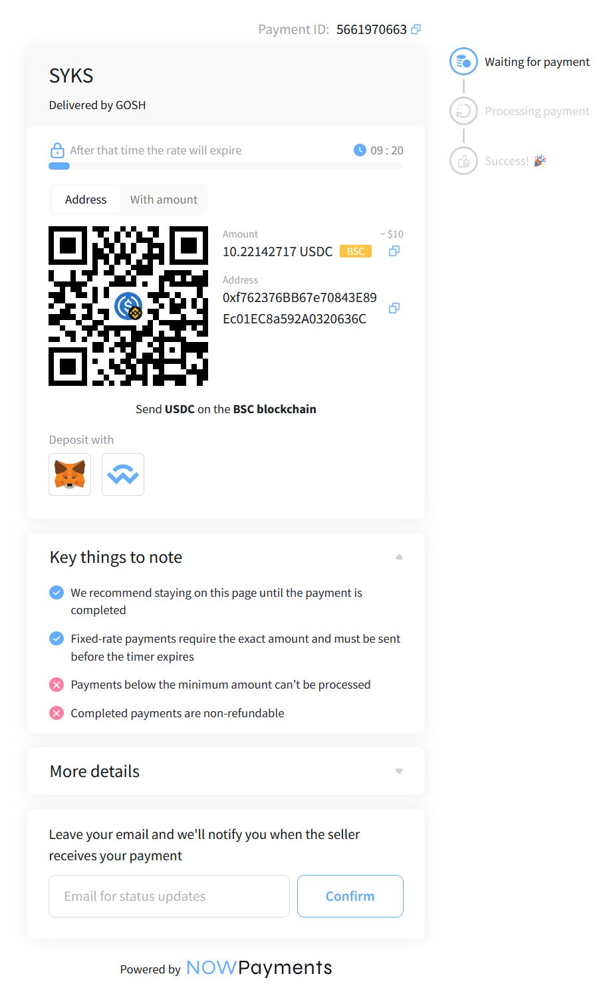<figcaption></figcaption></figure>


**Important:** send the exact amount shown. The payment must be sent before the timer expires. Payments below the minimum amount cannot be processed. Completed payments are non-refundable.


Once the payment is detected, the status changes to **Payment Processing**:

<figure>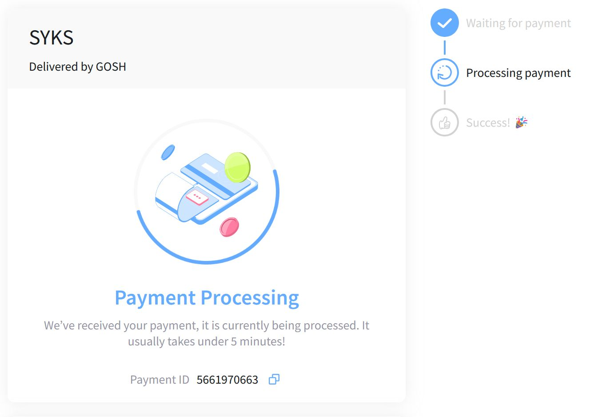<figcaption></figcaption></figure>





#### Track Your Order

After payment, the **Order Status** page shows a progress bar with five stages:

1. **PENDING** — order created
2. **PAYMENT CREATED** — payment initiated
3. **PAYMENT CONFIRMED** — payment confirmed by the provider
4. **MINTING** — SHELL tokens are being minted on the Acki Nacki chain
5. **DELIVERED** — tokens have been sent to your wallet

The **Order Details** section displays: Order ID, Status, Amount, SHELL Tokens, Payment Method, Created timestamp, Delivery Transaction link, and Delivered At timestamp.

<figure>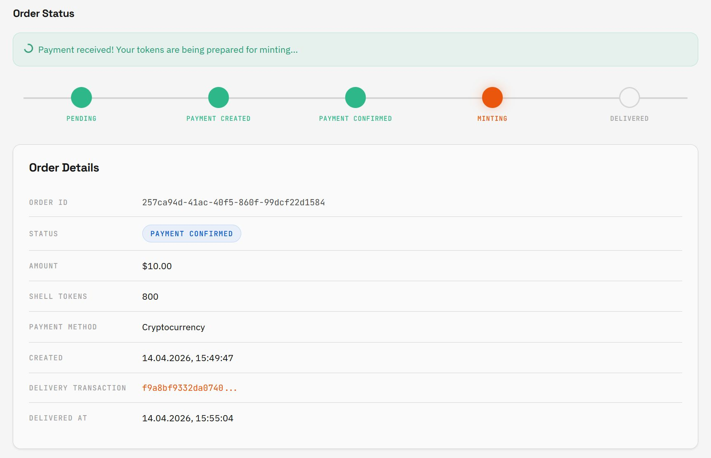<figcaption></figcaption></figure>



#### Order Delivered

When all stages are complete, the status shows **DELIVERED** with confirmation badges: **Minter** ✓ and **On-Chain** ✓. An **On-Chain Verified** timestamp confirms that the tokens have been verified on the Acki Nacki blockchain.

<figure>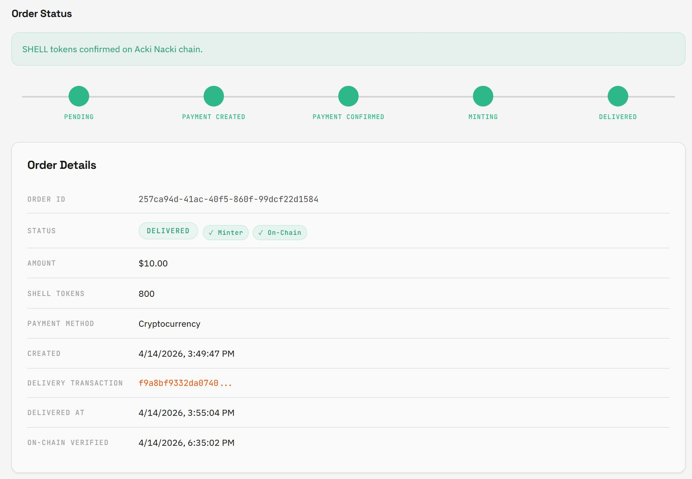<figcaption></figcaption></figure>



#### Check Your Wallet

Open your Acki Nacki Wallet. Your SHELL balance now reflects the purchased tokens (e.g. 800 SHELL).

<figure>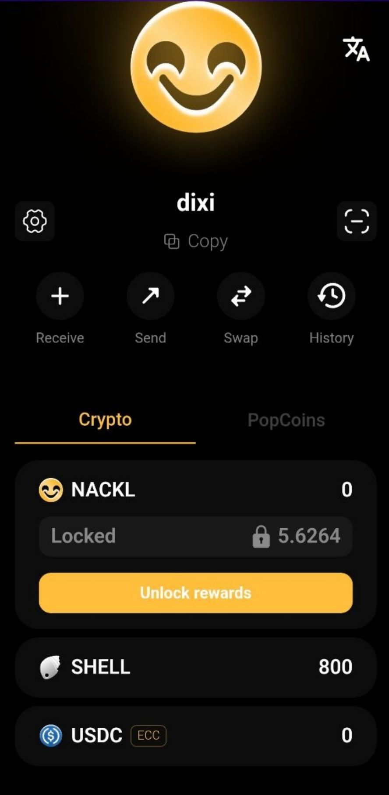<figcaption></figcaption></figure>



## Important Notes

* Payment provider fees (card processing fee, VAT) may be added depending on your country and payment method
* Processing time depends on the payment method: card payments usually take a few minutes, cryptocurrency transfers may take up to 5 minutes after confirmation
* After payment, SHELL minting and delivery happen automatically
* You can track order progress on the Order Status page at any time

## Possible Errors

| Message                  | Cause                            | Solution                                    |
| ------------------------ | -------------------------------- | ------------------------------------------- |
| Payment failed           | Payment provider error           | Try again or use a different payment method |
| Wallet connection failed | QR code expired or network issue | Generate a new QR code and try again        |
