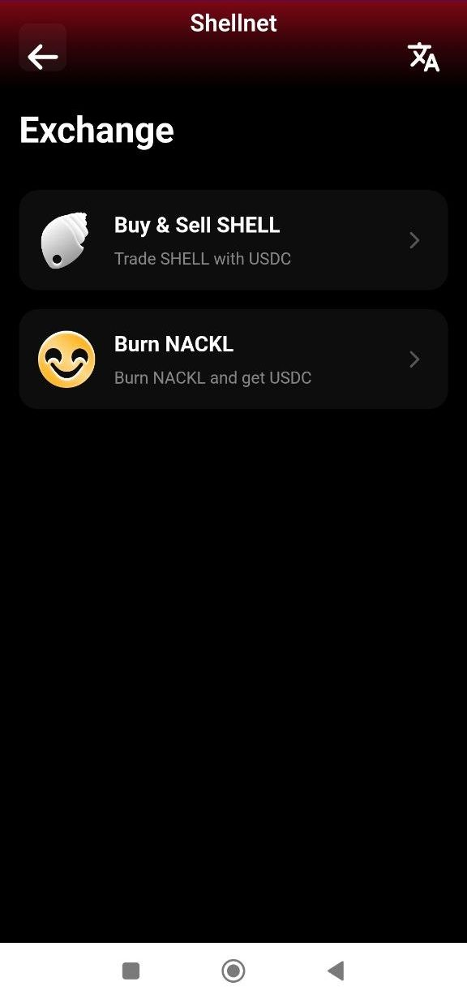
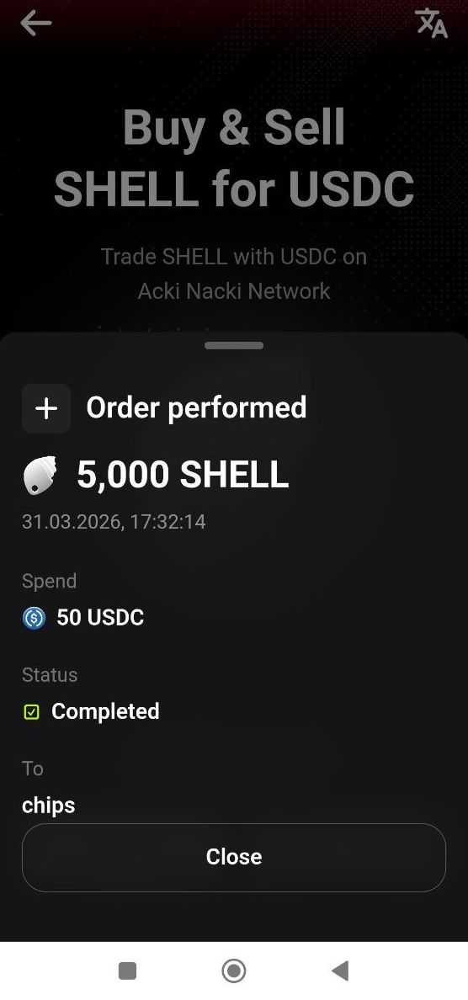
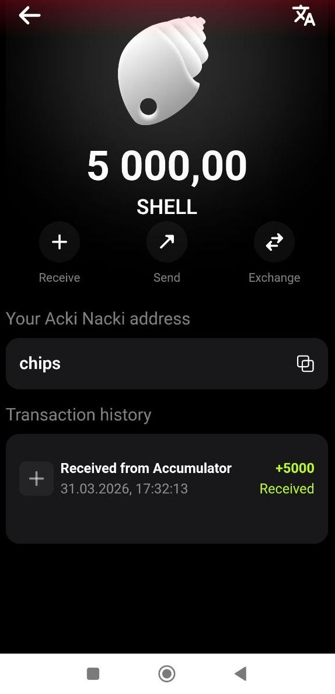

# Purchase with ECC USDC

If you already have ECC USDC in your balance, you can instantly buy SHELL directly in the Acki Nacki Wallet mobile app.

## Prerequisites

* Acki Nacki Wallet app installed
* ECC USDC in your balance (minimum 1 USDC)

## Step-by-Step Guide



#### Open the Exchange Section

On the main wallet screen, where your balances are displayed, tap the **Exchange** button  button and select **Buy and Sell SHELL**

<figure><figcaption></figcaption></figure> <figure><figcaption></figcaption></figure>




#### Select Buy

In the exchange screen, make sure the **Buy** mode is selected.

<figure><figcaption></figcaption></figure>



#### Enter the USDC Amount

In the **Select amount** field, enter the amount of USDC (ecc) you want to spend on SHELL. The system will instantly show how much SHELL you'll receive.

**Input rules:**

* Whole numbers only (1, 5, 100, etc.)
* Minimum amount — 1 USDC
* Cannot exceed your ECC USDC balance

Your current USDC balance is displayed at the bottom of the screen.

**Example:** you enter 50 USDC — the system shows you'll receive 5,000 SHELL.

<figure><figcaption></figcaption></figure>



#### Tap "Buy SHELL"

After entering the amount, tap the **Buy SHELL** button at the bottom of the screen



#### Confirm the Purchase

A confirmation screen appears with the details:

<figure><figcaption></figcaption></figure>

Tap **Confirm** to proceed or **Cancel** to go back



#### Wait for Execution

The transaction is being processed on the blockchain.



#### Purchase Complete

On success, you'll see the confirmation:

<figure><figcaption></figcaption></figure> <figure><figcaption></figcaption></figure>

Tap **Close** to return to the main screen. Your SHELL balance will update automatically.



## What Happens Under the Hood

When you buy SHELL, the system follows this algorithm:

1. Your USDC is sent to the Accumulator smart contract
2. The contract checks if there is SHELL available in seller queues
3. If sellers exist — their SHELL is transferred to you, and USDC is reserved for seller payouts
4. If there aren't enough sellers — the missing SHELL is created (minted) by the system
5. All SHELL is sent to you in a single transaction

As a buyer, it doesn't matter where the SHELL came from — you always receive exactly **amount × 100 SHELL**.

## Possible Errors

| Message                       | Cause                         | Solution                                 |
| ----------------------------- | ----------------------------- | ---------------------------------------- |
| Buy SHELL button inactive     | Amount field is empty or zero | Enter an amount greater than 0           |
| Enter a whole number          | A decimal number was entered  | Enter a whole number                     |
| Insufficient USDC ecc balance | Not enough USDC ecc           | Reduce the amount or top up your balance |
| Transaction failed. Try again | Transaction error             | Try again after a few seconds            |
