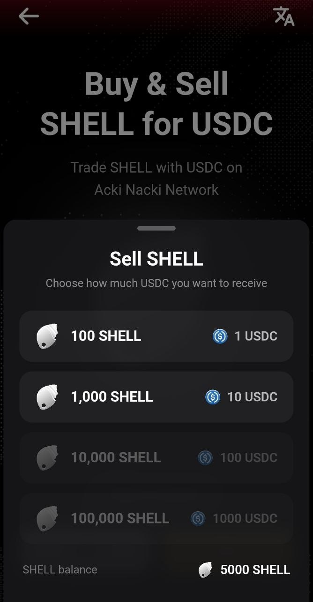
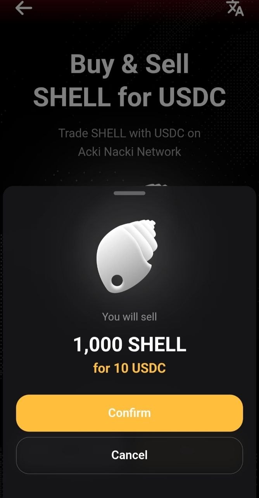
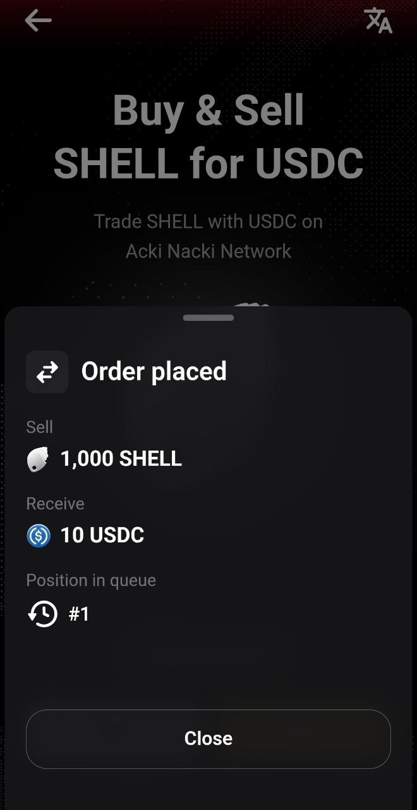
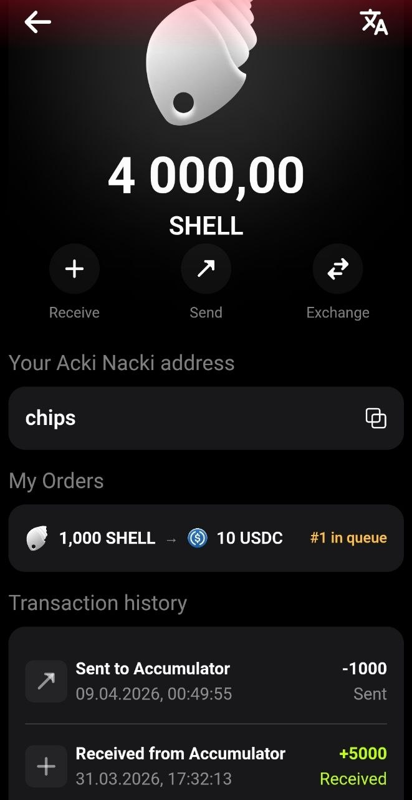
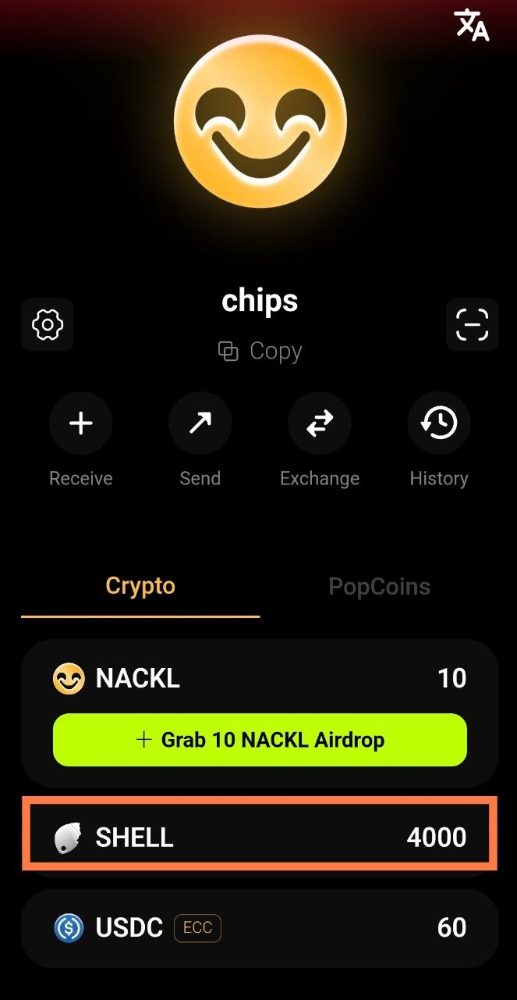
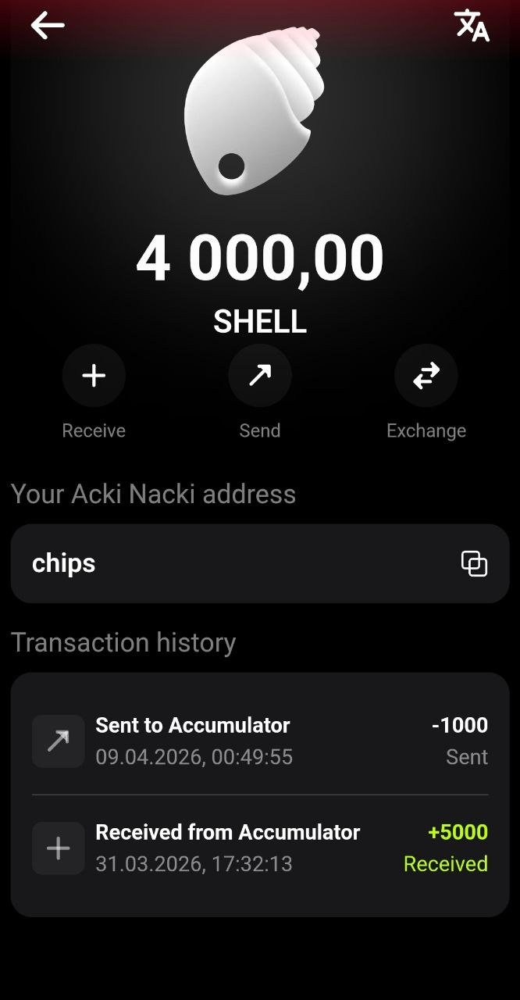

# How to Sell SHELL

Selling SHELL is done through the Acki Nacki Wallet. You choose a lot denomination, confirm — and your SHELL is locked until sold. When a buyer arrives, the lot is sold automatically on a first-come-first-served (FIFO) basis.


**Important:** once a sell order is confirmed, cancellation is not possible. \
Your SHELL will remain locked until sold.


## Prerequisites

* [Acki Nacki Wallet app](https://ackinacki.com/wallet) installed
* SHELL in your balance (minimum 100 SHELL for the smallest lot)

## Step-by-Step Guide



### Open Exchange

On the wallet's main screen, tap the **Exchange** button.

<figure><figcaption></figcaption></figure>



### Select Buy & Sell SHELL

On the Exchange screen you'll see two options. Tap **Buy & Sell SHELL** (Trade SHELL with USDC).

<figure><figcaption></figcaption></figure>



### Switch to Sell

On the "Buy & Sell SHELL for USDC" screen, two buttons are displayed at the bottom: **Sell** and **Buy**. Tap **Sell**.

<figure><figcaption></figcaption></figure>



### Choose a Lot Denomination

The **Sell SHELL** panel opens with the prompt "Choose how much USDC you want to receive." Four denominations are available:

|    You Sell   | You Receive |
| :-----------: | :---------: |
|   100 SHELL   |    1 USDC   |
|  1,000 SHELL  |   10 USDC   |
|  10,000 SHELL |   100 USDC  |
| 100,000 SHELL |  1,000 USDC |

Denominations that exceed your SHELL balance are unavailable. Your current SHELL balance is displayed at the bottom of the screen.

Tap the desired denomination. In this example, the **1,000 SHELL → 10 USDC** lot is selected.

<figure><figcaption></figcaption></figure>



### Confirm the Sale

A confirmation screen appears:

<figure><figcaption></figcaption></figure>

Tap **Confirm** to proceed or **Cancel** to go back.



### Order Placed

After confirmation, you'll see a screen with the order details:

* **Sell:** 1,000 SHELL
* **Receive:** 10 USDC
* **Position in queue:** #1

The queue number shows how many lots of this denomination are ahead of you. The lower the number, the sooner your lot will be sold.

Tap **Close** to return.

<figure><figcaption></figcaption></figure>



### Check the Result

After placing the order:

* Your SHELL balance decreased (was 5,000, now 4,000 — 1,000 SHELL is locked)
* The SHELL token screen now shows a **My Orders** section with your lot and its queue position

<figure><figcaption></figcaption></figure>

Your SHELL balance on the main wallet screen updates automatically.

<figure><figcaption></figcaption></figure>



## How to Sell a Larger Amount

Each transaction creates one lot of one denomination. To sell more SHELL, simply repeat the process multiple times, choosing the denominations you need.

**Example:** you want to sell 15,400 SHELL (= 154 USDC). Create lots:

1. 1 × 100,000 SHELL (= 1,000 USDC) — if you have enough balance, or skip
2. 1 × 10,000 SHELL (= 100 USDC)
3. 5 × 1,000 SHELL (= 5 × 10 USDC)
4. 4 × 100 SHELL (= 4 × 1 USDC)

Each lot joins its denomination's queue independently and is sold separately.

## Denominations Work Like Banknotes

The system uses four fixed denominations, similar to paper bills. A lot can only be sold in full — partial selling is not possible.

Choosing a denomination is a trade-off:

* **Smaller denominations** (1, 10 USDC) — sell faster, as even small purchases can fill them
* **Larger denominations** (100, 1,000 USDC) — fewer transactions needed, but may take longer to find a buyer

## Transaction History

On the SHELL token screen, the **Transaction history** section shows all operations:

* **Sent to Accumulator** — SHELL locked when the sell order was placed
* **Received from Accumulator** — SHELL received (from a purchase)

<figure><figcaption></figcaption></figure>

## What Happens Next

After placing your order, your lot waits in the queue. Learn more about status tracking: [Tracking Your Orders](/broken/pages/31c5d607b90a0484f3f75aebbe9f54e770806288). About receiving USDC after the sale: [Receiving USDC (Claim)](/broken/pages/4a68c01959125f6dcd554e0a91ed8733b8b21b6f).

## Possible Errors

| Message                               | Cause                                  | Solution                      |
| ------------------------------------- | -------------------------------------- | ----------------------------- |
| Denomination unavailable (grayed out) | Not enough SHELL for this denomination | Choose a smaller denomination |
| Transaction failed. Try again         | Transaction error                      | Try again                     |
