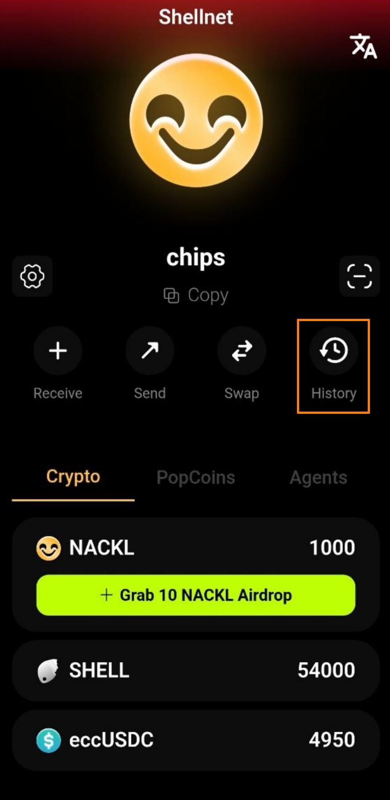
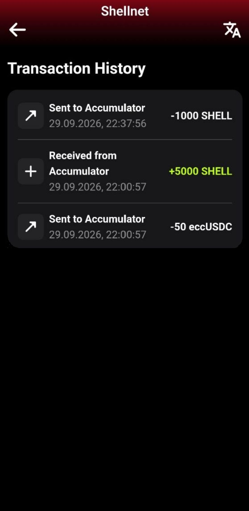

# Tracking Your Orders

After placing an order to convert SHELL to eccUSDC, you can track the status of each lot in the Acki Nacki Wallet.

## Where to Check Status

Open the SHELL token screen (tap the SHELL row on the main screen). The **My Orders** section displays all your active sell orders.

For each lot, you can see:

* The SHELL and eccUSDC amounts (e.g., 1,000 SHELL → 10 eccUSDC)
* Your position in the queue (e.g., **#1 in queue**)

<figure><figcaption></figcaption></figure>

## Lot Statuses

Each lot goes through three states:

| Status                     | Description                                                                                            |
| -------------------------- | ------------------------------------------------------------------------------------------------------ |
| **In queue** (#N in queue) | Lot is in the queue waiting for a buyer. The number shows your position                                |
| **Sold**                   | Lot has been sold; eccUSDC is ready for collection                                                     |
| **Claimed**                | 
eccUSDC has been received in your balance After that, the order disappears from the section.
 |

### How Quickly Are Lots Converted?

Lot processing speed depends on the activity of users converting eccUSDC to SHELL. The main factors are:

* **Denomination:** lots with smaller denominations (1 and 10 eccUSDC) are typically processed faster because even small conversions can fill them.
* **Queue position:** the lower the number, the sooner your lot will be processed. Position #1 means your lot will be processed first.
* **Conversion priority:** the system processes queues from larger to smaller denominations (1,000 → 100 → 10 → 1). For large conversions, 1,000 eccUSDC lots are processed first, followed by 100 eccUSDC lots, and so on.

### Transaction History

The **History** section on the main screen displays all transactions:

* **Sent to Accumulator** — SHELL locked when placing an order to convert SHELL to eccUSDC.
* **Received from Accumulator** — SHELL received as a result of converting eccUSDC to SHELL.

Each transaction includes the date, time, and amount.

<figure><figcaption></figcaption></figure> <figure><figcaption></figcaption></figure>

## Multiple Lots

If you created multiple lots (different or same denominations), each lot is displayed separately in the **My Orders** section. Lots are processed independently—the conversion and payout for each lot are completed separately.

### No Active Orders

If you have no active conversion orders, the **My Orders** section is not displayed.

