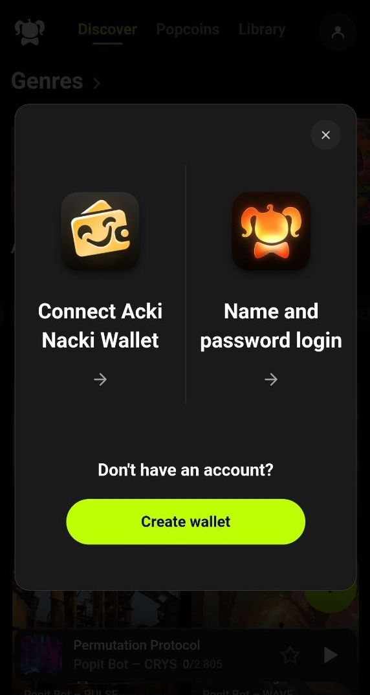
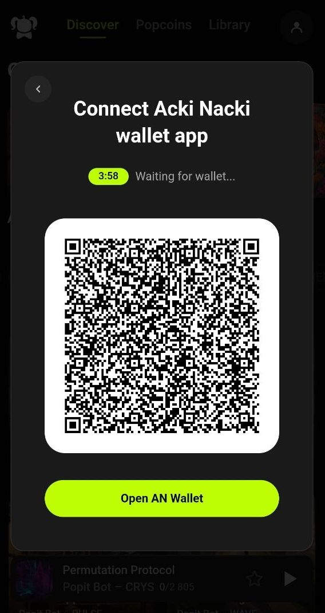
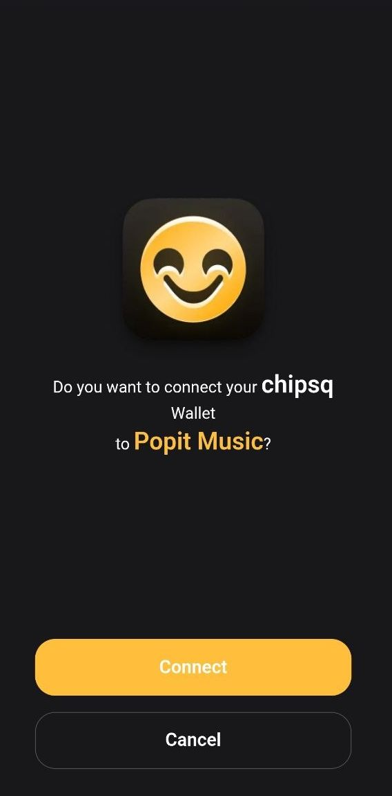
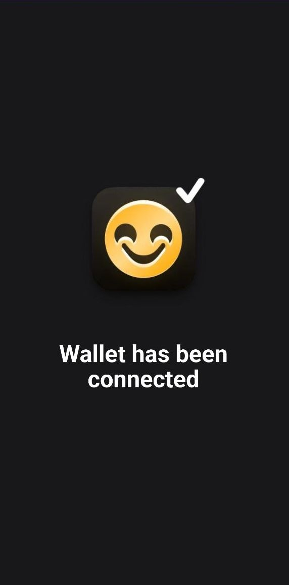
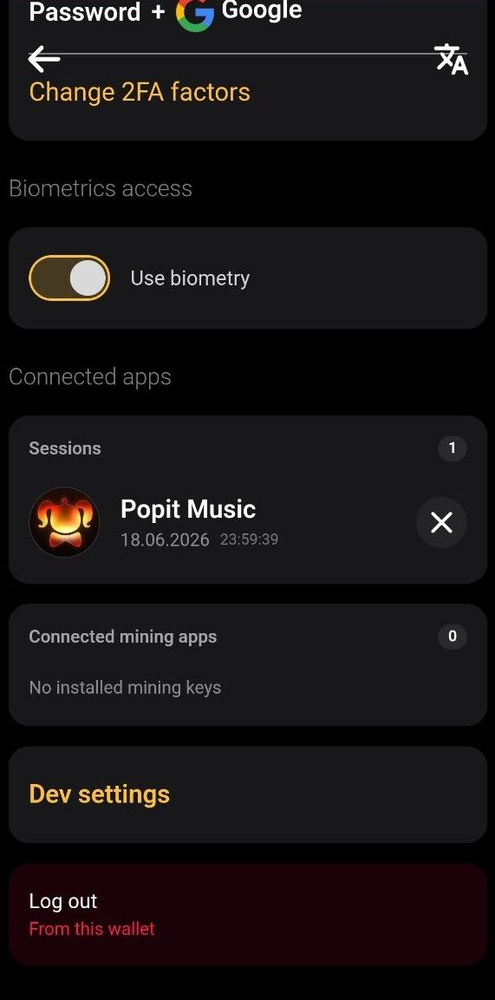
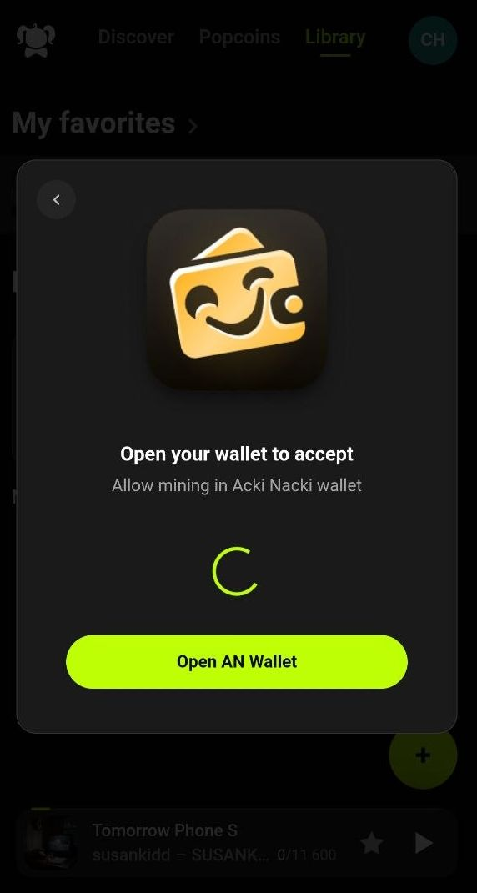
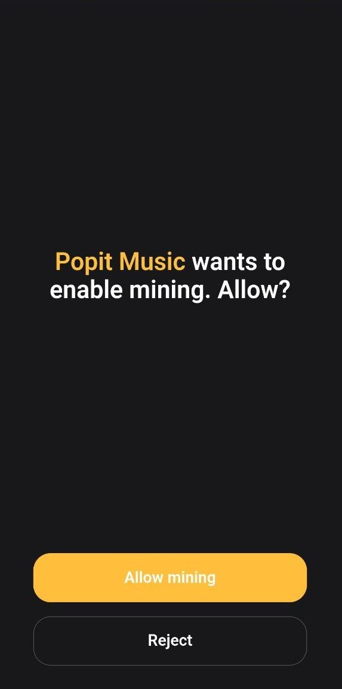
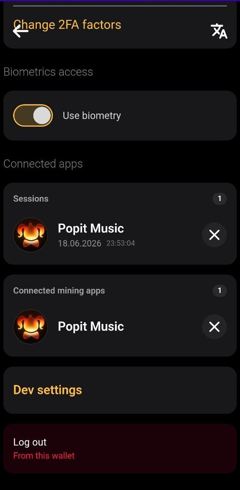
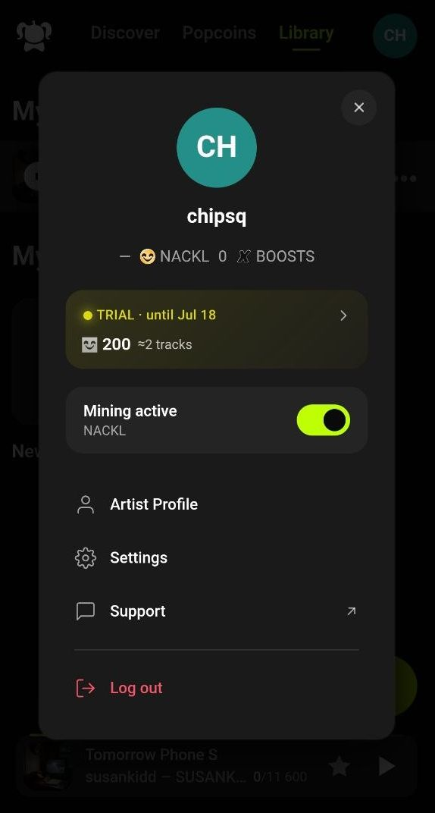

# Connecting an Acki Nacki Wallet and Setting Up Mining Keys

### Overview

Applications integrated with the Acki Nacki ecosystem typically require two types of permissions: Wallet Authentication and Mining Authorization

Applications may handle wallet connection and mining authorization differently.

Some applications combine both actions into a single approval flow. Others, such as **Popit Music**, require them to be completed separately:

1. **Wallet Authentication** — connect your AN Wallet and create a secure session.
2. **Mining Authorization** — allows an application to use Mining Keys associated with your wallet for NACKL mining activities.

The examples in this guide use **Popit Music** to demonstrate the two-step setup process.

> **What are Mining Keys?**
>
> **Mining Keys** are cryptographic keys associated with your Acki Nacki Wallet that allow approved applications to participate in NACKL mining on your behalf.
>
> When you grant mining access, you are **not sharing your wallet ownership or private keys**. Instead, you authorize a specific application (such as Popit Music) to use dedicated mining permissions linked to your wallet for earning mining rewards.
>
> Mining Keys can be managed, revoked, or reassigned at any time in **AN Wallet → Settings → Connected Mining Apps**.

***

## Step 1 — Wallet Authentication

Wallet Authentication creates a secure connection between your AN Wallet and the application.

### 1. Select Connect AN Wallet

Open the application and tap **"Connect or sign in",**\
then choose: "**Connect Acki Nacki Wallet"**

<figure><figcaption></figcaption></figure>

***

### 2. Scan the QR Code

Popit Music displays a QR code for wallet connection.\
Open AN Wallet and **scan the QR** code or tap "**Open AN Wallet**" and you will be redirected directly to your wallet

<figure><figcaption></figcaption></figure>

***

### 3. Enter Your Wallet Password

AN Wallet requests your password to approve the authentication request.

<figure><figcaption></figcaption></figure>

***

### 4. Approve the Connection Request

Review the request details and confirm the connection.

<figure><figcaption></figcaption></figure>

When approved:

* Wallet ownership is verified
* Wallet identity is shared with the application
* A secure application session is created

The application receives:

* Wallet Name
* Wallet Address

No private keys, passwords, or seed phrases are shared.

***

### 5. Wallet Authentication Completed

The wallet confirms that the connection has been established.

<figure><figcaption></figcaption></figure>

***

### 6. Verify Connected Applications (Optional)

You can review active application sessions in:

**AN Wallet → Settings → Connected Apps**

<figure><figcaption></figcaption></figure>

***

## Step 2 — Mining Authorization

Mining Authorization allows the application to use Mining Keys for NACKL mining activities.

> Wallet Authentication alone does not grant mining permissions.
>
> Applications that use a two-step setup require a separate Mining Authorization approval.

***

### 1. Open Mining Setup

In Popit Music, in the user settings select: "**Setup Mining Keys"**

<figure><figcaption></figcaption></figure>

***

### 2. Request Mining Access

Popit Music is requesting permission to enable mining. Tap "Request Mining".\
The application will redirect you to AN Wallet. To continue, tap "Open AN Wallet".

<figure><figcaption></figcaption></figure> <figure><figcaption></figcaption></figure>

***

### 3. Review Mining Permission Request

AN Wallet displays the mining authorization request. Select "**Allow Mining"** if you permit mining

<figure><figcaption></figcaption></figure>

***

### 6. Verify Connected Mining Applications

After approval, the application appears under:

**AN Wallet → Settings → Connected Mining Apps**

<figure><figcaption></figcaption></figure>

***

### 7. Mining Activated

Return to the application. Mining is now active and Mining Keys have been successfully assigned.

<figure><figcaption></figcaption></figure>

***

## Managing Permissions

### Connected Apps

Connected Apps are applications authorized to access your wallet identity and maintain an authenticated session.

Location: **AN Wallet → Settings → Connected Apps**

**Screenshot:** `5-w-settings.jpg`

<figure><figcaption></figcaption></figure>

***

### Connected Mining Apps

Connected Mining Apps are applications authorized to use Mining Keys.

Location: **AN Wallet → Settings → Connected Mining Apps**

**Screenshot:** `12-w-settings.jpg`

<figure><figcaption></figcaption></figure>

***

### Revoke Access

To remove an application:

1. Open AN Wallet Settings
2. Locate the application
3. Tap the **X** icon
4. Confirm removal

The application will immediately lose the associated permission.

<figure><figcaption></figcaption></figure> <figure><figcaption></figcaption></figure>

