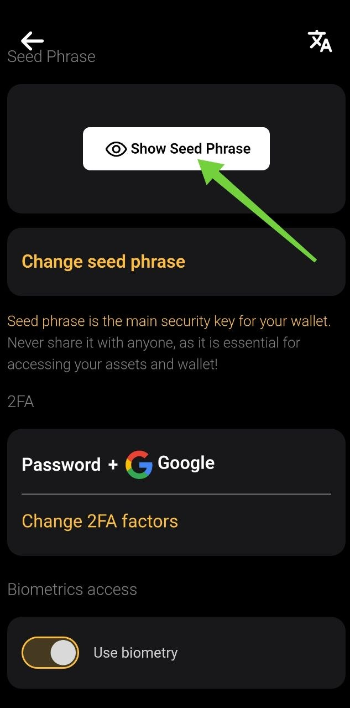
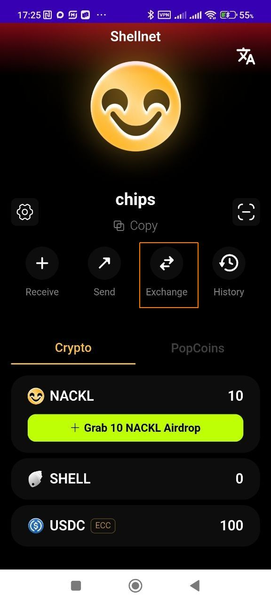
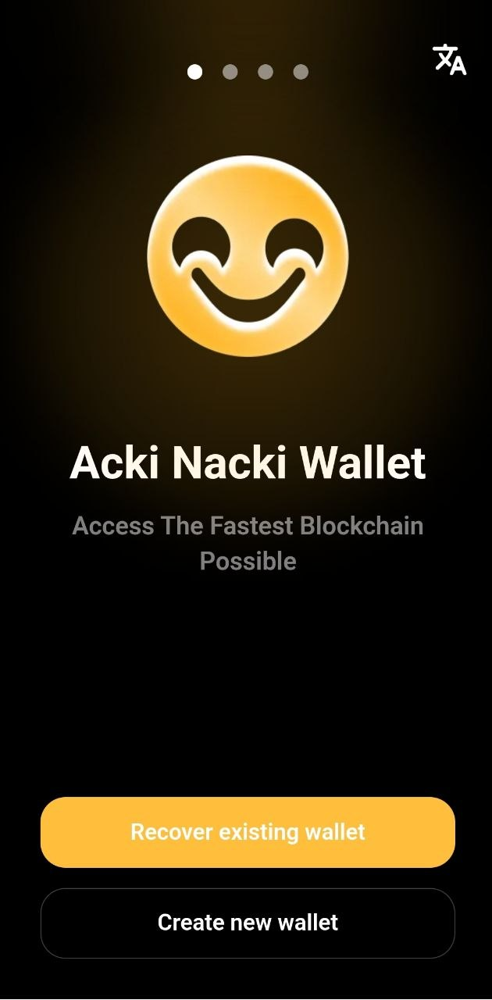
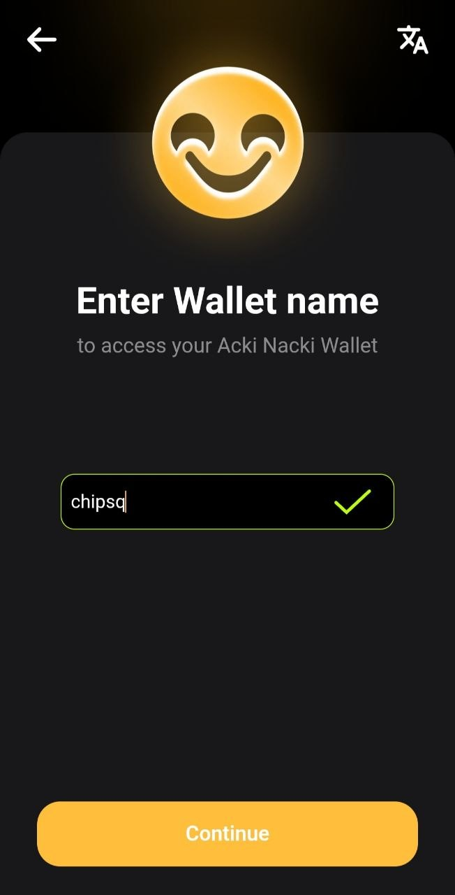
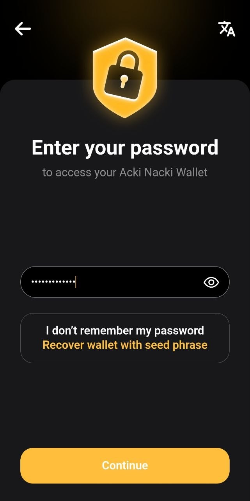
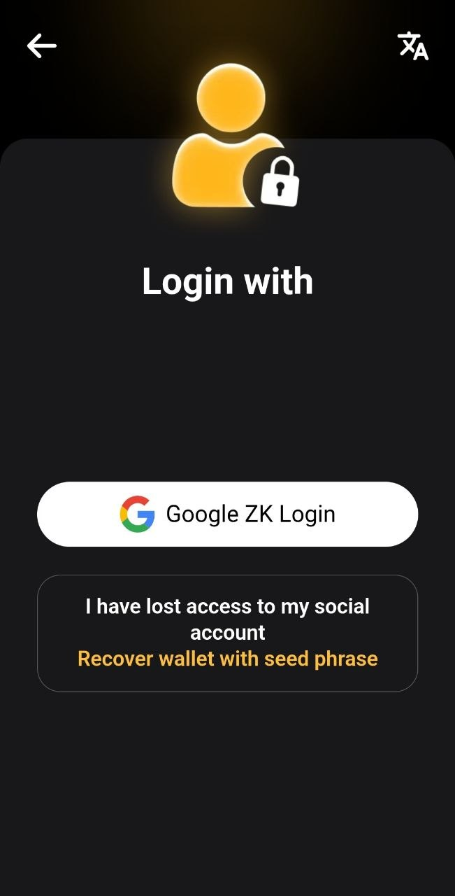
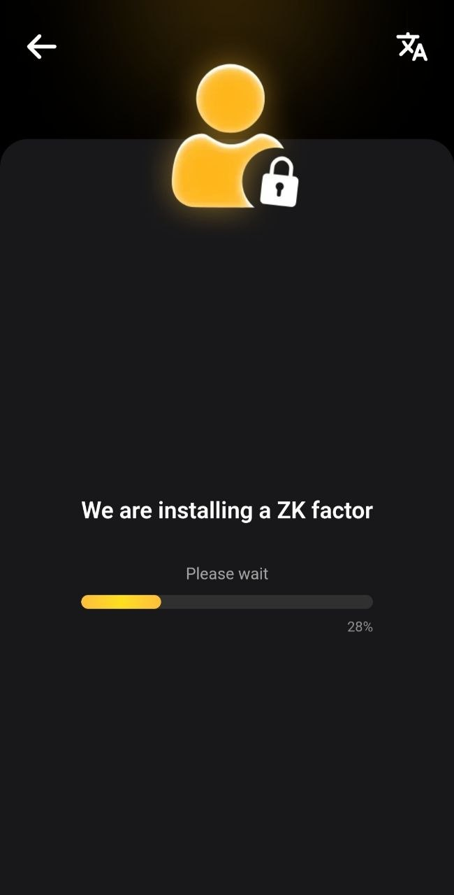

# What to Do if Your Authentication Factor Has Expired

If AN Wallet shows **Security factor expired**, you need to refresh the ZK factor by signing in again with the same wallet name and the same social account.

<figure><figcaption></figcaption></figure>

While the security factor is expired, wallet operations will not work. This also affects connected features that depend on the wallet, including mining keys.


**The ZK factor lets AN Wallet confirm that you signed in with the correct social account without publicly linking that account to your wallet on-chain**. When the factor is valid, the wallet can use it for operations without asking you to complete the full social sign-in flow each time. When it expires, you need to sign in again to refresh it.


### Before You Sign Out


**Before signing out, make sure you know your seed phrase and that it is saved in a secure place.**\
You may need the seed phrase to restore access to your wallet.


<figure><figcaption></figcaption></figure>

### Refresh the Authentication Factor

#### 1. Sign Out of the Wallet

Open the AN Wallet settings and sign out by tapping "Log Out" at the bottom of the screen.

<figure><figcaption></figcaption></figure>

***

#### 2. Sign In Again

Launch the AN Wallet flow again. On the sign-in screen, select the option "Recover existing wallet".

<figure><figcaption></figcaption></figure>

***

#### 3. Sign In with the Same Wallet Details

Use exactly the same wallet name that you used before signing out, enter the wallet password, and sign in with the same social account that were used for this wallet (Google, Facebook or Telegram).

<figure><figcaption></figcaption></figure> <figure><figcaption></figcaption></figure> <figure><figcaption></figcaption></figure>

***

#### 4. Confirm the New ZK Factor

After successful sign-in, AN Wallet will set up a fresh ZK authentication factor for your wallet.

<figure><figcaption></figcaption></figure>

### Result

Your authentication factor is refreshed. You can continue using the wallet with the same wallet name and the same social authentication factor.
