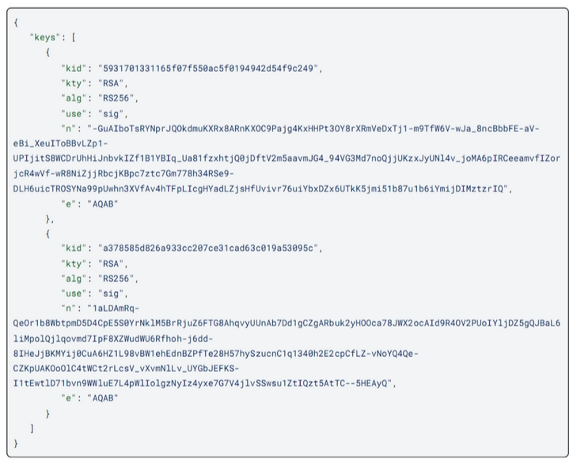

# ZK Login Authentication Flow

## Overview

Aсki Naсki employs an Zk-auth authentication scheme for conducting Multi-factor Wallet smart-contract transactions. Zk-auth is based on the OpenID Connect protocol and zk-SNARK system Groth16. It combines convenience for users and security. Transactions are confirmed via existing OpenID credentials. Multiple OpenID based providers like Google, Facebook, Apple etc are already supported by Zk-auth, and we are going to extend the list. The anonymity is preserved. Blockchain accounts and OpenID accounts are not publicly linked. This is achieved using zk-SNARK.

Zk-auth allows for quick authentication. The user is not burdened with remembering cumbersome seed phrase in the majority of cases. But we still use seed phrase for recovery.

Our scheme is inspired by [zkLogin](https://arxiv.org/abs/2401.11735).  But we modify it by removing extra service for salt back up since the corrupted salt service may deanonymize the link between blockchain account and OpenID account. To prevent possible privacy violations we replace the server-generated salt with a user-owned Password that is self-maintained by the user.\
Also, we add the ability to recover access to Wallet smart-contract in accidental cases like the loss of device or OpenID credentials.

Our multi-factor authentication scheme allows users not to input any extra information to confirm transactions while the JWT token is valid and not expired. So the user story is rather simple. At the same time, an attacker who compromised OpenID credentials cannot transact unless he separately compromised the user-owned Password.

If the user has lost the device and Password, he still will be able to restore access and at the same time to prevent the adversary from using the wallet.

Let’s summarize the properties that Zk-auth provides:

* In the majority of cases, one may transact on Acki Nacki using the familiar OpenID authentication flow. However, we do not eliminate the necessity in mnemonics to provide the ability to recover access to Wallet.
* Transaction requires approval from the user via the standard OpenID credentials, but the OpenID provider (or attacker who compromised an OpenID account) cannot transact himself, pretending to be the user. This is provided by extra user-owned Salt Password and by the fact that the OpenID provider does not know the matching between blockchain accounts and OpenID accounts. The last one is achieved using zero-knowledge proofs.


At the present moment we support the following list of OpenID providers: Google, Facebook, AWS, Twitch, Apple, Slack, Kakao, Microsoft, KarrierOne, Credenza3.


## Multi-factor Wallet initialization

To initialize a Multi-factor Wallet, the user must have valid OpenId credentials (for example related to Google email). Also, there are some extra secrets that the user creates during signUp to handle the access to Multi-factor Wallet: Salt Password, Recovery Password and Seed Phrase.

At first the user creates the **Salt Password**. It must be simple and convenient to remember and use it. At second the user creates a strong **Recovery Password**, meeting certain security conditions: be long enough and contain both digits and special characters. Finally **Seed Phrase** is generated by a Client Application exploited by the user. All this data is produced just before Multi-factor Wallet smart-contract deploying, and it is used for deployment.&#x20;


<mark style="color:red;">The user should store</mark> <mark style="color:red;"></mark><mark style="color:red;">**Salt**</mark> <mark style="color:red;">**Password, Recovery Password,**</mark> <mark style="color:red;"></mark><mark style="color:red;">and your</mark> <mark style="color:red;"></mark><mark style="color:red;">**Seed Phrase**</mark> <mark style="color:red;"></mark><mark style="color:red;">in a secret place.</mark>&#x20;


Directly before Multi-factor Wallet smart-contract deployment, Seed Phrase and Recovery Password are used by Client Application to derive corresponding ed25519 keypairs (_SK\_SeedPhrase, PK\_SeedPhrase_) and (_SK\_Recovery, PK\_Recovery_). Also, Poseidon hash _zkID_ is computed based on OpenID account data (stable id) and user-owned Password.  _zkID_ hash is used to link Multi-factor Wallet smart-contract and OpenID account, but anonymously.&#x20;

So for deployment of Multi-factor Wallet smart-contract the following triple is prepared: hash _zkID_, ed25519 public key _PK\_SeedPhrase_ and  ed25519 public key _PK\_Recovery_.


This Client Application does not backup user-owned Password, Recover Password, Seed Phrase and related secret keys. It will store only fresh JWT token related to OpenId Connect, zero-knowledge proof and some extra data, which we will discuss in more detail below.



Issuer value on the diagram below is a string identifying OpenId provider like Google, Facebook etc.


<figure><figcaption></figcaption></figure>

## Transactions Authentication sketch

Key aspects of transacting with OpenID credentials:

* A **JWT** is a signed access token obtained from an OpenID provider, containing a payload that includes a field named 'nonce'. We add into nonce: user’s temporary ephemeral public key, timestamp of its expiration and some extra randomness.
* **Client Application** generates and stores the temporary ephemeral key pair, where the ephemeral public key is added into nonce of JWT. The ephemeral private key is used to sign transactions during some predetermined period of time (\~ 2 weeks), eliminating the need for the user to back it up.
* The Groth16 zero-knowledge proof is generated based on JWT. The aim is to prove that the user really owns an OpenID account, i.e. has a related signed valid JWT. However, JWT contains fields deanonymizing users. Thus we generate zero-knowledge proof per JWT to hide some JWT fields.
* A transaction is submitted on-chain being signed by an ephemeral secret key and supplied with valid zero-knowledge proof. TVM executes the transaction after verifying the ephemeral signature and the zero-knowledge proof.

## Main Entities

* **Application frontend (Client Application)**: This is the Client frontend application that supports our flow to create and authenticate transactions. Client Application is responsible for deploying Wallet smart-contract with valid user's data, storing the ephemeral private key, maintaining OpenID, creating and signing transactions.
* **Proof Service**: This is a backend service responsible for generating zero-knowledge proofs based on JWT, extra randomness, Salt Password and expiration timestamp (for ephemeral keypair). The proof is submitted on-chain along with the ephemeral signature for the transaction.


The delegation of zero-knowledge proof computation to the extra Proof Service backend is a necessary step for now. This is motivated by the fact that the protocol deals with non-ZK-friendly cryptographic primitives: SHA-2, modular exponentiation for RSA signature verification. It causes an essential number of R1CS constraints in the corresponding circuit that was written for Zk-auth protocol in Circom language. Our circuit was essentially inspired by [zkLogin](https://docs.sui.io/concepts/cryptography/zklogin) existing  implementation. We did only very small optimizations for the part related to JWT token parsing. But the circuit is still cumbersome and has about 2^20 constraints. This makes the proof computation impractical in Client Application. That’s why following the experience of [zkLogin](https://docs.sui.io/concepts/cryptography/zklogin) we chose to delegate proof computation to a powerful service. The corruption of Proof Service (corruption = control by the adversary) will lead to deanonymization immediately. The adversary in this case gets access to JWT token and user-owned Salt Password, he can calculate _zkId_ and discover the link between blockchain and OpenID  accounts. However user Wallet assets are still safe and can not be maintained by the adversary. Since the related JWT token ephemeral private key  is still hidden, and the adversary can not create a valid signature for the transaction.  Only corrupting both Proof Service and OpenID provider is required to steal the Wallet. Since in this case the adversary may create a valid JWT token for his new independent ephemeral key pair and then he will be able to provide valid proof per JWT and sign the transaction by his ephemeral private key.

Since the problem of deanonymization exists in the case of Proof Service corruption, we continue researching the possibility to compute proofs on the client's side. Some extra circuit optimizations are required to reduce the number of constraints. This problem is still under review.


## Keys priorities and loss case handling

(_**SK\_SeedPhrase, PK\_SeedPhrase**_) – master key pair that is used to maintain Multi-factor Wallet smart-contract. It is used for recovery. Knowledge of _SK\_SeedPhrase_ (Seed Phrase) allows one to change _zkID_ or _PK\_RecoveryPassword_ in contract.


To change _PK\_SeedPhrase_ in contract one should have: access to OpenID account, Salt Password, Recovery Password.


We have protection against several of the most likely accident scenarios of loss.

* **If mobile device and/or access to OpenID account and/or Salt Password are lost**, then use Seed Phrase to change _zkID_ in Multi-factor Wallet smart-contract.
* **If Recovery Password is lost**, then use Seed Phrase to replace  _PK\_RecoveryPassword_ by fresh  _PK\_NewRecoveryPassword_ in contract.
* **If Seed Phrase is lost**, then the user must have a mobile device with not yet expired JWT, related zero-knowledge proof and Recovery Password. It allows one to change PK\_SeedPhrase in contract.
* **If Seed Phrase is lost and mobile phone is lost (or JWT is expired)**, then to change _PK\_SeedPhrase_ the user needs OpenID account access, Salt Password and Recovery Password.


For now, it is the responsibility of a user to make a strong Recovery Password and backup it. The ideal Recovery Password is the second Seed Phrase, but this is too cumbersome. So our requirements for the Recovery Password are more lightweight.



(_SK\_RecoveryPassword, PK\_RecoveryPassword_) is a key pair that is used only in the case the Seed Phrase was lost by the user.


## Multi-factor Wallet transactions maintenance details

### Transaction WITH signIn to OpenID provider

At the first time the user starts with signIn to the relevant OpenID account. To make a signIn request, the user generates an ephemeral random temporary ed25519 key pair (_SK\_e, PK\_e_). Public key _PK\_e_, its expiration timestamp _T\_max_ and extra generated randomness _R_ are concatenated and the concatenation is hashed using Poseidon hash function. The hash is put into a 'nonce' field that is added into a semi-finished JWT token prepared by Client Application. JWT payload is sent to the OpenID provider together with standard  authenticating data. OpenID provider authenticates the user,  signs JWT payload with public fresh JWK RSA private key and sends signed JWT back. Signed JWT is used as a certificate for _PK\_e_ issued by an OpenID provider.

Since we want to provide anonymity, we can not send JWT into Wallet smart-contract to prove that the user is a valid owner of an OpenID account embedded into both JWT and _zkID_ previously stored by contract. Instead, we produce zero-knowledge Groth16 proof to prove that the user really got such JWT. And the contract verifies the zk-proof.

We suppose that the Client Application will run on a device having small computational power. Groth16 proof calculation is computationally hard, that's why we can not handle it on mobile devices. We deploy our own Proof service for computing proofs. Client Application sends a request to Proof service providing as input JWT and Salt Password. Private input to calculate zk-proof contains the following data: signed JWT, Salt Password, extra randomness _R_ used for nonce computation. Public input consists of ephemeral public key _PK\_e_, its expiration timestamp _T\_max_, OpenID provider public RSA JWK key, _zkID_. The Proof service generates zero-knowledge proof for a related Zk-auth arithmetic circuit (AC) that takes aforementioned private and public inputs. Zk-auth AC does the following computations:

* partially parse JWT token (payload);
* checks that `nonce` claim  in JWT is correctly formed, \
  i.e. `nonce = Poseidon(PK_e || T_max || R)`;
* checks that `iss` claim in JWT contains the valid OpenID provider name;
* verifies the RSA signature (third part of JWT token) that was done by OpenID provider using his private JWK key for this JWT (recall that JWT header and payload of JWT are signed by provider using RSA private key).&#x20;
* checks that _zkID_ is correct, \
  i.e. _`zkID`_` ``= Poseidon(stable id || issuer || Salt Password)`


`iss` claim in JWT token is constant identifying OpenId provider. \
For example, for Google `iss` claim equals to "[https://accounts.google.com](https://accounts.google.com)".



The extra randomness _R_ during nonce computation is added to strengthen unlink ability between blockchain and OpenID accounts. The data about ephemeral public keys is publicly available in blockchain. More particularly, Wallet contract stores _zkID_ and fresh ephemeral public key. Hence, an honest but curious OpenID provider knowing stable ids of all his users can carry out dictionary attack to deanonymize blockchain accounts.

Groth16 zk-proof computed by Proof Service is sent to Wallet smart-contract to authenticate the user. To prevent the case of malicious Proof service pretending to be the user and some other possible attacks, an extra step into the authentication process is added. The user must sign a message sent into the Wallet smart-contract by _SK\_e_ that only the user knows.




There is a single public key pair (_proof\_key, verify\_key_) generated during the trusted setup phase called Powers-of-tau ceremony, which we describe in a separate document. This key pair is generated only once and depends on a related Zk-auth AC that we briefly discussed already. This key pair is not a secret and used for all clients later.  Proof service uses _proof\_key_ (that is the same for everyone) to generate proofs. In the meantime, _verify\_key_ (that is also public) is embedded into TVM that has a  respective instruction VERGRTH16, using this key to verify zero-knowledge proofs. The last instruction is used by the Multi-factor Wallet smart-contract.

The described process is fulfilled by the user at the first time. And then each time when the keypair (_SK\_e, PK\_e_) becomes expired, the user must relogin to get a fresh JWT for the new _PK\_e_. But until _PK\_e_ is not expired, Client Application must store and use JWT and related zero-knowledge proof generated by Proof service. The frequency of OpenID relogin is regulated by us, since we choose _T\_max_ ourselves and completely ignore standard `exp` claim in JWT that is set by the OpenID provider.&#x20;

Let’s summarize how a transaction is conducted at the first time (or if an ephemeral key pair/JWT  is expired).

* The user makes a signIn in an OpenID account, gets signed JWT  and requests zk-proof for it from Proof service using Salt Password.
* The user sends to the Multi-factor Wallet contract fresh zk-proof and related _PK\_e, T\_max_, OpenID JWK RSA public key data.
* Multi-factor Wallet contract checks that _T\_max_ is not expired valid Unix timestamp. Then it verifies zk-proof using VERGRTH16 instruction. The public data used for zk-proof verification: _PK\_e, T\_max_, OpenID JWK RSA public key and _zkID_. If _T\_max_ is not expired  and zk-proof is valid, then the Wallet contract saves a pair (_PK\_e, T\_max_) into mapping \_factors.
* The user sends a message/transaction to Wallet to transfer some amount. The message is signed by _SK\_e_. Multi-factor Wallet contract checks that the related public key _PK\_e_ was previously added into mapping _\_factors_ and its timestamp _T\_max_ is not smaller than the latest block time. If this is true, then transfer will be done.



The secret key _SK\_e_ is stored in local storage in the browser or secure storage/element in a smartphone, locked by standard passkey.



The _T\_max_ timestamp aimed to limit operation time of ephemeral keypair (_PK\_e, SK\_e_). Using the parameter _T\_max_ we maintain the required reasonable frequency of OpenID relogin to handle Wallet transactions. We must keep a balance between security and user comfort. It’s reasonable to choose _T\_max_ quite big to avoid cumbersome using experience to relogin too often. But the user always has an option to add/change ephemeral keypair at any moment of time. At the same time multiple ephemeral key pairs could be handled by the Wallet contract for the same OpenId account (for example each key pair per new device).


<figure><figcaption></figcaption></figure>

### Transaction WITHOUT signIn to OpenID provider

This is the case when the user has not expired ephemeral key pair (_SK\_e, PK\_e_), for which public key _PK\_e_ was previously added into the Multi-factor Wallet contract (like we described above). Then the user sends only a message signed by _SK\_e_. Multi-factor Wallet contract checks that the related public key _PK\_e_ was previously added into mapping \_factors and _T\_max_ is fresh. If this is true, then the message will be accepted by contract.


We minimize the number of VERGRTH16 instruction calls to achieve the best transaction performance. VERGRTH16 is quite cumbersome. So the user calls it only once for a fresh JWT zk-proof. The Wallet contract validates zk-proof. If it’s ok, then it saves the related ephemeral public key and the time of its expiration. Then the user only sends to contract messages signed by ephemeral secret key. The contract checks that the key is present, not expired and the signature is valid.


<figure><figcaption></figcaption></figure>

## More details on handling OpenID via zero-knowledge proofs

In Acki Nacki blockchain we allow users to login into their Wallets with OpenID accounts credentials. For this we use JWT tokens obtained after successful authentication from Google, Facebook and other major services supporting OpenID. We do not reveal JWT tokens themselves and therefore do not leak access to the original service and preserve anonymity. This is achieved through a zero-knowledge proof protocol that provides blind verification of the properties of JWT tokens. We use Groth16 over the elliptic curve BN254, a non-interactive zero-knowledge proof verification system.

### OpenID and JSON Web Tokens (JWTs)

We use the OpenID protocol. In this protocol a user can log into a trusted third party (Google, Facebook, etc.) and get a signed access token attesting that they logged in the form of a signed JSON Web Token (JWT). A signed JWT looks like three base64-encoded payloads separated by a dot:

<figure><figcaption></figcaption></figure>

When decoded, the first part of the payload is a header, the second is the JWT's content itself (called the payload), and the third one is the signature that is done by the OpenID provider secret JWK key. One can use the debugger on jwt.io to inspect such JWTs:

<figure><figcaption></figcaption></figure>

There are the following important fields in the JWT payload :

* the issuer `iss` field, indicates who issued and signed the JWT.
* the audience, `aud` field, indicates who the JWT was meant for.
* the subject `sub` field, represents a unique user ID (from the point of view of the issuer) who the JWT is authenticating.
* the `nonce` field contains a user nonce for the application to prevent replay attacks.

### Verifying JWTs

To verify a JWT, one needs to verify the signature over the JWT. To verify a signature one must know the public key of the issuer of the JWT. All issuers have a published JSON Web Key Set (JWKS). For example, Facebook's JWKS can be downloaded from https://www.facebook.com/.well-known/oauth/openid/jwks and looks like the picture below.

<figure><figcaption></figcaption></figure>

JWKS contains several JSON Web Keys (JWKs) identified by their key ID `kid`. Several keys are often displayed to provide support for key rotation. Since this information is external to the JWT, the network must know who the issuer is, and specifically `kid` that was used to issue the JWT.

Since the issuer of a JWT is contained in the payload, not in the header, the Zk-auth circuit (described below) must extract this value and witness it in its public input.

### Zk-auth arithmetic circuit

Here we discuss what the Zk-auth circuit does at a high level. Given the following public input:

* the issuer `iss` field (that we expect to find in JWT);
* the RSA public key of the issuer.

It extracts the following as public output:

* the ephemeral public key contained in the `nonce` field of the JWT, as well as expiration information;
* _zkID_ value introduced before, which is a hash linking user's OpenID account (stable ID) with blockchain address;
* the header of the JWT (which the network needs to validate, and also contains the key ID used by the issuer)
* the audience `aud` field of the JWT.

Zk-auth circuit in addition to extracting above public outputs performs the following:

* It inserts the actual JWT in the Zk-auth circuit as a private witness.
* It checks that the issuer passed as public input is indeed the one contained in the JWT.
* It hashes the JWT with SHA-256 and then verifies the signature (passed as private input) over the obtained digest using the issuer's public key (passed as public input).
* It derives _zkID_ value deterministically using the Poseidon hash function and the user identifier (e.g., an email) as well as some user randomness.

The signature is verified in zk-auth circuit to avoid issuers from being able to track users on-chain via the signatures and digests.

The idea at this point is for the network to make sure that, besides the validity of the zk-proof, the address is strongly correlated to the user.
