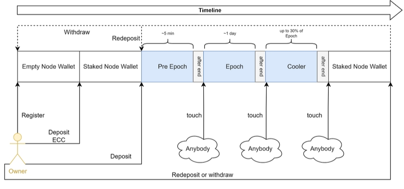
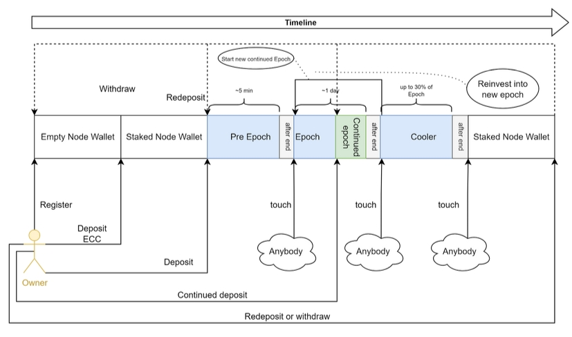
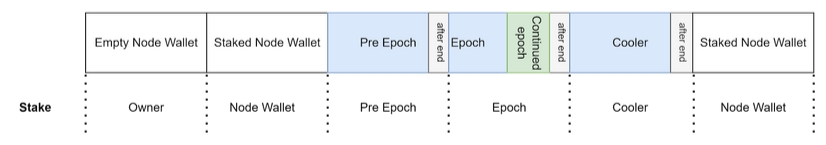
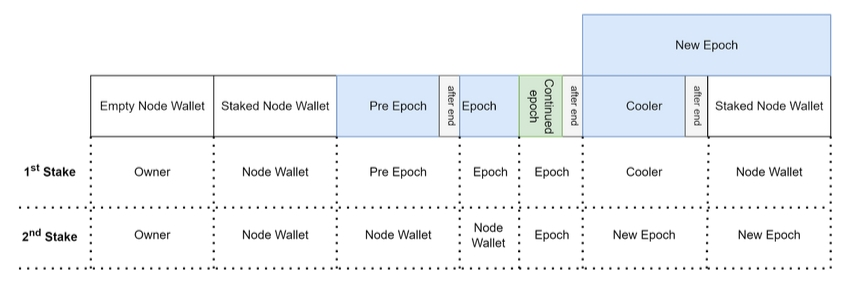
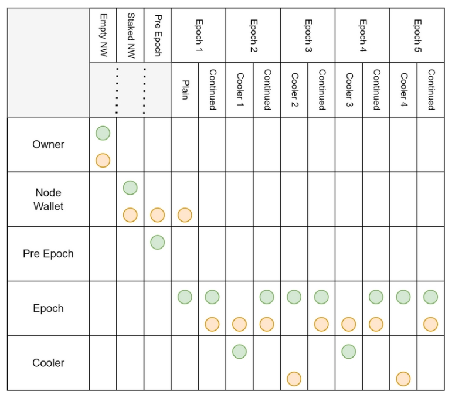
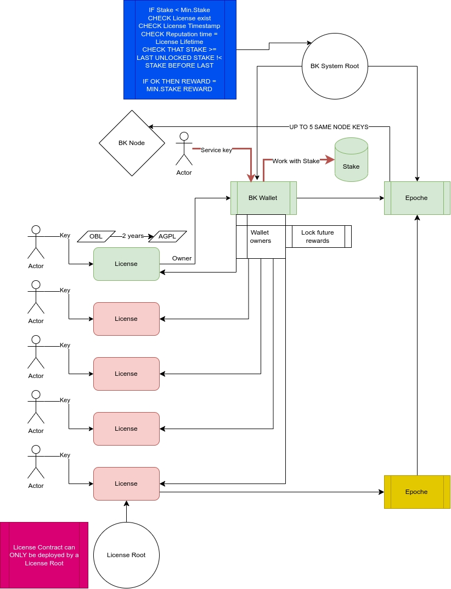

# Block Keeper Contracts Business-Level Specification

<figure><figcaption></figcaption></figure>

## Purpose 

The purpose of the present document is to create business-level specification (highest-level of specification) for the Block Keeper set of smart contracts. This document is intended to:

* Be thoroughly reviewed by the Customer
* Act as a base for the high-level specification

## Introduction 

The key intention of the _Block Keeper_ set of smart contracts is to let any participant become a _Block Keeper_ either for a single participation (in Acki Nacki protocol as Block Keeper) period (called _Epoch_) or repeatedly.

### Single participation period 

In this case the following stages are introduced:

* _Pre Epoch_. This stage is relatively short (a few minutes) and intended to let the _Block Keeper_ to finish synchronizing its node if necessary
* _Epoch_ - the main stage where the participant acts as a _Block Keeper_. Its duration is usually is most than one day
* _Cooling_ - the terminating stage where the _Block Keeper_ can still be slashed (up to 30% of Epoch’s duration)

The workflow described below must be followed:

* Participant must be registered as a _Block Keeper_
* Stake (exceeding minimally allowed value, which is a dynamic parameter) must be deposited
* _Pre Epoch_ must be started and, then, finished
* Then, _Epoch_:
  * Must be started
  * Throughout the _Epoch_, the participant is a _Block Keeper_
  * Later _Epoch_ must be finished
* Then, Cooling:
  * Must be started
  * At any time the _Block Keeper_ can be slashed
  * Later _Cooling_ must be finished and:
  * Then, stake can be withdrawn or reinvested

Graphically, the described workflow can be presented by the following chart:

<figure><figcaption>
Single participation period
</figcaption></figure>

### Repeated participation 

The main difference with the Single Participation Period is that upon _Epoch_ completion, a new _Epoch_ starts immediately.

The workflow described below must be followed:

* Participant must be registered as a _Block Keeper_
* Stake (exceeding minimally allowed value) must be deposited
* _Pre Epoch_ must be started and, then, finished
* Then, _Epoch_:
  * Must be started
  * **Another (additional) stake must be deposited making the workflow repeated thus turning Epoch into continue state**
  * Later _Epoch_ must be finished
* Then:
  * New _Epoch_ (in non-continued state) starts immediately with `additional stake`
  * Cooling:
    * Must be started with the rest of stake
    * At any time the _Block Keeper_ can be slashed
    * Later Cooling must be finished and:
    * Then, stake can be withdrawn or reinvested any time in future

The described workflow is illustrated by the following diagram:

<figure><figcaption>
Repeated participation
</figcaption></figure>

### Stake workflow 

Throughout the loop, stakes are transferred from one entity to another. For single participation their workflow can be illustrated by the following diagram (the second row indicated what entity the stake belongs to at each stage):

<figure><figcaption>
Stake workflow (single participation period)
</figcaption></figure>

For repeated participation the diagram is more complicated:

<figure><figcaption>
Stake workflow (repeated participation period)
</figcaption></figure>

It’s important to mention that in case the participant (owner) reinvests each stake for the repeated participation immediately after cooling down by continuing the current _Epoch_, he gets some kind of a carousel of continuous participation.&#x20;

Such a carousel is illustrated in the diagram below. For simplicity, all the “gray” periods between ending of the particular stages and external actions are omitted. Green dots stay for the “first” stake, while the red one - for the “second” stake.

<figure><figcaption></figcaption></figure>

### Auxiliary values 

#### Number of active blockkeepers

* Increased when a new blockkeeper arranges its first stake
* Decreased when a blockkeeper is fully slashed

#### Is\_min 

This value indicates if the low stakes (below minimal value) are accepted (using the mechanism of [virtual stakes](block-keeper-contracts-business-level-specification.md#docs-internal-guid-42f56a2c-7fff-ff7e-aec1-f40b75a545af)) or rejected. It’s calculated using the following formula:

$$
\prod_{l \in L}
\bigg(r(l)+s(l)+\frac 3 2 d\geq t\bigg)
\land (\sigma \geq \sigma_0)
\land (f \geq t)
$$

where:

* _L_ - set of licenses assigned to the wallet
* _r_ - reputation time of the license
* _s_ - start time of the license
* _d_ - Epoch duration
* _t_ - current time
* 𝜎 - current stake
* 𝜎｡ - last stake
* _f_ - time, when the licenses become free

#### Minimal Stake 

Minimal stake is calculated is by calling a special TVM instruction with the following parameters:

* &#x20;$$r - s$$, where:
  * _r_ - total reward assigned
  * _s_ - total amount slashed
* $$t - t_0 + \frac w 3$$, where:
  * _t_ - current time
  * _t_｡ - time when network started
  * _w_ - wait step
* [Number of active blockkeepers](block-keeper-contracts-business-level-specification.md#number-of-active-blockkeepers) at block start
* Number of active blockkeepers

#### Virtual Stake 

Virtual stake is a value assigned in case of [Is\_min](block-keeper-contracts-business-level-specification.md#docs-internal-guid-4c0c0303-7fff-635d-69d8-a10d878ebbd4) is true and stake is lower than a&#x20;

[minimal Stake](block-keeper-contracts-business-level-specification.md#docs-internal-guid-db255fd8-7fff-a64b-97ab-11411a69ab2a).

#### Local Stake

* If some virtual stake exists, then it’s a [virtual Stake](block-keeper-contracts-business-level-specification.md#docs-internal-guid-42f56a2c-7fff-ff7e-aec1-f40b75a545af)
* Otherwise, it’s just a stake

#### Total Stake

Total stake is a sum of all [Local Stakes](block-keeper-contracts-business-level-specification.md#local-stake) ever deposited.

#### Planned Epoch Finish Time 

Calculated as $$s+d$$, where:

* _s_ - Epoch start time
* _d_ - Epoch duration

### Reward 

Reward is calculated at the end of Epoch, but remains locked until the cooler stage ends.. It is implemented using a special TVM instruction and depends on:

* [Reward adjustment](block-keeper-contracts-business-level-specification.md#docs-internal-guid-ca7f15ea-7fff-6ed8-88f0-ca3ceb888318)
* [Number of active blockkeepers](block-keeper-contracts-business-level-specification.md#number-of-active-blockkeepers)
* Total reward already assigned at the time of calculation
* $$t - t_0$$, where:
  * _t_ - current time
  * _t_｡ - time when the Epoch started
* [Total Stake](block-keeper-contracts-business-level-specification.md#total-stake)
* [Local Stake](block-keeper-contracts-business-level-specification.md#local-stake)
* Reputation time, that is calculated according to the following formula: $$\frac s n+d+t-f$$, where:
  * _s_ - [Sum Reputation Coefficient](#user-content-fn-1)[^1]
  * _n_ - number of participating licenses
  * _d_ - Epoch duration
  * _t_ - current time
  * _f_ - [planned Epoch finish time](block-keeper-contracts-business-level-specification.md#docs-internal-guid-6f797f0b-7fff-a8b0-0a7d-01c5d0e4c6ea)

#### Reward Adjustment 

Invoked every time the Root method is called and $$l+p<t \lor n=0$$, where:

* _l_ - last time adjustment was performed
* _p_ - minimal period between adjustments
* _t_ - current time
* _n_ - number of adjustments

When performed the special TVM instruction is called with the following parameters and the number of adjustments is increased as well as a reward period:

* Total amount of assigned rewards
* Reputation coefficient, that is:
  * _MIN\_REP\_COEF_ constant, in case if [average reputation coefficient](#user-content-fn-2)[^2] equals to zero
  * average reputation coefficient, otherwise
* Reward period, that is calculated as follows:
  * $$n=0 \implies t-l$$
  * $$n>0\implies \frac{\pi n+t-l}{n+1}$$, where 𝜋 - the previous value of reward period
* Previous value of Reward Adjustment
* Current time

## Licences

<figure><figcaption></figcaption></figure>

_License_ smart contract is controlled by the License Owner’s cryptographic keys (_ED25519_). Without an active _License_ smart contract,  _Block Keeper_ won’t function (it won’t be able to submit a stake to _Epoch_ smart contract).

In order to submit stakes at least one _License_ must be delegated to _BK Wallet_. Up to 5 _Licenses_ can be delegated. A _License_ can be delegated just to one _BK wallet_.

The rewards are split equally between all _Licenses_ currently delegated. The stake is blocked for active wallet _Licenses_, in proportion to their wallet balances. If a slashing occurred the remaining stake will be divided proportionally between original stake owners.

The _License_ contains text of provisions of _GOSH Business License and AGPL_. The _License_ contains a provision that changes the _Business License_ for AGPL two years after the first _Acki Nacki_ block has been produced.

_Licenses_ are transferable, i.e. their keys can be changed by the key owner without interrupting operations.

Within the first 2 years _License_ (under _Business License terms_) give users an ability to join the network at any time without a minimum required stake, when certain conditions are met. This is further described in Block Keeper System Root below.

#### License Root

_Licenses_ are always deployed by _License Root_ to avoid a possibility of unauthorized/non-existent _Licenses_ to be deployed.

_GOSH_ holds keys for the _License Root_ contract that allows it to issue new _Licenses_, but not revoke already issued ones.

#### Reputation

Reputation coefficient is recorded in the _License_ contract and updated by _Epoch_ smart contract with start block _sequence number_ and end block _sequence number_. _Epoch_ Smart Contract won’t be deployed if the reputation coefficient \[1.0…3.0] between all licenses is inconsistent.

**Reputation time**

Reputation time is the total time of the license usage in stakes since the latter of:

* License start
* The last full slashing of the stake where the license participated

**Average Reputation Coefficient**

The Average Reputation Coefficient is recalculated in case of changing the [number of active blockkeepers](block-keeper-contracts-business-level-specification.md#number-of-active-blockkeepers).

In case of increase:

* In case the [Total Stake](block-keeper-contracts-business-level-specification.md#total-stake) is zero, it’s assigned to _MIN\_REP\_COEF_ constant
* Otherwise, it’s assigned to $$\frac {a(t-l)+rl} {t}$$, where:
  * _a_ - the previous value of the Average Reputation Coefficient
  * _t_ - [Total Stake](block-keeper-contracts-business-level-specification.md#total-stake)
  * _l_ - [Local Stake](block-keeper-contracts-business-level-specification.md#local-stake)
  * $$r=\frac s n$$, where:
    * _s_ - [Sum Reputation Coefficient](#user-content-fn-3)[^3]
    * _n_ - quantity of licenses assigned for the particular Epoch

In case of decrease:

* In case the [Total Stake](block-keeper-contracts-business-level-specification.md#total-stake) equals to [Local Stake](block-keeper-contracts-business-level-specification.md#local-stake), it’s assigned to _MIN\_REP\_COEF_ constant
* Otherwise, it’s assigned to $$\frac {a-rl} {t-l}$$, where:
*
  * _a_ - the previous value of the Average Reputation Coefficient
  * _t_ - [Total Stake](block-keeper-contracts-business-level-specification.md#total-stake)
  * _l_ - [Local Stake](block-keeper-contracts-business-level-specification.md#local-stake)
  * $$r=\frac s n$$, where:
    * _s_ - [Sum Reputation Coefficient](#user-content-fn-3)[^3]
    * _n_ - quantity of licenses assigned for the particular Epoch

**Sum Reputation Coefficient**

The Sum Reputation Coefficient is a sum of all the [Reputation Coefficien](#user-content-fn-4)[^4]t of all the participating licenses at the time of Epoch creation, but slashed.

**Reputation Coefficient**

Reputation Coefficient is calculated by applying a special TVM instruction with [Reputation Time](#user-content-fn-5)[^5] as a parameter.

**Auxiliary values**

**Balance**

Each license has a balance associated with it.

* Balance can be increased by running a public method to the wallet (the license must be owned by the wallet)
* In case of license removal the balance must be zeroed, all the assets are to be transferred to the address provided by the license owner
* In case of full slashing, the balance is decreased by the stake amount
* In case of partial slashing, the balance is decreased by the corresponding portion of the stake amount

**Lock Stake**

The amount owned by the license but locked by the current Epoch.

* In case of Epoch starting the following amount is locked: $$\frac {\sigma(b(\lambda)-c(\lambda))} {\sum_{l \in L}( b(l)-c(l))}$$, where:
  * 𝜎 - stake
  * 𝜆 - the current license
  * _L_ - the set of the all participating licenses
  * _b_ - the license balance[^6]
  * _c_ - the amount locked by the Cooler
* In case of too long PreEpoch it must be unlocked
* In case of repeated Epoch the following amount is locked: $$\frac {\sigma(b(\lambda)-c(\lambda)-e(\lambda))} {\sum_{l \in L}( b(l)-c(l)-e(l))}$$, where:
  * e - locked stake
* &#x20;The locked amount can not be used for withdrawal
* In case  of slashing the locked amount is either zeroed or decreased proportionally&#x20;
* The locked stake must be released upon finished Epoch without continuation

**Lock Cooler**

This value represents the share of the license balance locked throughout the cooling phase.

* Upon normal end of the cooling phase the locked amount is released
* In case of slashing:
  * In case of full slashing the full amount is released
  * In case of partial slashing the proportional amount is released

#### Block Keeper Wallet 

It is a smart contract which transmits user funds to an _Epoch_ smart contract for staking, receives rewards, manages _License_ rights and administers stakes in the _Epoch_ contracts.

#### Block Keeper System Root

_Block Keeper System Root_ is a smart contract which performs minimum stake validation, stores active validators number, manages _Wallet_ and _Epoch_ contract deployments, calculates rewards and mints them.

Any new _License_ owner joining the network within the first 2 years is able to start validating without a need for stake. Note that such _License_ owners can only join the network on these terms once. The perfect reputation count must be ensured therefore. In order to combat potential loss of stake due to bleeding the check is performed that the last stake without rewards is not less than a previous stake without rewards. The bleeding will come only from Rewards.

### Slashing 

Slashing is initiated by the node itself and can be applied both at Epoch and Cooler stages.

When the slashing is full:

* All the deposited stakes are confiscated
* The reputation time of all licenses, including old ones (possibly, owned by other people), is zeroed
* Auxiliary values of each license are changed as described in the [corresponding section](block-keeper-contracts-business-level-specification.md#docs-internal-guid-2be41919-7fff-941b-035d-464cde51524c)&#x20;
* All the keys are invalidated
* [Sum Reputation Coefficient](#user-content-fn-3)[^3] is decreased accordingly in case the slashed license has participated

In case of partial slashing:

* The provided percentage of the deposited stakes is confiscated
* The reputation time of all licenses, including old ones (possibly, owned by other people), is zeroed
* Auxiliary values of each license are changed as described in the corresponding section
* [Sum Reputation Coefficient](#user-content-fn-3)[^3] is decreased accordingly in case the slashed license has participated

## Details 

### Common

Before any action any participating system contract must be supplied with gas enough to perform this action, if necessary.

### Participant registration

* External request comes from anybody
* New unique _BNW_ (_Block Keeper_ Node Wallet) is created
* Newly created _BNW_ is initialized

### Withdraw 

Can be called by _License_ only.

Checks

* &#x20;if:&#x20;
  * the required amount of tokens is available, and
  * the required amount of tokens is available at the _License_ balance
* If yes:
  * The balance of tokens is decreased by the required amount from the node wallet
  * The balance of the _License_ is decreased by the required amount
  * The balance of tokens is increased by the required amount to the recipient
* Otherwise:
  * Exception is raised

### Participation 

#### Stake placement

* Owner sends a request to _BNW_
* _BNW_ checks if:
  * _Owner_ is correct
  * Stake value is available (in ECC that serves as a secondary currency)
  * No stake already exists or being processed
  * At least one license is available
  * In case of success:
    * For each license:
      *   There are “issues” if and only if:

          * Any _License_ was not used at lease for a half of _Epoch_,&#x20;

          or

          * Provided stake is less than last stake,&#x20;

          or

          * GPL license is still in place
      * Reputation time becomes the sum of the reputation times of all the _Licenses_
      * _Root_ is informed (alongside side with other information, it is informed, whether there were any issues, as well as sum of reputation times of all licenses being used)
* _Root_ checks if:
  * Stake exceeds minimally allowed value and no issues were received, otherwise it must be sent back
  * In case of success:
    * _BLS_ key is created
    * _BLS_ key is asked for acceptance
* _BLS_ key:
  * transfers this request to _Root_, informing alongside with other information, whether this was already used
    * marks the key as used
* _Root_:
  * checks if the _BLS_ key was not used, otherwise it sends stake back
  * In case of success:
    * _Signer_ is created
    * _Signer_ is asked for acceptance
* _Signer_:
  * transfers this request to _Root_, informing alongside with other information, whether this was already used
  * marks the key as used
* Root:
  * checks if the _Singer_ was not used, otherwise:
    * &#x20;it sends stake back
    * destroys _BLS_ key
  * In case of success _BNW_ is informed
* New BKPE (Block Keeper Pre Epoch) created
* Stake is moved to Pre Epoch

#### Pre Epoch 

* Upon creation:
  * _BKPE_ is initialized
  * _BNW_ is moved to “Pre Epoch” state
* Then, at any moment external _touch_ message can be received
* If time for the next stage still did not come, nothing happens
* Otherwise:
  * New _Epoch_ created
  * Stake is moved to _Epoch_
  * _BKPE_ is self-destructed and all its assets are transferred to _Epoch_

#### Epoch 

* Upon creation:
  * _Epoch_ is initialized
  * _Root_ is informed to enlist the _Block Keeper_
  * _BNW_ is moved to “Epoch” state
* Then, at any moment external _touch_ message can be received
* Also, at any moment external _slash_ message can be received, and:
  * The whole stake will be confiscated
    * Reputation time for all existing and previous licenses is zeroed
    * _BLS_ _key_ is destroyed
    * _Signer_ is destroyed
  * Wallet will be delisted
  * Continuation is canceled
    * All the licences mark as unused
    * _BLS key_ is destroyed
    * _Signer_ is destroyed
* If time for the next stage still did not come, nothing happens
* Otherwise:
  * _Root_ is informed
  * Root checks if it’s possible to end an _Epoch_ and does nothing if negative
  * Otherwise:
    * _Block Keeper_ is delisted
    * _Epoch_ is informed and:
      * _Cooler_ is created
      * Stake (with reward) is moved to _Cooler_
      * _Epoch_ is self-destructed in favor of _Cooler_

#### Cooler 

* Upon creation:
  * _Cooler_ is initialized
  * _BNW_ is moved to “Cooler” state
* Then, at any moment external _touch_ message can be received
* Also, at any moment external _slash_ message can be received, and:
  * The whole stake will be confiscated
    * Reputation time for all existing and previous licenses is zeroed
    * _BLS key_ is destroyed
    * _Signer_ is destroyed
  * Wallet will be delisted
  * Continuation is canceled
    * All the licences mark as unused
    * _BLS_ _key_ is destroyed
    * _Signer_ is destroyed
* If time for the next stage still did not come, nothing happens
* Otherwise:
  * _BNW_ is moved to initial state
  * _BKPE_ is self-destructed and all stake transferred to the _BNW_
  * If any license exists, the profit is distributed evenly among them
  * _BLS_ key is destroyed
  * _Signer_ is destroyed

#### Epoch (Repeated) 

* Upon creation:
  * _Epoch_ is initialized
  * _Root_ is informed to enlist the _Block Keeper_
  * _BNW_ is moved to “Epoch” state
* Then, at any moment `additional stake` request can be received with _continue_ flag, following the [Stake Placement](block-keeper-contracts-business-level-specification.md#stake-placement) logic,  where the _Epoch_ repeated instead of _PreEpoch_ creation
* Then, at any moment external _touch_ message can be received
* Also, at any moment external _slash_ message can be received, and [Epoch](block-keeper-contracts-business-level-specification.md#docs-internal-guid-28db9cf3-7fff-7ebe-57c2-a861dc3a97f0) logic is followed
* If time for the next stage still did not come, nothing happens
* Otherwise:
  * _Root_ is informed
  * _Root_ checks if it’s possible to end an _Epoch_ and does nothing if negative
  * Otherwise:
    * _Epoch_ is informed and:
      * New repeated _Epoch_ is created with `additional stake`
      * _Cooler_ is created is the rest of stake with reward
      * _Epoch_ is self-destructed in favor of _Cooler_

### Proxy 

This scenario handles the proxy system. _Proxy List_ is created for any Epoch and stays until it ends (as an uncontinued one). In case of continued _Epoch_, the same _Proxy List_  stands until it is canceled. Throughout the lifetime of the _Proxy List_, _Proxy_ elements can be added or removed to/from it.&#x20;

* Initialization the proxy (during _Pre Epoch_ creation)
* Destruction of the proxy (by the end of an uncontinued _Epoch_)
* Adding new elements to the _Proxy_ List
* Removal of elements from the _Proxy_ List

### License management 

All the licenses can be created by _License Root_ only.&#x20;

Before moving to _GPL_ they can be created by _Owner_ only, later by anybody.

#### Attach to BK Wallet

_License_ can be attached to _BK Wallet_ by request from the license _Owner_.

In this case:

* _License_:
  * Checks if the _License_ is not attached to any other _BK Wallet_
  * Checks if the _License_ attachment is not in progress
  * Informs the _BK Wallet_ that it is going to be added
* _BK Wallet_:
  * Checks if a number of _Licenses_ does not exceed maximally allowed value
  * Increased a number of licenses
  * Increases a total reputation time
  * Informs _License_ about acceptance
* _License_:
  * Starts the license, if not started yet
  * Attaches the license to the _BK Wallet_

#### Detaching from BK Wallet 

_License_ can be detached from _BK Wallet_ by request from the license _Owner_.

In this case:

* _License_:
*
  * Checks if the _License_ is attached to some _BK Wallet_
  * Informs the _BK Wallet_ that it is going to be removed
* _BK Wallet_:
  * Checks if the _License_ exists
  * Decreased a number of licenses
  * Decreases a total reputation time
  * Transfers all the _License_ balance to the specified address
  * Informs _License_ about acceptance
* _License_:
  * Detaches the license from the _BK Wallet_
  * Keeps the reputation time

## Top-level scenarios 

To formally specify the behavior briefly described above the following top-level scenarios were identified for further creation of high-level and, then, low-level formal specification:

* Registration
* ECC Withdrawal
* Participation
* Proxy
* License management

[^1]: **Sum Reputation Coefficient**

    The Sum Reputation Coefficient is a sum of all the [Reputation Coefficients](block-keeper-contracts-business-level-specification.md#reputation) of all the participating licenses at the time of Epoch creation, but slashed.

[^2]: **Average Reputation Coefficient**

    The Average Reputation Coefficient is recalculated in case of changing the [number of active blockkeepers](block-keeper-contracts-business-level-specification.md#number-of-active-blockkeepers).

[^3]: **Sum Reputation Coefficient**

    The Sum Reputation Coefficient is a sum of all the [Reputation Coefficien](#user-content-fn-4)[^4]t of all the participating licenses at the time of Epoch creation, but slashed.

[^4]: **Reputation Coefficient**

    Reputation Coefficient is calculated by applying a special TVM instruction with Reputation Time as a parameter.

[^5]: 

    **Reputation time**

    Reputation time is the total time of the license usage in stakes since the latter of:

    * License start
    * The last full slashing of the stake where the license participated

[^6]: 

    **Balance**

    Each license has a balance associated with it.

    * Balance can be increased by running a public method to the wallet (the license must be owned by the wallet)
    * In case of license removal the balance must be zeroed, all the assets are to be transferred to the address provided by the license owner
    * In case of full slashing, the balance is decreased by the stake amount
    * In case of partial slashing, the balance is decreased by the corresponding portion of the stake amount
