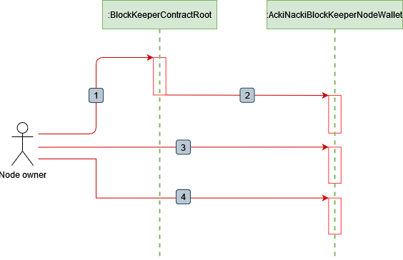
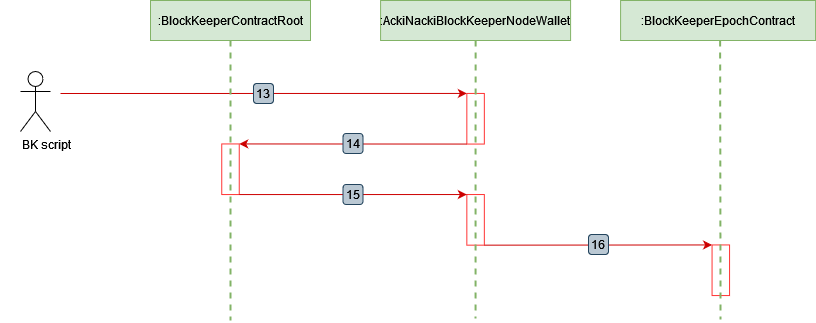
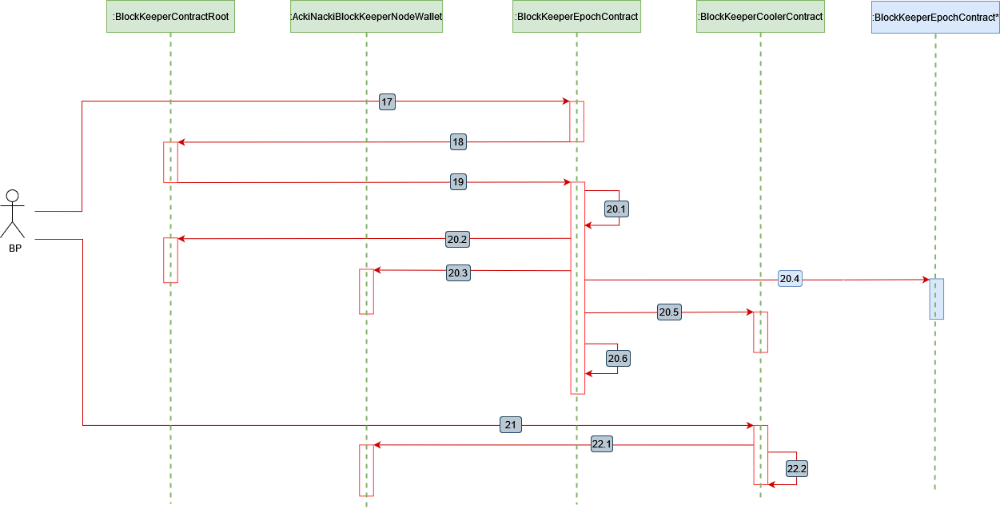

# How to join the protocol as Block Keeper?

## **Glossary**

* **Block Keeper Node (BK)** - A node with a deployed Epoch contract that participates in the Acki Nacki protocol.
* **Epoch** - a participation period in the Acki Nacki protocol during which a participant acts as a Block Keeper.
* **Node Owner** - The owner of the staked funds who holds full rights to manage the BK wallet, including withdrawing funds and other operations.
* **Service Key** - An additional public key that provides limited access to the BK wallet, allowing only BK node operations. This key is added by the owner.
* **NACKL** - The native token of the network, used for staking and as a reward for participating in the Acki Nacki protocol.
* **Stake** - The amount of NACKL tokens required to participate in the Acki Nacki protocol.
* **Minimal Stake** - the minimum amount of tokens a BK must stake to participate in the network. This value dynamically adjusts based on the difference between the current number of BKs and the required number of BKs in the network.
* **Reputation Coefficient** is a metric that increases the rewards for BKs based on their continuous participation in the protocol.&#x20;
* **BK Reward System**: BKs earn rewards based on their participation in the network during each _epoch_, regardless of their specific role (Block Producer, Acki-Nacki, or Block Keeper). The reward depends on the BK’s stake and _Reputation Coefficient_.

[Here](https://tokenomics.ackinacki.com/) you can review multiple plots detailing various aspects of [Tokenomics](../../tokenomics.md).

## Setting up Block Keeper Node

By this point, you should already have a [node running](setting-up-block-keeper-node.md).

## **How to join a network as a Block Keeper**

### **Contracts**

* **BlockKeeperContractRoot (Root)** - The main system contract that manages a BK's participation in the network.
* **AckiNackiBlockKeeperNodeWallet (Wallet)** - The BK wallet contract, responsible for stake management.
* **BlockKeeperPreEpochContract (Pre Epoch)** - The contract responsible for BK's preparation during the epoch.
* **BlockKeeperEpochContract (Epoch)** - The contract that indicates its owner is an active Block Keeper.
* **BlockKeeperCoolerContract (Cooler)** - The contract where the stake (plus rewards) is locked for the duration of the BK's operation verification.

### **Stage 1: Initializing the Block Keeper Wallet before joining the Acki Nacki protocol**


<figure><figcaption></figcaption></figure>

1. To become a network member, a prospective BK must lock their stake. To do this, the Owner needs to deploy a wallet for every BK. \
   To deploy BK wallet Owner should send an external message to the Root contract, signed with their public key:

```
deployAckiNackiBlockKeeperNodeWallet(pubkey)
```

2. The Root contract will deploy the BK wallet using the owner's public key:

```
constructor (
     TvmCell BlockKeeperPreEpochCode,
     TvmCell AckiNackiBlockKeeperNodeWalletCode,
     TvmCell BlockKeeperEpochCode,
     TvmCell BlockKeeperEpochCoolerCode,
     TvmCell BlockKeeperSlashCode,
     uint256 walletId
)
```

3. To restrict access to the wallet but allow node operations, the Node Owner should set a service key by calling a function in the Wallet contract:

```
setServiceKey(optional(uint256))
```

4. **Top Up with NACKL (from any source):**

<pre><code><strong>receive()
</strong></code></pre>


Ensure that the NACKL amount sent to the wallet exceeds 2 minimum stakes if you want  continuous re-staking.&#x20;



To determine the minimum stake amount, you can request this information from the Root contract.:

`tvm-cli -u -j run 0:7777777.....7777 getDetails {} --abi <BlockKeeperContractRoot_ABI_FILE>`



### Stage 2: Preparing the node for participation in the protocol

<figure><figcaption></figcaption></figure>

5. Send a request to the Wallet contract for registration as a BK in the Acki Nacki Protocol (this must be signed with either the owner’s public key or the service key):

```
sendBlockKeeperRequestWithStake(bytes bls_pubkey, varuint32 stake)
```

6. The Wallet contract sends a request with the NACKL stake attached.

```
receiveBlockKeeperRequestWithStakeFromWallet(uint256 pubkey, bytes bls_pubkey )
```

7. The Root contract permits the Wallet to deploy the Pre Epoch contract with the NACKL stake attached:

```
deployPreEpochContract(
    uint32 epochDuration,
    uint64 epochCliff,
    uint64 waitStep,
    bytes bls_pubkey
)
```

8. The Wallet deploys the Pre Epoch contract, attaching the NACKL stake:

```
constructor (
     uint64 waitStep,
     uint32 epochDuration,
     bytes bls_pubkey,
     mapping(uint8 => TvmCell) code,
     uint256 walletId
)
```

9. The Pre Epoch contract sends a message to the Wallet contract to lock the stake:

```
setLockStake(uint64 seqNoStart, uint256 stake)
```

### Stage 3: Starting the Epoch

<figure><figcaption></figcaption></figure>

10. The BK script calls a function in the Pre Epoch contract to join the Acki Nacki protocol:

```
touch()
```

11.1.  The Pre Epoch contract deploys the Epoch contract with the stake attached:

```
constructor (
     uint64 waitStep,
     uint32 epochDuration,
     bytes bls_pubkey,
     mapping(uint8 => TvmCell) code,
     bool isContinue, // is false in this case
     uint256 walletId,
     uint32 reputationTime
)
```

11.2 The Pre Epoch contract destructs itself:

```
selfdestruct(epoch)
```

12.1 The Epoch contract sends a message to the Root contract to increase the number of BKs:

```
increaseActiveBlockKeeperNumber(
    uint256 pubkey,
    uint64 seqNoStart,
    uint256 stake
)
```

12.2 The Epoch contract sends a message to the Wallet to update information about the previously locked stake:

```
updateLockStake(
    uint64 seqNoStart,
    uint32 timeStampFinish,
    uint256 stake
)
```

### Stage 4: Preparing the stake for the next epoch

BKs receive a base reward for blocks, but their Reputation Coefficient adds a premium reward depending on how long they have continuously participated in network work and restaked their tokens.

The longer a BK operates without missing any epochs, the higher their Reputation Coefficient, which can significantly increase their total reward.&#x20;


However, if a BK skips even one epoch, the coefficient is reset to the minimum value.&#x20;


If the Node Owner wants to remain on the Acki Nacki network after the epoch ends they must send another stake upfront.

&#x20;When the active Epoch contract will be destroyed:&#x20;

* the old stake will be transferred to the Cooler contract &#x20;
* The new Epoch contract will be deployed with the new stake
* If no slashing occurred then the stake + rewards will be transferred from the Cooler Contract when the cooling period is over to Block Keeper wallet, so that they become available to be re-staked again


This process is not automatically repeatable, it just allows transitioning from one epoch to another without time gaps and, therefore, reputation loss but you still need to do it every epoch.


<figure><figcaption></figcaption></figure>

13. To initiate this, send an external message to the Wallet contract with next stake attached while the current epoch is still active:

```
   sendBlockKeeperRequestWithStakeContinue(
    bytes bls_pubkey,
    varuint32 stake,
    uint64 seqNoStartOld
)
```

14. The Root contract accepts the stake and sends a permission to deploy a new Epoch contract to the Wallet contract:

```
receiveBlockKeeperRequestWithStakeFromWalletContinue(
    uint256 pubkey,
    bytes bls_pubkey,
    uint64 seqNoStartOld
)
```

15. The BK script calls a function in the Wallet contract to lock the stake for rejoining the Acki Nacki network:

```
 deployBlockKeeperContractContinue(
        uint32 epochDuration,
        uint64 waitStep,
        uint64 seqNoStartold, 
        bytes bls_pubkey
)
```

16. A flag is activated in the existing Epoch contract, indicating that the BK will remain for the next epoch:

```
continueStake(
    uint32 epochDuration,
    uint64 waitStep,
    bytes bls_pubkey
)
```

### Stage 5: Finalizing the Active Epoch&#x20;

<figure><figcaption></figcaption></figure>

17\. Block Producer checks Block Keeper set and epochs duration and when it sees that some BK's epoch is over, it sends a touch message to it:

```
touch()
```

18\. The Epoch contract requests permission from the Root contract to delete itself. \
If, after deletion, the number of BKs is less than the required minimum, the function returns false, making it impossible to complete the epoch.

```
canDeleteEpoch(
    uint256 pubkey,
    uint64 seqNoStart,
    uint256 stake,
    uint32 epochDuration,
    uint32 reputationTime,
    uint256 totalStakeOld
)
```

19\. The Root contract authorizes the deletion of the Epoch contract, with the reward attached:

```
canDelete(uint256 reward)
```

20.1 The Epoch contract initiates its own self-destruction:

```
destroy(bool isSlash) 
```

20.2 The Epoch contract notifies the Root contract about the decrease in the number of BKs:

<pre><code>decreaseActiveBlockKeeperNumber(
    uint256 pubkey,
<strong>    uint64 seqNoStart,
</strong>    uint256 stake
)
</code></pre>

20.3 The Epoch contract will call the Wallet contract function, which will deploy a new Epoch contract for the next iteration:

```
deployBlockKeeperContractContinueAfterDestroy(
    uint32 epochDuration,
    uint64 waitStep,
    bytes bls_pubkey,
    uint64 seqNoStartOld,
    uint32 reputationTime
)
```

20.4 The Wallet contract deploys a new Epoch contract  if there is already another stake with `isContinue=true` flag ([see the previous step)](how-to-join-the-protocol-as-block-keeper.md#stage-4-preparing-the-stake-for-the-next-epoch-optional).\
At the same time, the number of active BKs is updated in the Root Contract, and information about the previously blocked stake is refreshed (steps [12.1 and 12.2](how-to-join-the-protocol-as-block-keeper.md#stage-3-starting-the-epoch) ):

```
  constructor (
        uint64 waitStep,
        uint32 epochDuration,
        bytes bls_pubkey,
        mapping(uint8 => TvmCell) code,
        bool isContinue,
        uint256 walletId,
        uint32 reputationTime
   
```

20.5 The Epoch contract deploys the Cooler contract with the NACKL stake (+reward) attached:

```
constructor (
     uint64 waitStep,
     address owner,
     address root,
     bytes bls_pubkey,
     mapping(uint256 => bool) slashMember,
     uint128 slashed,
     mapping(uint8 => TvmCell) code,
     uint256 walletId
)
```

20.6 The active Epoch contract destructs itself:

```
selfdestruct(
    BlockKeeperWalletAddress,
    _root,
    _owner_pubkey
)
```

21. An unsigned external message is sent by Block Keeper script to notify that the Cooling stage has finished:

```
touch()
```

22.1 The stake and reward are unlocked in the Wallet contract:

```
unlockStakeCooler(uint64 seqNoStart)
```

22.2  The Cooler contract destroys itself:

```
destroy(address to)
```

### Stage 6: Withdrawing a Portion of the Rewards

After the Cooler contract sends the tokens to the Wallet, they can be withdrawn.&#x20;

To do this, send an external message to the Wallet contract.


Only the Node Owner is authorized to perform this action.


```
withdrawToken(
    address to, 
    varuint32 value
)
```

### Stage 7: Stopping the Work as a BK

To conclude their activity as a BK, the Node Owner must wait for the end of the epoch and the cooling period, then call a specific function in the Wallet contract. This function triggers the process of exiting the Acki Nacki protocol and unlocking the staked funds.

```
sendBlockKeeperRequestWithCancelStakeContinue(uint64 seqNoStartOld)
```
