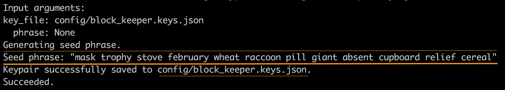

# Join DNSP Gossip

## Prerequisites <a href="#create-a-wallet" id="create-a-wallet"></a>

* Latest Rust nightly release&#x20;
* cargo
* Docker

## **Build and install CLI tool** <a href="#create-a-wallet" id="create-a-wallet"></a>

<pre class="language-bash"><code class="lang-bash">cd ~
git clone https://github.com/tvmlabs/tvm-sdk
<strong>cd tvm-sdk
</strong>cargo install --path tvm_cli --force
</code></pre>

The path to the `tvm-cli` is now publicly accessible. You can also add it to your environment variables (ENVs).

```bash
export PATH=$PATH:~/.cargo/bin
```

## Step 1. Generate seed phrase and keys for each BK node (offline step)


With [**BK Node Owner keys** ](../../glossary.md#bk-node-owner-keys) you will be able to manage the node. \
**The public key must be provided to the License Owner for license delegation.**


Here’s an example of a command that generates a key pair from a seed phrase and saves it to a specified file:

```bash
cd ~
mkdir config
tvm-cli getkeypair -o config/block_keeper.keys.json
```

Result:


**Write down your `seed phrase` and store it in a secure location.** \
**You will only see them once and won't be able to restore them!**\
**Never share it with anyone. Avoid storing it in plain text, screenshots, or any other insecure method. If you lose it, you lose access to your assets. Anyone who obtains it will have full access to your assets.**&#x20;

**Additionally, ensure the file containing the `key pair` is saved in a safe place.**


<figure><figcaption></figcaption></figure>

## **Step 2.** Running [Acki Nacki Igniter](../../glossary.md#acki-nacki-igniter)


**You must run single instance of Acki Nacki Igniter on each BK server**


### Step 2.1

Generation of `BLS keys` **for each BK node** using the `node-helper tool`.&#x20;


[BLS keys](../../glossary.md#bls-keys) will be required by BKs for signing blocks and will be rotated every [epoch](../../glossary.md#epoch).


Building node-helper:

```bash
cd ~
git clone https://github.com/ackinacki/ackinacki.git
cd ackinacki
cargo install --path node-helper
```

run it:

```bash
cd ~
node-helper bls --path config/block_keeper_bls.keys.json
```

As a result, the `BLS keys` will be saved in the file `config/block_keeper_bls.keys.json`


Each new call to `node-helper bls` adds keys to this array


for example:

```json
[
  {
    "public": "a03f22faaa0ae87c3676ce2018278e4e08a6423cd3043fe8ee71b1f33dff9178a8414d7a37e6d42ef5f3bce020e2d4ff",
    "secret": "05f7d62bc3c2bc60f966ce5b80b973c7e24a79f82f5b648c1186cc5f3aed9277",
    "rnd": "234291dc9e47ecb9f1265fe9e7f1ea485fe38c8daba9faf6741a836d810bc743"
  }
]
```

### Step 2.2

**Create a file** `config/keys.yaml` **from** [**template**](https://github.com/ackinacki/acki-nacki-igniter/blob/main/keys-template.yaml) **with keys**:

* place the keys from the file `config/block_keeper.keys.json` in the `wallet` section;
* place the data from the file `config/block_keeper_bls.keys.json` in the `bls` section;

For example:

```yaml
wallet:
  pubkey: 7876682d123554aeedc71eb4e437e3c25ea8c9d97c0fd3fb9521061d6f494cdc
  secret: 0e31a5b3f97f5d244421b07afc16d5f9a236043c81a932a941d49c983dff6fa8

bls:
  pubkey: a03f22faaa0ae87c3676ce2018278e4e08a6423cd3043fe8ee71b1f33dff9178a8414d7a37e6d42ef5f3bce020e2d4ff
  secret: 05f7d62bc3c2bc60f966ce5b80b973c7e24a79f82f5b648c1186cc5f3aed9277
  rnd: 234291dc9e47ecb9f1265fe9e7f1ea485fe38c8daba9faf6741a836d810bc743

```

#### Create the configuration file `config/igniter.yaml` for Acki Nacki Igniter from [template](https://github.com/ackinacki/acki-nacki-igniter/blob/main/config-template.yaml):

For example:

```yaml
advertise_addr: "your_ip_address:10000"

# Do not change next lines
listen_addr: "0.0.0.0:10000"
api_addr: "0.0.0.0:10001"
interval: 1000
seeds:
  - "94.156.25.201:10000"
  - "94.156.25.202:10000"
  - "94.156.25.203:10000"
  - "94.156.25.204:10000"
  - "94.156.25.205:10000"
  - "94.156.25.206:10000"
  - "94.156.25.207:10000"
  - "94.156.25.208:10000"
  - "94.156.25.209:10000"
  - "94.156.25.210:10000"
```


`advertise-addr` specifies the address that the node shares with other nodes for connection.



`seeds` are a list of nodes in gossip that provide other nodes with information for connecting to the network. Each seed serves as a starting point for synchronization and discovering other nodes in the network.


**Run Igniter in Docker:**

* before this set environment variables:

```bash
cd ~
export KEYS=./config/keys.yaml
export CONFIG_FILE=./config/igniter.yaml

# Change the following line to match the `advertise_addr` specified in your config file
export ADVERTISE_PORT=10000

export IMAGE=teamgosh/acki-nacki-igniter:latest

```


If you are using a non-standard socket for Docker, you can specify it via the `DOCKER_SOCKET` environment variable when launching Acki Nacki Igniter.



We strongly recommend using the installation via Docker for proper update process operation.


* and run docker container:

```bash
docker run  \
        --rm \
        -p 10001:10001 \
        -p ${ADVERTISE_PORT}:10000/udp \
        -p ${ADVERTISE_PORT}:10000/tcp \
        -v "${KEYS}:/keys.yaml" \
        -v "${CONFIG_FILE}:/config.yaml" \
        -v "/var/run/docker.sock:/var/run/docker.sock" \
        $IMAGE \
        acki-nacki-igniter --keys /keys.yaml --config /config.yaml

```

By default the **DNSP state** is accessible on **http://your\_public\_ip\_address:10001**

Link to the [source code](https://github.com/ackinacki/acki-nacki-igniter).

## **Step 3. Delegating licenses**

If you own [BK licenses](../../glossary.md#license) and want to delegate them to your nodes, do this in the [dashboard](https://dashboard.ackinacki.com/).


To delegate licenses, you need to know the **public key of the BK node owner.**


* In the first step, you need to connect the cryptocurrency wallet from which the licenses were purchased.

<figure><figcaption></figcaption></figure>

Confirm that you are the wallet owner by signing a message:

<figure><figcaption></figcaption></figure>

* Generate  Acki Nacki License Owner Phrase and public key or click the "Import an existing phrase" button to import your existing Phrase from Acki Nacki app.


This Phrase will be linked to your Dashboard Account through a public key. **This can only be done once.** You will use it to withdraw BK rewards for your delegated licenses.&#x20;


<figure><figcaption></figcaption></figure>

At this step, a seed phrase will be generated/imported for this Account. \
It will be required to manage your licenses. After the network starts, you will be able to update the license contract owner to a wallet address, such as a multisig. This way, the withdrawal of rewards can be confirmed by multiple custodians.


**You will only see `seed phrase` once and won't be able to restore it!**


<figure><figcaption></figcaption></figure>


Write down your **`seed phrase`** and store it in a secure location. \
Never share it with anyone. Avoid storing it in plain text, screenshots, or any other insecure method. If you lose it, you lose access to your assets. Anyone who obtains it will have full access to your assets.&#x20;


A very important point: make sure you have memorized your seed phrase correctly:

<figure><figcaption></figcaption></figure>

* Create and confirm a `passcode`:


The **passcode** is used to encrypt the seed phrase in the device storage.


<figure><figcaption></figcaption></figure>

Your **license owner's public key** will be available in the top right corner:

<figure><figcaption></figcaption></figure>

* Then, delegate each license from your list to a node using one of the **BK Node Owner** public key generated above.


**Do not use BLS keys for license delegation.**


To do this, go to the **Licenses** tab and click the **Delegate** button.

<figure><figcaption></figcaption></figure>


Licenses that are not delegated will not generate rewards.


If you already know the Node Owner's public key, enter it in the corresponding field and click the **Delegate** button.

If not, send a delegation request to one of the Node Providers from the suggested list.

<figure><figcaption></figcaption></figure>


**No more than 5 BK licenses can be delegated to a single node.** \
The reward for BK validation in the network is evenly distributed among the licenses delegated to it.


Information about delegated licenses will look something like this:

<figure><figcaption></figcaption></figure>

A BK node can be changed, and a license can be delegated to another BK. However, to avoid losing rewards, this should be done between [Epochs](../../glossary.md#epoch).

Actual information about the DNSP Gossip state can be viewed on the **Gossip** tab:


Information about delegated licenses will be automatically updated in Gossip with Acki Nacki Igniter.


<figure><figcaption></figcaption></figure>


If the license is not delegated to a BK node before the network launch, it will not be placed in the Zerostate.



**Once over 75% of BK Licenses join the DNSP, the network will automatically go live.**

