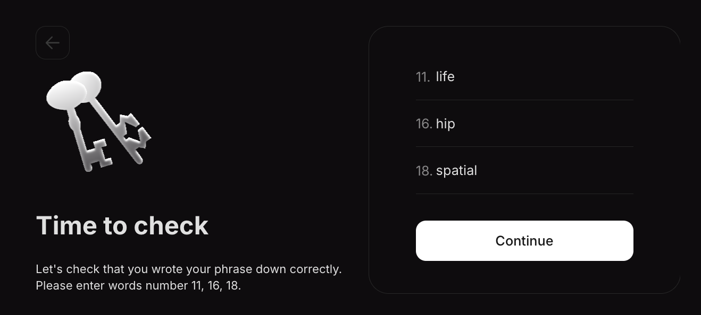
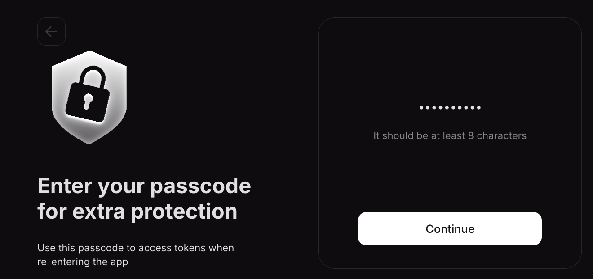

# License Dashboard Guide

After purchasing a [license](../../glossary.md#license), all further operations with it are carried out through the [dashboard](https://dashboard.ackinacki.com/). To access your licenses, follow these steps:

* Go to the [dashboard page](https://dashboard.ackinacki.com/).
* Connect the cryptocurrency wallet that was used to purchase the license, by clicking the `Connect Wallet` button.&#x20;


Use the exact wallet from which the purchase was made; otherwise, access to the license will not be granted.


<figure><figcaption></figcaption></figure>

* Confirm that you are the wallet owner by signing a message:

<figure><figcaption></figcaption></figure>

* Generate  **Acki Nacki License Owner Phrase** and public key or click the `Import an existing phrase` button to import your existing phrase from Acki Nacki app.


This seed phrase will be linked to your dashboard Account through a public key. \
**This can only be done once.** You will use it to withdraw BK rewards for your delegated licenses.&#x20;


<figure><figcaption></figcaption></figure>

The seed phrase will be required to manage your licenses. After the network starts, you will be able to update the license contract owner to a wallet address, such as a multisig. This way, the withdrawal of rewards can be confirmed by multiple custodians.

<figure><figcaption></figcaption></figure>


Write down your **`seed phrase`** and store it in a secure location. \
Never share it with anyone. Avoid storing it in plain text, screenshots, or any other insecure method. If you lose it, you lose access to your assets. Anyone who obtains it will have full access to your assets.&#x20;


A very important point: make sure you have memorized your seed phrase correctly:

<figure><figcaption></figcaption></figure>

* Create and confirm a `passcode`:


The **passcode** is used to encrypt the seed phrase in the device storage.


<figure><figcaption></figcaption></figure>

* Information about your keys will be available in the top right corner:

<figure><figcaption></figcaption></figure>

To copy **the license owner's public key**, click the button 

To view **the seed phrase, private key, and public key of the license owner**, click the button 

and enter your `passcode`**:**


If you forgot your passcode, log out of your account, reconnect your wallet, enter your seed phrase, and you will be able to create a new passcode.


<figure><figcaption></figcaption></figure>


**Be careful and ensure the security of your data!**\
Avoid storing it in plain text, screenshots, or any other insecure methods. If you lose it, you will lose access to your assets.


<figure><figcaption></figcaption></figure>

* **To claim your license**, contact a Gosh representative by reaching out to them via any publicly available channel or group, and send `the license owner's public key` to them.
* To receive rewards, the licenses must be delegated. You can find more details on how to do this [here](https://docs.ackinacki.com/protocol-participation/block-keeper/join-dnsp-gossip#step-3.-delegating-licenses).
