# Tokenomics

The original document can be found here [Tokenomics Paper](https://tokenomics.ackinacki.com/).

For personalized projections of token economic metrics and reward amounts, use the [Reward Calculator](https://rewardcalculator.ackinacki.com/).

## Abstract&#x20;

We present the Acki Nacki network Tokenomics, optimized for maximum decentralization from the start, as well as for security and fairness. \
For more information on the Acki Nacki protocol, refer to the [Acki Nacki Overview](../).

In Acki Nacki, there are five types of Network Participants: Block Producer, Block Keeper, Block Verifier (also known as Acki-Nacki), Block Manager, and Mobile Verifier.


We collectively refer to Block Producer, Block Keeper, and Block Verifier as "Block Keepers" when it is unnecessary to distinguish their individual roles.


## Definitions

**Block Keeper** - is a network participant that receives blocks from the Block Producer (BP) and sends back an [Attestation](../glossary.md#attestation) with the block hash and other metadata. A BK can also become a Block Verifier (Acki-Nacki) or a Block Producer (BP)

**Block Producer (BP)** is a BK that serves as the leader of a particular [Thread](../glossary.md#thread), responsible for block production.

**Block Verifier (or Acki-Nacki)** - is a BK responsible for block validation and notifying all network participants of their verdict: whether the block is valid or not.

**Block Manager -** is a network participant whose primary role is to provide users with a blockchain database and process external messages. Block Managers receive a portion of the total block reward based on the number of external messages they process.

**Mobile Verifier -** participates in the protocol by validating transactions in subtrees of accounts, occasionally. Mobile Verifiers will compete in an online game, which involves earning Boosts, to secure a place in the mobile verifiers list that determines the fraction of block reward.&#x20;

## Quick Facts

| Token                         | Supply    | Emission     | Function         |
| ----------------------------- | --------- | ------------ | ---------------- |
| [NACKL](../glossary.md#nackl) | 10.4 B    | Curve, final | Network security |
| [SHELL](../glossary.md#shell) | Unlimited | Pledge       | Computation      |

## Separation of Tokens

In Acki Nacki there are two tokens: a network token and a computation token.&#x20;

The separation allows us to have two distinctive properties of Acki Nacki that is not possible under a one common token design.&#x20;

In Proof-of-Stake systems the security of the network and the participation incentives are largely attributed to the network token price increase over time. This is achieved by bending the Supply/Demand curve in favor of Demand. It can be done by increasing the Token Utility and Decreasing the Supply. But when there is only one token which is used for both security guarantees and network transaction fees its utility will be hampered by its increasing price, which happens with every blockchain we know. To tackle this problem Bitcoin is promoting the Lightning network, Ethereum is trying to balance the gas price and Solana is processing large amounts of transactions with very low fees. We don’t believe any of these approaches work over time and we see problems with all of them: Lightning Network adoption rate is faltering, Ethereum transactions are so expensive, most of the people using L2 networks to transact Ethe and Solana can’t regulate its network usage effectively leading to network stoppage and spam.

We take a different approach by introducing two interconnected tokens separately created to optimally perform each of the functions: network usage and network security.&#x20;

Computation token, called **SHELL** — is designed to pay for network usage, and **NACKL** coin — designed to guarantee network security.&#x20;

**NACKL** Coin — is used for Staking and provides a claim for a share of Shell revenues therefore will accumulate value over time.&#x20;

**SHELL** Token — designed in such a way that its price will never increase, it can only decrease, but will eventually correct itself, as described in more details [below](./#shell-equal-or-less)

## NACKL Tokenomics

### Proof Of Stake

In Acki Nacki there is no predetermined Stake Interest rate. Simple and clear — there are no staking rewards. Like in Bitcoin the rewards are paid for Network Participation which comprises several activities like Block Production, Block Verification and Transaction Processing, but unlike Bitcoin all the [Rewards](./#rewards) are distributed proportionally between all Network Participants within a common Epoche. If Network Participants are not performing according to current Acki Nacki Network rules or boundaries they may be excluded from the network, penalized or slashed depending on the type of rule they violate. This is according to the main idea of [Proof-of-Stake Protocols](https://decred.org/research/king2012.pdf).

### Delegation

Acki Nacki is trying to avoid delegation of stakes as much as possible. There are special mechanisms in place to make it not economical or not secure to delegate NACKL Token for staking by other Block Keepers: Block Keeper Epoch contract only accepts messages signed by a Block Keeper private key, therefore making it impossible to create decentralized pools and perform staking delegation. Of course, Block Keepers can run off-chain services to obtain stakes from investors, but this is no longer a network concern.

Instead there is a special mechanism to include regular participants into a protocol without a need to become a Block Keeper and have special server equipment etc. ([see section “Mobile Verifiers”](./#mobile-verifiers)) Yet it is important to mention that it’s not based on staking pools or delegation either, as mobile verifiers perform very particular and real security verification contributing to network security guarantees.

### Fairness

Acki Nacki is "fair" protocol, where fairness is defined per [Pass and Shi](https://dl.acm.org/doi/10.1145/3087801.3087809): "A blockchain protocol has $$n$$-approximate fairness if, with overwhelming probability, any honest subset controlling $$f$$ fraction of the compute power is guaranteed to get at least a $$(1 − n)f$$ fraction of the blocks in a sufficiently long window".

The fairness in Acki Nacki is achieved by the following logical construction:

_Each Validator receives proportional reward regardless of if they produced blocks or not. The reward depends solely on their honest participation in the network as described below. Thus the network participants are not rewarded specifically for producing the block but for participating in all stages of block livecycle from the creation and up to the finality._

Because in the Asynchronous transaction model the particular arrangement of incoming external transactions does not determine the execution order of subsequent internal transactions, there is no apparent calculable profit extraction (MEV) opportunity exists for a Block Producer. For example, frontrunning is highly improbable and can instead result in a loss. Since the chances of such loss are high enough no rational actor should try. In Acki Nacki therefore there is simply no game to play around MEV extraction, which in turn makes the equal block rewards model possible.

Therefore in Acki Nacki [the fairness model](https://arxiv.org/pdf/2102.04326) that usually applies to most of the networks does not hold true. We therefore can consider Acki Nacki a “fair protocol” at least according to the above definition.

## Rewards

The curve of the number of minted tokens in Acki Nacki is precomputed and known in advance. This curve is an exponential saturation function. It determines the reward for network participants.

The reward in Acki Nacki is divided among three groups of network participants: Block Keepers, Mobile Verifiers, and Block Managers. The reward for each participant is awarded based on individual Epochs of a certain duration. It is precomputed before the start of the individual [**Epoch**](#user-content-fn-1)[^1] and is awarded at the end of that Epoch. The distribution of the reward within each group of network participants is described in more detail in the sections "Block Keeper Reward", "Mobile Verifier Reward", and "Block Manager Reward".

### General Reward

The General Reward for network participation across the entire network is calculated per second to eliminate dependency on blocks and thereby prevent potential spam activity.

General Reward Per Second is an ever decreasing function of token supply calculated as following:

• $$t$$— Time (in seconds) since the network launch&#x20;

• $$TotalSupply$$ — Total Supply — The total number of tokens to be minted&#x20;

• $$GRPS(t)$$ — General Reward Per Second — reward for network participation per one second for all network participants&#x20;

•  Total Minted Token Amount — The number of minted tokens at time $$t$$&#x20;

• $$TTMT$$ — Total Token Minting Time — The expected time for minting the last fraction of token.

• $$TMTAFC$$ — Total Minted Token Amount Function Coefficient — The parameter regulating the decay rate of the Total Minted Token Amount function

• $$TBBKRPS(t)$$ — Total Base Block Keeper Reward Per Second — the fraction of the reward $$GRPS$$ allocated to Block Keepers

• $$TMVRPS(t)$$ — Total Mobile Verifier Reward Per Second — the fraction of the reward $$GRPS$$ allocated to Mobile Verifiers

• $$TBMRPS(t)$$ — Total Block Manager Reward Per Second — the fraction of the reward $$GRPS$$ allocated to Block Managers

• $$BBKRFC$$ — Base Block Keeper Reward Function Coefficient — coefficient that determines the fraction of the reward $$GRPS$$ allocated to Block Keepers

• $$MVRFC$$ — Mobile Verifier Reward Function Coefficient — coefficient that determines the fraction of the reward $$GRPS$$ allocated to Mobile Verifiers

• $$BMRFC$$ — Block Manager Reward Function Coefficient — coefficient that determines the fraction of the reward $$GRPS$$ allocated to Block Managers

<figure>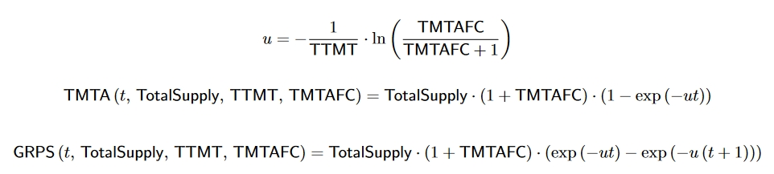<figcaption>
Formulas 1, 2, 3
</figcaption></figure>

The resulting reward is divided among the three groups of network participants in predetermined proportions, calculated based on each group’s contribution to the network’s operation.

<figure>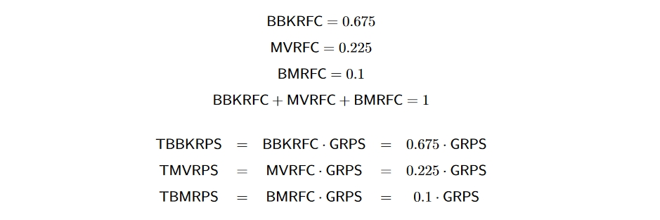<figcaption>
Formulas 4, 5
</figcaption></figure>

<figure>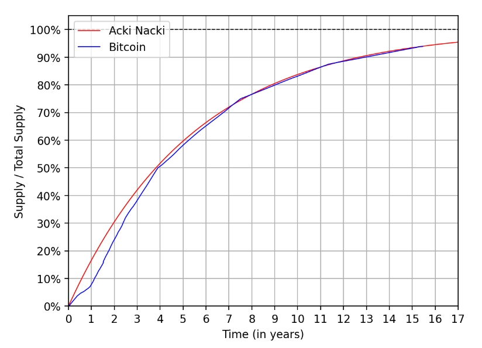<figcaption>
Figure 1: Comparison plot of Bitcoin and Acki Nacki NACKL token supplies per year
</figcaption></figure>

### Reputation Coefficient

For Block Keepers, the reward they receive from $$GRPS$$ is called the Base Reward. This is because on top of the fair block reward, each Block Keeper may receive a Reputation Premium Reward called the Reputation Coefficient. This reward is calculated based on the time the particular Block Keeper, authenticated as Public Key of the cryptographic key pair, controlling the Block Keeper’s wallet has continuously participated in a protocol and restaked their tokens.

The reputation multiplicator can provide much greater rewards than Base Reward, thus providing incentives for Block Keepers to keep uninterrupted network validation.

If a Block Keeper skips at least one Epoch, their Reputation Coefficient is immediately reset to the minimum possible one.

* $$RepCoef$$ — Reputation Coefficient — Additional rewards granted to a Block Keeper for continuous validation
* $$BKRT$$ — Block Keeper Reputation Time — The time during which the Block Keeper has been continuously running validation Epochs
* $$minRC$$ — Minimal Reputation Coefficient
* $$maxRC$$ — Maximal Reputation Coefficient
* $$maxRT$$ — Maximal Reputation Time — The time it takes for the Block Keeper to accumulate maximum reputation for continuous validation
* $$ARFC$$ — Adjustment Reputation Function Coefficient — The parameter regulating the rate of reputation growth over time

<figure><figcaption>
Formula 6
</figcaption></figure>

<figure>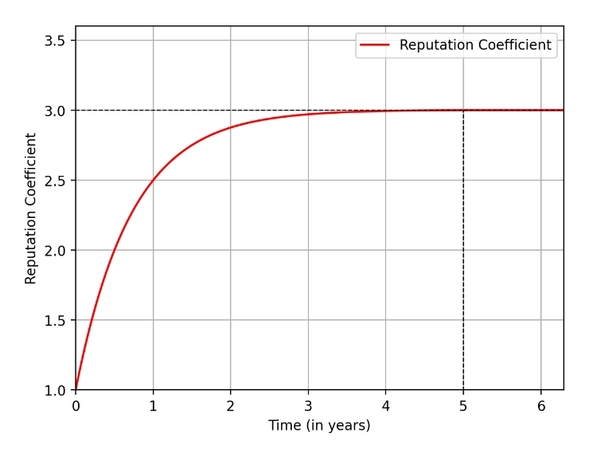<figcaption>
Figure 2: Plot of the Reputation Coefficient depending on the continuous validation time by a particular Block Keeper
</figcaption></figure>

### Block Keeper Reward

As mentioned earlier, each network participant receives a reward for each Epoch. For Block Keepers, we will refer to this Epoch as the Validation Epoch.

We assume that if all network participants act honestly, the reward should be distributed fairly among them, regardless of whether the Block Keeper performs as a Block Producer, Acki-Nacki, or Block Keeper during that Epoch. Thus, the Block Keeper’s reward will depend only on their stake and Reputation Coefficient.

Therefore, the Block Keeper’s reward function $$BKRPS$$ will be calculated as follows:

* $$BKRPS$$ — Block Keeper Reward Per Second — the reward earned by a Block Keeper per second of validation, depending on their stake and current Reputation Coefficient
* $$BKStake$$ — Block Keeper Stake — the specific amount of tokens that a Block Keeper has staked in order to participate in validation
* TotalBKStake — Total Block Keeper Stake — the sum of all Block Keeper stakes at time
* $$TBBKRPS(t)$$ — Total Base Block Keeper Reward Per Second — the fraction of the reward GRPS allocated to Block Keepers
* $$RepCoef$$ — Reputation Coefficient — Additional rewards granted to a Block Keeper for continuous validation
* $$BKRT$$ — Block Keeper Reputation Time — The time during which the Block Keeper has been continuously running validation Epochs
* $$t_{val}$$ — Validation Epoch Start Time — the time in seconds that has passed from the moment the network was launched until the start of a particular Validation Epoch
* $$BKRPVE$$ — Block Keeper Reward per Validation Epoche — the reward received by a Block Keeper for one Validation Epoch
* $$BKED$$ — Block Keeper Epoch Duration — the duration of one validation Epoch in seconds

<figure>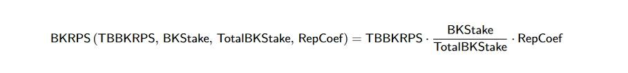<figcaption>
Formula 7
</figcaption></figure>

For personalized projections of token economic metrics and reward amounts, use the [Reward Calculator](https://rewardcalculator.ackinacki.com/).

#### Block Keeper Epoch Reward

Since a Block Keeper receives a reward at the end of each Validation Epoch, let us convert the reward per second of validation into a reward per Epoch.

To ensure that each Block Keeper can easily calculate their reward for the Validation Epoch at the start of the Epoch, we lock the parameters $$BKStake$$, $$TotalBKStake$$, and $$RepCoef$$ at the beginning of the Epoch and don’t change them during the Epoch. Since the number of Block Keepers in the network remains approximately constant during a Block Keeper’s Epoch, the case where the parameters $$BKStake$$ and $$TotalBKStake$$ are fixed at the start of the Epoch is practically identical to the case where these parameters are dynamically recalculated throughout the Epoch. In other words, for a reasonable Block Keeper, it is disadvantageous to choose the moment when he starts an Epoch to maximize their reward, as the time spent waiting will cause them to lose more reward than they could potentially earn, and they will also reset their accumulated Reputation Coefficient. Additionally, since the Maximal Reputation Coefficient accumulates over a much longer period of time than the duration of a Validation Epoch, it does not make practical sense to recalculate it during an Epoch. It is sufficient to update the value of the Reputation Coefficient when transitioning from one Epoch to the next. For the same reason, it does not make practical sense to recalculate the value of the $$TBBKRPS$$ function during the Validation Epoch.

Thus, let us calculate the reward for a single Block Keeper for the Validation Epoch:

<figure>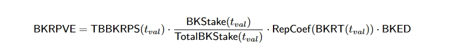<figcaption>
Formula 8
</figcaption></figure>

If a Block Keeper, for any reason, validates longer than the expected duration of a single Epoch, additional time spent as a Block Keeper will be added to the parameter $$BKED$$.

## Free Float

Acki Nacki largely follows a well-researched Bitcoin free float model. We define Bitcoin’s Free Float as the number of tokens that have been in circulation over the last year. While in Bitcoin the free float average is around 40%, Acki Nacki will theoretically experience exponential saturation growth from nearly 0 to $$\dfrac{1}{3}$$, while $$(1 − Free Float)$$ $$(1 − Free Float)$$of tokens (up to a maximum of $$\dfrac{2}{3}$$) will be locked in staking.

Let’s construct the exponential saturation function for the Free Float (as a percentage of the total number of minted tokens):

* $$maxFreeFloatFrac$$ — Maximal Free Float Fraction — Maximal fraction of Free Float of Total Supply
* $$FreeFloatFrac(t)$$$$(t)$$ — Free Float Fraction — The current fraction of Free Float of Total Supply
* $$FFFC$$ — Free Float Function Coefficient – The parameter regulating the decay rate of the FreeFloatFrac function
* $$TTMT$$ — Total Token Minting Time — The expected time for minting the last fraction of token

<figure><figcaption>
Formulas 9, 10
</figcaption></figure>

If Block Keepers do not restake their stakes and withdraw them, thereby increasing the Free Float, the reward remains fixed. Meaning the remaining Block Keepers will start receiving more rewards, which will reduce their motivation to withdraw their stakes even if the token price decreases. Because the min stake will decrease, allowing other Block Keepers to stake their tokens if they couldn’t do so before ([see Section "Block Keeper Min Stake"](./#block-keeper-min-stake)).

<figure>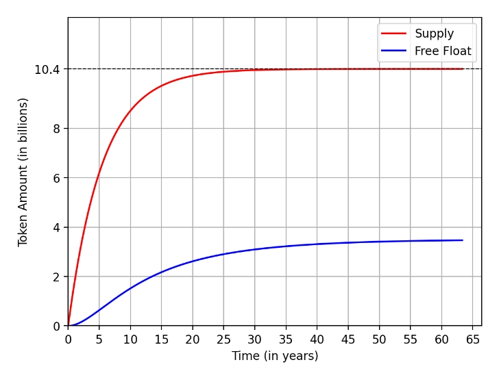<figcaption>
Figure 3: Plot of the total number of minted tokens and free float (in tokens) over time
</figcaption></figure>

<figure>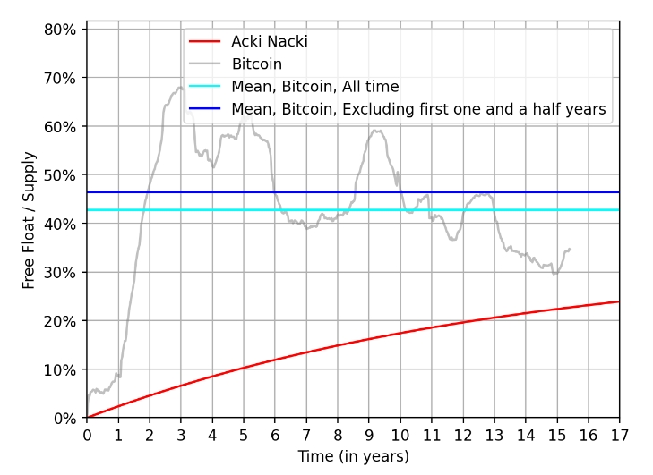<figcaption>
Figure 4: Comparison plot of Bitcoin and Acki Nacki NACKL Free Floats (as a percentage of the current Supply) per year
</figcaption></figure>

<figure>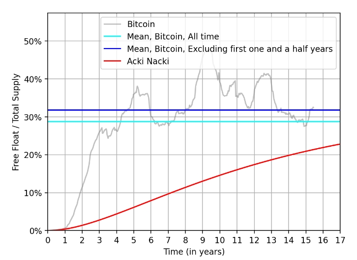<figcaption>
Figure 5: Comparison plot of Bitcoin and Acki Nacki NACKL Free Floats (as a percentage of the Total Supply) per year
</figcaption></figure>

## Block Keeper Min Stake

Because Acki Nacki is a scalable computational network the execution load parameter plays a significant role in its tokenomics.

Acki Nacki is a multithreaded execution environment. Threads grow when computation demand on the network grows, more Block Keepers are required to process the network load. Usually one would argue the rewards should grow to lure more Block Keepers into the network. But that won’t work because of a “spam attack”. In the Spam Attack the Block Keeper may create spam transactions to artificially increase network load so that threads are multiplied to inflate the block rewards. And since in Acki Nacki the payment for computations (electricity) is [stable or less](./#shell-equal-or-less) the arbitrage between the compute expanse and block reward is always beneficial to the attacker. Therefore no increase of the Block Reward is possible. Instead the minimum required stake is lowered automatically. Thus allowing lower barriers to entry for new Block Keepers to provide their computing power to participate in a slice of a block rewards. And since Reputation Coefficient plays a much greater role in the Block reward for each Block Keeper over time, it provides a lucrative opportunity for profitable network participation.

* $$NeedBKNum(t)$$ — Needed Block Keeper Number — The number of Block Keepers required in the network at time $$t$$ according to the number of threads
* $$baseMinBKStake(t)$$ — Base Minimal Block Keeper Stake — Minimal Stake when the current number of Block Keepers equals the necessary number of Block Keepers
* $$FreeFloatFrac(t)$$— Free Float Fraction — The current fraction of Free Float of Total Supply
* $$TSTA(t)$$— Total Staked Token Amount — The total number of tokens staked in the network at time $$t$$
* $$BKSFC$$ — Block Keeper Stake Function Coefficient — The coefficient that determines the expected fraction of tokens that will be staked by Block Keepers out of the Total Staked Token Amount
* $$MVSFC$$ — Mobile Verifier Stake Function Coefficient — The coefficient that determines the expected fraction of tokens that will be staked by Mobile Verifiers out of the Total Staked Token Amount
* $$BMSFC$$ — Block Manager Stake Function Coefficient — The coefficient that determines the expected fraction of tokens that will be staked by Block Managers out of the Total Staked Token Amount
* $$TMTA(t)$$— Total Minted Token Amount — The number of minted tokens at time $$t$$
* $$BBKRFC$$ — Base Block Keeper Reward Function Coefficient — coefficient that determines the fraction of the reward GRPS allocated to Block Keepers
* $$MVRFC$$ — Mobile Verifier Reward Function Coefficient — coefficient that determines the fraction of the reward GRPS allocated to Mobile Verifiers
* $$BMRFC$$ — Block Manager Reward Function Coefficient — coefficient that determines the fraction of the reward GRPS allocated to Block Managers
* $$t_{val}$$ — Validation Epoch Start Time — the time in seconds that has passed from the moment the network was launched until the start of a particular Validation Epoch

The total number of staked tokens is easily calculated from the known total number of minted tokens and the current free float:

<figure><figcaption>
Formula 11
</figcaption></figure>

Since in Acki Nacki, not only Block Keepers stake but also Mobile Verifiers and Block Managers (see sections "[Mobile Verifier Min Stake](./#mobile-verifier-min-stake)", "[Block Manager Min Stake](./#block-manager-min-stake)"), let the distribution of their stake from the total number of staked tokens be the same as the reward distribution ([formula 4](./#general-reward)):

<figure><figcaption>
Formulas 12
</figcaption></figure>

From which it follows:

<figure><figcaption>
Formula 13
</figcaption></figure>

Since each Validation Epoch for a Block Keeper requires time to verify the correctness of all Block Keepers’ actions, half of the staked tokens is locked in the current validation cycle, and the other half of the staked tokens is locked in the cooling period for slashing calculation. Therefore, each Block Keeper effectively needs to have two stakes to validate.

Let’s calculate $$baseMinBKStake$$ for Block Keepers, taking into account that the minimum stake should be calculated at the start of the Validation Epoch:

<figure>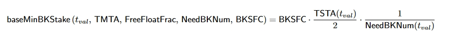<figcaption>
Formula 14
</figcaption></figure>

<figure>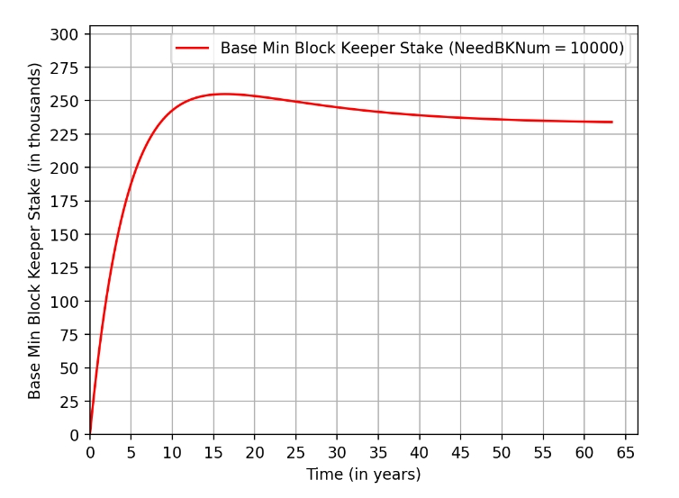<figcaption>
Figure 6: Plot of baseMinBKStake over time since the network’s launch with the necessary number of Block Keepers set to 10, 000
</figcaption></figure>

## Expected APR for Block Keepers

While we are not keen to use terms like Annual Percentage Reward while talking about Acki Nacki staking, it is still important to provide such indicative calculations on the rewards Block Keeper receive for performing Network Participation work in comparison with NACKL Stake they provide as security bond. Please note that we omit all direct Block Keeper operation costs as they are compensated by SHELL Token as described below.

<figure>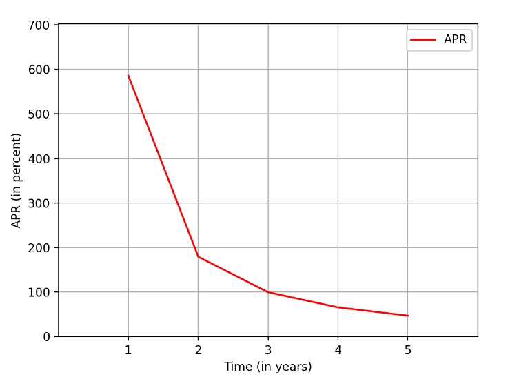<figcaption>
Figure 7: APR plot for the first 5 years after network launch
</figcaption></figure>

<figure>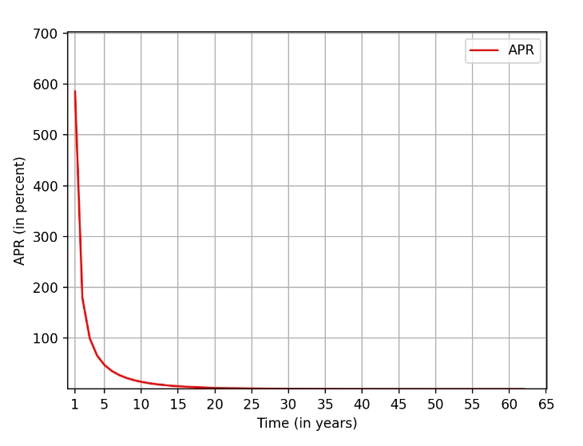<figcaption>
Figure 8: APR plot over time
</figcaption></figure>

<figure>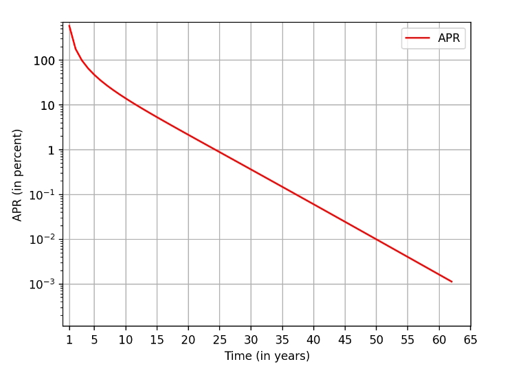<figcaption>
Figure 9: APR Plot with a logarithmic Y-axis over time
</figcaption></figure>

## Security Guarantees

The main function of NACKL Token is to provide Network Security guarantees and now we will discuss in more details how this function is performed.

**Lemma 1.** _Total of NACKL min stakes for Block Keepers will make it virtually impossible to attack the network because the sum of money that will be required to collect it for successful attack with probability set by network parameters does not exist in the world economy._

$$Proof.$$

* $$BKNum$$ — number of Block Keepers
* $$ANNum$$ — average number of Acki-Nacki per block
* $$AtNum$$ —number of attestations required for block finalization
* $$MalBKNum$$ — expected number of malicious Block Keepers
* $$SAP$$ — successful attack probability in a single attempt
* $$FFT$$ — current Free Float (in tokens)
* $$FFTReduction$$ — The coefficient describing how much the Free Float (in tokens) decreased after purchasing tokens for the attack
* $$MAA$$ — Maximum Attack Attempts — Maximum number of attack attempts that the attacker can perform
* $$BNP$$ — Breaking Network Probability — The probability of performing a successful attack on the network in $$MAA$$ attempts
* $$MalStakeNum$$ — Malicious Stake Number — The number of stakes that a malicious Block Keeper needs to purchase for an attack with a probability of $$BNP$$
* $$minBKStake(t)$$ — Minimal Block Keeper Stake — Current minimal Block Keeper stake depending on the particular difference between the current number of Block Keepers and the required number of Block Keepers

**Assumption:** our Bitcoin analysis of free float contribution to the price increase shows that a decrease by 5% of free float leads to doubling of the Bitcoin price over time regardless of existing market demand.

Let’s consider how the probability of an attack and the reduction of Free Float depend on each other. For simplicity, let’s consider the case without Mobile Verifiers, as their presence would only reduce the probability of an attack.

The probability of a successful attack in one attempt:

<figure><figcaption>
Formula 15
</figcaption></figure>

The probability that the attacker successfully breaks the network in $$i$$ attempts is given by:$$(1 − SAP)^{i−1} * SAP$$

Let’s sum this probability over all possible numbers of attempts by the attacker and obtain the probability $$BNP$$:

<figure>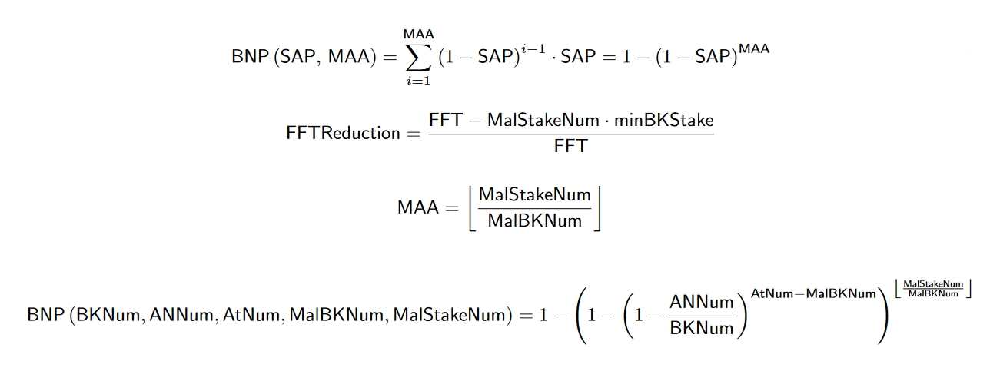<figcaption>
Formulas 16, 17, 18, 19
</figcaption></figure>


Note that the $$BNP$$ $$(MalBKNum)$$ function will be concave downwards, meaning that a malicious Block Keeper benefits either from attacking many times with a single malicious node or attacking once with multiple malicious nodes.


From this it follows that:

<figure>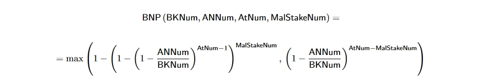<figcaption>
Formula 20
</figcaption></figure>

If the $$BNP$$ parameter is known, \
then $$MalStakeNum = min (MalStakeNum_1, MalStakeNum_2)$$, where&#x20;

<figure><figcaption>
Formula 21
</figcaption></figure>

and

<figure><figcaption>
Formula 22
</figcaption></figure>

Therefore

<figure>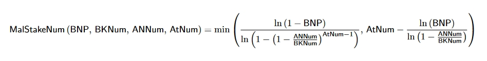<figcaption>
Formula 23
</figcaption></figure>

Even if we do not take into account that the minimum stake increases when the number of Block Keepers exceeds the required amount, we will see a significant reduction in Free Float:

1. In the case of an attack with multiple attempts, due to token burning after slashing a malicious network participant, which will iteratively increase the cost of the attack.
2. In the case of a one-time attack at the moment of purchasing tokens for the attack. Every 5% reduction in Free Float will double the cost of the attack.

Example calculation of $$MalStakeNum$$ with\
$$BKNum = 1000$$, \
$$ANNum = 40$$,\
$$AtNum = 800$$,\
$$BNP = 10^{−8}$$:

<figure>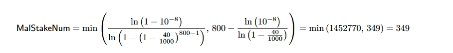<figcaption>
Formula 24
</figcaption></figure>

With 1000 Block Keepers,\
$$FFT$$ $$FFT = 2, 253, 808, 534$$ tokens,\
$$minBKStake = 2, 253, 808$$ tokens:

<figure><figcaption>
Formula 25
</figcaption></figure>

This reduction in Free Float increases the token price by $$2^{ln(0.65)/ln(0.95)} = 2^{8.38} = 331.31$$ times, making it practically impossible to collect that much money to purchase tokens for the attack.

## Mobile Verifiers

### Motivation$$f(x) = x * e^{2 pi i \xi x}$$

Ideally we would want a protocol that everyone can participate in without a need to run expensive server hardware. That would dramatically increase network security and decentralization. From the other side such a network would not be very performant, fast and scalable because of network and computing power limitation of mobile devices.

To solve this we introduce the Mobile Verifier role to Acki Nacki. A mobile user would not need to validate every block on the network, which would be technically impossible, but instead such a user could participate in the protocol as a Verifier by validating transactions in subtrees of accounts, occasionally. Since there is no way to know when such a user would choose to Verify, it would provide additional security guarantees to the network, dramatically decreasing the probability of attack on top of the already great security guarantees of the main Acki Nacki Protocol.

* $$BKNum$$ — number of Block Keepers
* $$ANNum$$ — average number of Acki-Nacki per block
* $$AtNum$$ — number of attestations required for block finalization
* $$MalBKNum$$ — expected number of malicious Block Keepers
* $$MVNum$$ — number of Mobile Verifiers
* $$MalMVNum$$ — expected number of malicious mobile verifiers
* $$λ_{MV}$$ — verification frequency by Mobile Verifiers — fraction of blocks verified by Mobile Verifiers
* $$MVRPS$$ — Mobile Verifier Reward per Second (accrued only on the condition of owning at least one Boost)
* $$TMVRPS(t)$$ — Total Mobile Verifier Reward Per Second — the fraction of the reward $$GRPS$$ allocated to Mobile Verifiers.
* $$MVStake$$ — Mobile Verifier Stake
* $$TotalMVStake$$ — Total Mobile Verifier Stake of all Block Keepers who have at least one boost
* $$BoostCoef$$ — Boost Coefficient — a coefficient that determines the fraction of the reward allocated to a particular Mobile Verifier based on their position in the sorted in ascending order list of all Mobile Verifiers by the number of boosts. The sum of $$BoostCoef$$ for all Mobile Verifiers equals 1.
* $$SAP$$ — successful attack probability in a single attempt
* $$SAP_{MV}$$ — successful attack probability in a single attempt with Mobile Verifiers

<figure>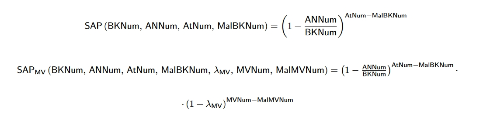<figcaption>
Formulas 26, 27
</figcaption></figure>

For the reference, next Figs. are illustrating the successful attack probability from a number of malicious network participants for Bitcoin, pBFT, and Acki Nacki protocols with a total of 1000 Block Keepers.

To calculate the successful attack probability in Bitcoin, we use the commonly accepted number of blocks for probabilistic ’finality’, which is 6. For calculating the successful attack probability in Acki Nacki, we use the number of Acki-Nacki set to 40 and the number of Attestations set to 80.

<figure><figcaption>
Figure 10: Comparison of successful attack probabilities in Bitcoin, pBFT and Acki Nack
</figcaption></figure>

<figure>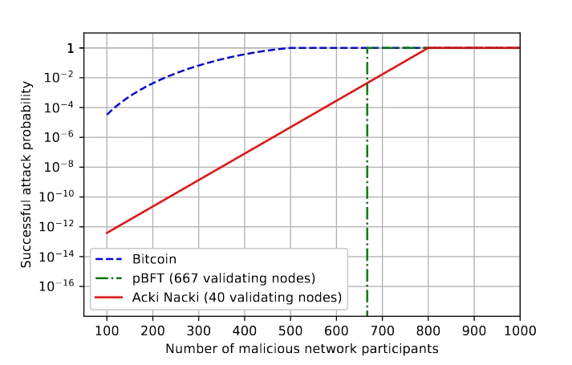<figcaption>
Figure 11: Fig. 10 with log-scaled y-axis
</figcaption></figure>

### Mobile Verifier Reward

Mobile Verifiers will compete in an online game, which involves earning Boosts, to secure a place in the mobile verifiers list that determines the fraction of block reward they will receive:

<figure><figcaption>
Formula 28
</figcaption></figure>

### Boost Coefficient

Our task will be to determine BoostCoef for each Mobile Verifier. To do this, we will create an exponential curve consisting of several sub-curves such that:

1. The domain of the curve will be $$Dom(f ) = [0, 1]$$, allowing us to distribute the Total Mobile Verifiers Reward regardless of the number of Mobile Verifiers.
2. The integral over the entire domain of the curve equals 1, so we can divide the Total Mobile Verifiers Reward among all Mobile Verifiers.
3. • The first 30% of Mobile Verifiers will receive almost no reward.\
   • The middle 40% will receive 30% of the total reward.\
   • The last 30% with the most boosts will receive 70% of the total reward.

#### Form of the Exponential Curve

An exponential curve with a growth coefficient $$k$$, passing through the points $$(x1, y1)$$ and $$(x2, y2)$$, is defined as follows:

<figure><figcaption>
Formula 29
</figcaption></figure>

Thus, we obtain a function with the following input parameters:

* $$Dot1 = (x1, y1)$$ — The leftmost point of the first sub-curve
* $$Dot2 = (x2, y2)$$ — The connection point between the first and second sub-curves
* $$Dot3 = (x3, y3)$$ — The connection point between the second and third sub-curves 16
* $$Dot4 = (x4, y4)$$ — The rightmost point of the third sub-curve
* $$k1$$ — the growth coefficient of the first sub-curve
* $$k2$$ — the growth coefficient of the second sub-curve
* $$k3$$ — the growth coefficient of the third sub-curve

<figure>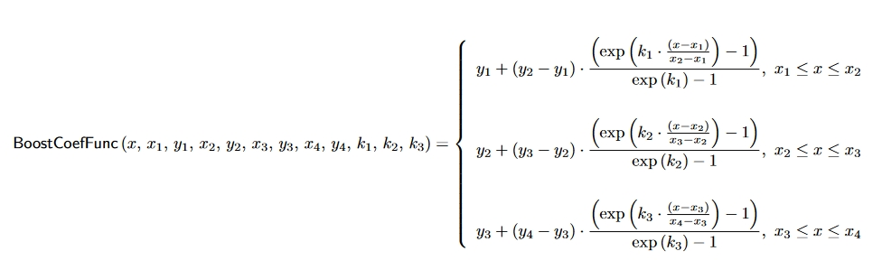<figcaption>
Formula 30
</figcaption></figure>

Let us denote these sub-curves as I, II, and III.

<figure>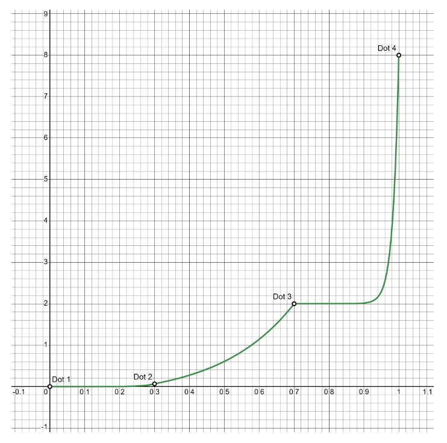<figcaption>
Figure 12: Boost Coefficient Curve
</figcaption></figure>

#### Calculation of Parameters for the Piecewise Exponential Curve

As mentioned earlier (refer to the relevant section), let $$x_1 = 0$$, $$x_2 = 0.3$$, $$x_3 = 0.7$$, and $$x_4 = 1$$. \
We will empirically choose the following parameters for the curves: $$k_1 = 10$$, $$y_3 = 2$$, $$y_4 = 8$$.

The curve starts at the point $$y_1 = 0$$. This means that a Mobile Verifier with the fewest Boosts receives almost no reward. (This could be adjusted to provide a very minimal reward, but for simplicity, we’ll leave it as is for now.)&#x20;

Now we need to find the parameters $$y_2$$, $$k_2$$, and $$k_3$$. To do this, we will calculate the integral for each sub-curve and, based on [point 3](./#boost-coefficient), equate these integrals to the following values:

<figure>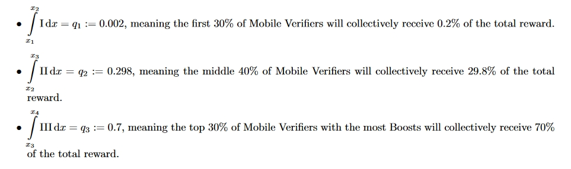<figcaption></figcaption></figure>

Let’s calculate these definite integrals:

<figure>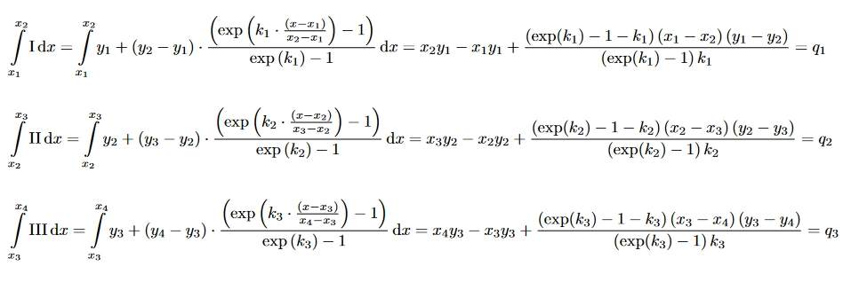<figcaption>
Formula 31
</figcaption></figure>

Let’s construct a system of three equations for the three unknowns $$y_2$$, $$y_3$$, and $$y_4$$:

<figure>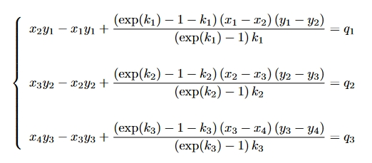<figcaption>
Formula 32
</figcaption></figure>

The analytical solution to this system of equations would be too large to include in this document, so we will immediately substitute the known parameter values $$x_1, x_2, x_3, x_4, y_1, y_3, y_4, k_1, q_1, q_2, q_3$$ and obtain the following values for $$y_2, k_2, k_3$$:

<figure><figcaption>
Formula 33
</figcaption></figure>

Thus, we have obtained the curve with all known parameters.

#### Calculation of the Boost Coefficient for Different Numbers of Mobile Verifiers

Now, we need to calculate $$BoostCoef$$ from the known function $$BoostCoefFunc$$. \
For this, we introduce the parameter for the number of Mobile Verifiers $$MVNum$$.

The reward of a Mobile Verifier, who is in the i-th position in the list sorted in ascending order of the number of Boosts, will be calculated as the integral over the subinterval corresponding to this Mobile Verifier. In other words, we will divide the interval $$[0, 1]$$ into $$MVNum$$ parts, and the$$i$$-th Verifier will correspond to the interval  $$[\frac{i-1}{MVNum},\frac{i}{MVNum}]$$ .

That is,

<figure><figcaption>
Formula 34
</figcaption></figure>

#### Mobile Verifier Min Stake

* $$TSTA(t)$$ — Total Staked Token Amount — The total number of tokens staked in the network at time $$t$$
* $$TMTA(t)$$ — Total Minted Token Amount — The number of minted tokens at time $$t$$
* $$MVRH$$ — Mobile Verifier Reward History — Amount of tokens that Mobile Verifier have earned during their entire participation in the network
* $$minMVStake(t)$$ — Minimal Mobile Verifier Stake — Current minimal particular Mobile Verifier stake
* $$FreeFloatFrac(t)$$ — Free Float Fraction — The current fraction of Free Float of Total Supply

The size of the Mobile Verifier’s stake does not affect their reward ([formula 30](./#mobile-verifier-reward)), only the presence of the Min Stake on the Mobile Verifier’s wallet matters. For Mobile Verifiers, there is no point in dynamically adjusting the stake based on the current number of Mobile Verifiers (as is done for Block Keepers), since it is impossible to determine the required number of Mobile Verifiers. Therefore, each Mobile Verifier’s Min Stake will be unique and depend solely on the amount of tokens MVRH they have earned during their entire participation in the network. The Min Stake of a Mobile Verifier will be a fraction of the MVRH parameter, just as the Total Staked Token Amount TSTA is a fraction of the Total Minted Token Amount TMTA ([11](./#block-keeper-min-stake)), provided that the Mobile Verifier must have two stakes for the same reasons as for Block Keepers.

<figure><figcaption>
Formula 35
</figcaption></figure>

If a Mobile Verifier does not have enough tokens in their wallet to place the stake for the next Epoch, their number of Boosts is reset to zero.

#### Mobile Verifier Epoch Reward

* $$MVED$$ — Mobile Verifier Epoch Duration — the duration of one Epoch of Mobile Verifiers in seconds
* $$MVRPE$$ — Mobile Verifier Reward per Epoche — the reward received by a Mobile Verifier for one Epoch
* $$BoostCoef$$ — Boost Coefficient — a coefficient that determines the fraction of the reward allocated to a particular Mobile Verifier based on their position in the sorted in ascending order list of all Mobile Verifiers by the number of boosts. The sum of $$BoostCoef$$ for all Mobile Verifiers equals 1.
* $$TMVRPS(t)$$ — Total Mobile Verifier Reward Per Second — the fraction of the reward $$GRPS$$ allocated to Mobile Verifiers
* $$t_{verf}$$ — Verification Epoch Start Time — the time in seconds that has passed from the moment the network was launched until the start of a particular Epoch of Mobile Verifiers

The Epoch of Mobile Verifiers, unlike the Epochs of Block Keepers, is common for all Mobile Verifiers. The first Epoch starts when the network is launched, and after that, the current Block Producer must send a message to the Epoch contract. If at least $$ $MVED $$ seconds have passed since the start of the Epoch, all Mobile Verifiers will receive the reward for the Epoch $$MVRPE$$, and the next Epoch will begin for them. The current $$BoostCoefficient$$ is locked at the beginning of each Epoch for its entire duration and updated after the Epoch ends to prevent unnecessary continuous calculations, as the number of Boosts for Mobile Verifiers changes with high frequency. $$TMVRPS$$ is locked at the beginning of the Epoch, as its changes during the epoch are negligible.

<figure><figcaption>
Formula 36
</figcaption></figure>

## Block Managers

The primary function of Block Managers is to provide the user with a blockchain database and to process external messages. Block Managers receive a portion of the total block reward based on the number of external messages they process. The reward distribution is structured in such a way that spamming the network with external messages to increase rewards is not practically beneficial. This is because generating spam external messages requires certain resources, and the reward increase will slow down significantly if the number of external messages processed by a specific Block Manager exceeds the average number of processed messages across all Block Managers.

### Block Manager Reward

Block Managers do not have a stake because they do not verify transactions and do not impact network security. Therefore, their reward depends only on the number of external messages they processed.

* $$BMRPS$$ — Block Manager’s Reward per Second
* $$TBMRPS(t)$$ — Total Block Manager Reward Per Second — the fraction of the reward $$GRPS$$ allocated to Block Managers.
* $$ExtMesCoef$$ — External Messages Coefficient — the coefficient that determines the fraction of the reward allocated to a particular Block Manager based on their position in the sorted in ascending order list of all Block Managers by the number of processed external messages. The sum of $$ExtMesCoef$$ for all Block Managers equals 1.
*

The reward for Block Managers is calculated using the following formula:

<figure><figcaption>
Formula 37
</figcaption></figure>

For personalized projections of token economic metrics, use the [Reward Calculator](https://rewardcalculator.ackinacki.com/).

### External Messages Coefficient

Let’s determine $$ExtMesCoef$$ for each Block Manager. To do this, we create a complex curve consisting of several sub-curves such that:

1. The domain of the curve will be $$Dom(f ) = [0, 1]$$, allowing us to distribute the Total Block Managers Reward regardless of the number of Block Managers.
2. The integral over the entire domain of the curve equals 1, so we can divide the Total Block Managers Reward among all Block Managers.
3. • The first 10% of Block Managers will receive almost no reward.\
   • The top 90% will receive almost the entire reward.

#### Form of the Curve

If we establish a direct proportionality between the reward received by a Block Manager and the number of transactions they process, some Block Managers may be incentivized to carry out a spam attack on the network with fake transactions to receive the entire reward. To prevent this, we designed the following $$ExtMesCoefFunc$$ curve, based on the model we had developed for Mobile Verifiers.

* $$Dot1 = (x1, y1)$$ — The leftmost point of the first sub-curve
* $$Dot2 = (x2, y2)$$ — The connection point between the first and second sub-curves
* $$Dot3 = (x3, y3)$$ — The rightmost point of the second sub-curve
* $$k1$$ — the growth coefficient of the first sub-curve

<figure>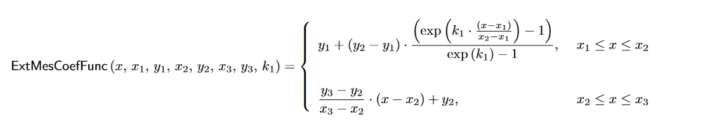<figcaption>
Formula 38
</figcaption></figure>

Let us denote these sub-curves as I, II.

<figure>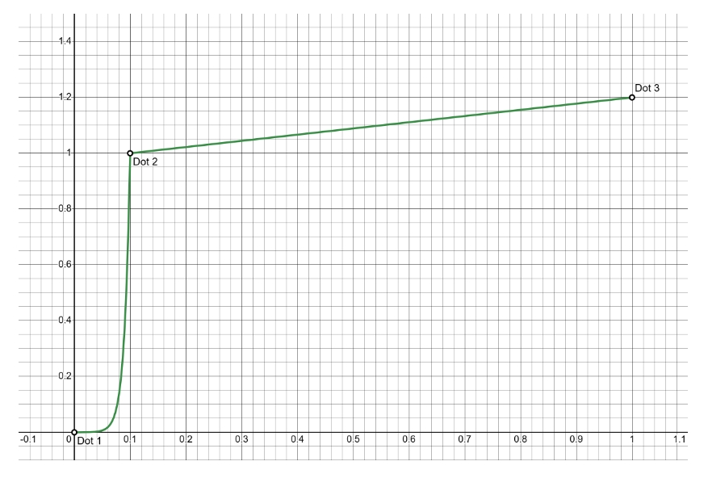<figcaption>
Figure 13: External Messages Coefficient Curve
</figcaption></figure>

#### Calculation of Parameters for the Piecewise Curve

As mentioned earlier, let $$x_1 = 0, x_2 = 0.1, x_3 = 1$$.&#x20;

To remove the incentive for a spam attack on the network, we analyzed the curve and empirically chose the following parameter for the curve: $$y_3 = 1.2$$.&#x20;

The curve starts at the point $$y_1 = 0$$.&#x20;

This means that a Block Manager with the smallest number of processed external messages will receive almost no reward. Now we need to find the parameters $$y_2$$, $$k_1$$. To do this, we will calculate the integral for each sub-curve and, based on point 3, equate these integrals to the following values:

<figure>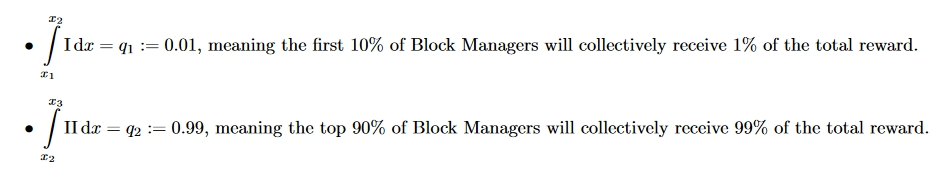<figcaption></figcaption></figure>

Let’s calculate these definite integrals:

<figure>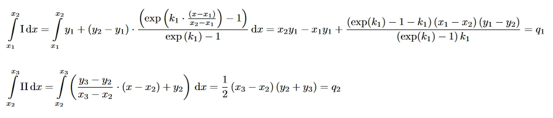<figcaption>
Formula 39
</figcaption></figure>

Let’s construct a system of two equations for the two unknowns $$y_2$$, $$k_1$$:

<figure><figcaption>
Formula 40
</figcaption></figure>

For simplicity, we directly substitute the known parameter values $$x_1, x_2, x_3, y_1, y_3, q_1, q_2$$ and obtain the following values for $$y_2, k_1$$:

<figure><figcaption>
Formula 41
</figcaption></figure>

Thus, we have obtained the curve with all known parameters.

#### Calculation of the External Messages Coefficient for Different Numbers of Block Managers

Now, we need to calculate $$ExtMesCoef$$ from the known function $$ExtMesCoefFunc$$. For this, we introduce the parameter for the number of Block Managers $$BMNum$$.

By analogy with the Mobile Verifiers, we define the reward for the Block Manager who is in the i-th position in the list sorted in ascending order of the number of processed external messages, will be calculated as the integral over the subinterval corresponding to this Block Manager. In other words, we will divide the interval $$[0, 1]$$ into $$BMNum$$ parts, and the $$i$$-th Manager will correspond to the interval  $$[\frac{i-1}{BMNum},\frac{i}{BMNum}]$$.

That is,

<figure>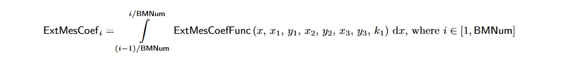<figcaption>
Formula 42
</figcaption></figure>

### Block Manager Min Stake

* $$BMRH$$ — Block Manager Reward History — Amount of tokens that Block Manager have earned during their entire participation in the network
* $$minBMStake(t)$$ — Minimal Block Manager Stake — Current minimal particular Block Manager stake
* $$FreeFloatFrac(t)$$ — Free Float Fraction — The current fraction of Free Float of Total Supply

Similarly to [Mobile Verifiers](./#mobile-verifier-min-stake), the reward of a Block Manager does not depend on the amount of stake they place but only on the presence of the Min Stake. The Min Stake of each Block Manager is unique and depends solely on the amount of tokens they have earned during their participation in the network $$BMRH$$. As with [Block Keepers](./#block-manager-min-stake) and Mobile Verifiers, two stakes are required to continuously participate in the network:

<figure><figcaption>
Formula 43
</figcaption></figure>

### Block Manager Epoch Reward

* $$BMED$$ — Block Manager Epoch Duration — the duration of one Epoch of Block Managers in seconds
* $$BKRPE$$ — Block Manager Reward per Epoche — the reward received by a Block Manager for one Epoch
* $$ExtMesCoef$$ — External Messages Coefficient — the coefficient that determines the fraction of the reward allocated to a particular Block Manager based on their position in the sorted in ascending order list of all Block Managers by the number of processed external messages. The sum of $$ExtMesCoef$$ for all Block Managers equals 1.
* $$TBMRPS(t)$$ — Total Block Manager Reward Per Second — the fraction of the reward $$GRPS$$ allocated to Block Managers
* $$t_{manage}$$ — Management Epoch Start Time — the time in seconds that has passed from the moment the network was launched until the start of a particular Epoch of Block Managers

Similarly to [Mobile Verifiers](./#mobile-verifier-epoch-reward), the Epoch of Block Managers is common for all Block Managers and starts and ends after a message is sent to the contract by the Block Producer. $$ExtMesCoef$$ is calculated each time at the end of the epoch and reset after its completion. This means that the reward of a Block Manager is influenced only by their position in the sorted in ascending order list of all Block Managers by the number of processed external messages at the end of the epoch. $$TVMRPS$$ is locked at the beginning of the Epoch, as its changes during the epoch are negligible.

<figure>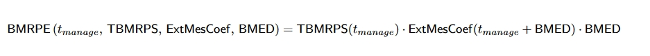<figcaption>
Formula 44
</figcaption></figure>

## SHELL — Equal or Less

SHELL is a network usage token, designed to provide compensation for Block Keepers for their computing resources. Anyone who wishes to execute a transaction on Acki Nacki needs to pay Block Keepers for their computing resources and storage. Since main expenses for running a Block Keeper are electricity and network traffic costs and server amortization (wherever hardware or lease costs), and all of them are paid in fiat currency the SHELL price should try to reflect those. SHELL Tokens will be sold via a System Pool in exchange for any currency Block Keepers decided to accept. Block Keepers will provide liquidity for such exchange and set up a SHELL minting rate for that pair, which will constitute their collective vote on current conversation price for a particular pair. Any SHELL holder may decide to sell their unused SHELL tokens which will be placed in the pool setting the price lower, respectively until the supply is not sold. Therefore the SHELL Token can be sold at the price Block Keepers set up in the Pool, or less. Hence — equal or less. All the payments collected for SHELL tokens are then directed into an Accumulator Contract where they are locked. Any NACKL token holder has a proportional right to the content of the Accumulator Contract. At any time NACKL holder can decide to burn their tokens and receive the proportional amount locked in Accumulator Contract. A NACKL holder would rarely (or never) use such a mechanism because most of the time the open market price of NACKL will be higher than revenues divided by tokens outstanding because of future revenues expectations and decreasing supply mechanism built into the market price of NACKL. Since all SHELL revenues go to the Accumulator Contract, the amount of Revenue divided by the amount of NACKL Tokens will constitute the “intrinsic” or a “floor” value of the NACKL. This intrinsic value will always rise while the NACKL supply will always decrease.

[^1]: **Epoch** - a participation period in the Acki Nacki protocol during which a participant acts as a Block Keeper.
